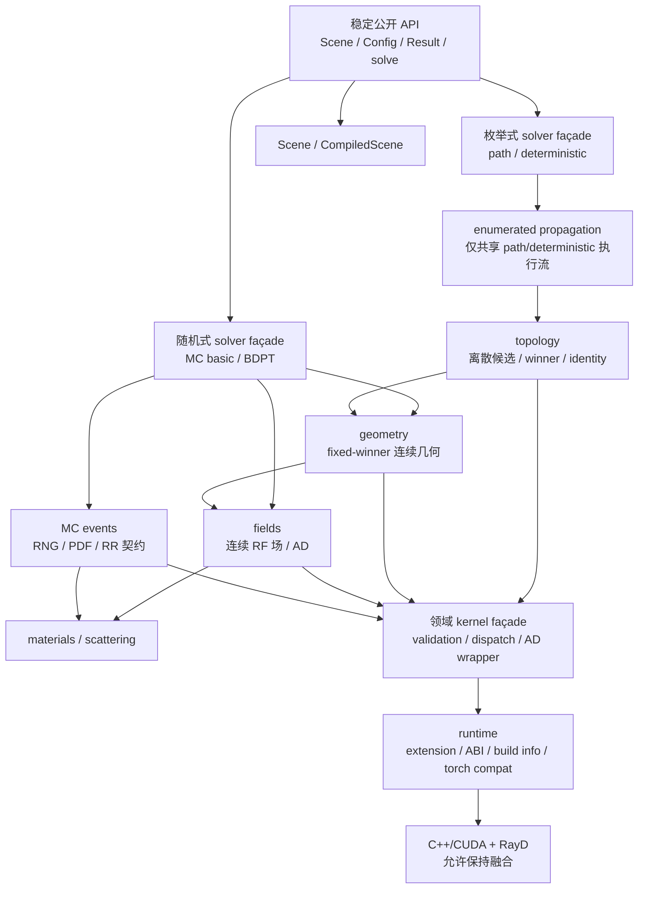

# Channel Native 模块化架构与代码治理修理计划

**状态：** Phase 0-11 completed；Phase 12 in progress（用户于 2026-07-16 明确取消向后兼容要求）

**计划日期：** 2026-07-14

**审计基线：** `main@4c5da23`

**范围：** Python、C++/CUDA、RayD 集成、AD、测试/CI、依赖锁定与 Git 仓库治理

**架构修订：** 2026-07-14 独立评审后，引入拆分的传播数据契约、Path/Deterministic enumerated engine、显式 runtime ownership，并取消 Python/native 机械镜像要求。

**关联计划：** [05-implementation-contract.md](./05-implementation-contract.md)、[07-channel-native-differentiable-solver-plan.md](./07-channel-native-differentiable-solver-plan.md)

## 1. 执行结论

Channel Native 可以参考 GSplat 的模块化设计，但不应复制它的目录名称或把所有代码一次性迁入一个全新的 `solvers/` 包。适合本项目的核心原则是：

1. 按 RF 领域能力划分高内聚模块，而不是按“Python/CUDA/AD”横向堆放所有实现。
2. 每个领域内部区分公开功能层、内核桥接层和有状态模型/求解编排层，并保持依赖单向流动。
3. 四个现有求解器继续作为稳定公开 façade；共享逻辑下沉到 propagation、materials、scattering 等领域层。Path/Deterministic 共享范围受限的 enumerated propagation；MC Basic/BDPT 只共享真实共同的事件和底层 primitive；求解器之间禁止互相导入。
4. 原生扩展保持唯一生产计算后端。架构重构不迁移算法、不改变计算顺序、不增加 PyTorch/CPU/有限差分 fallback，也不把原生伴随替换为自动重建。
5. 重构采用逐域、可回滚、可二分的提交序列；“移动/拆分代码”和“修改数值算法”不得出现在同一提交或同一 PR。

本计划不是一次大爆炸式重写。最终目标是移除巨型 `ops.py` 和 `path_topology.py` 的职责中心地位，建立可测试的模块边界，同时保持当前公开 API、路径语义、随机流、前向数值、JVP/VJP 和性能预算。

## 2. 不可协商约束

以下约束优先于代码简洁、复用率和文件行数：

- 不改变任何公开 `solve(scene, config)` 签名、Config 默认值、Result 字段、metadata 字段或 capability 声明，除非经过单独的 API 变更流程。
- 不减少求解模式、传播分量、路径深度、样本数、路径候选、AD 输入或输出，以换取结构简单或测试通过。
- 不改变浮点 dtype、复数约定、相位约定、单位、坐标系、极化基、材料 ABI、路径排序、winner 选择、可见性判断或随机数消费顺序。
- 不改变 CUDA kernel 的 grid/block、stream、同步、归约顺序、原子操作或编译选项，除非放入独立的性能/数值变更 PR。
- 不允许 Python/PyTorch 重算 RayD 已负责的几何，不允许 CPU 生产计算，不允许有限差分充当生产 JVP/VJP，不允许“缺 native op 时继续算”的降级路径。
- 不允许为合并 primal/JVP/VJP 重复而改变运算次序。无法证明等价时，保留重复并增加 lockstep 测试。
- 不通过放宽现有容差、增加 skip/xfail、降低 benchmark 规模或更换更简单场景来使重构通过。
- 不删除疑似 dead/legacy 代码，直到静态可达性、动态绑定、公开导入和完整测试四项都证明其不可达。
- 不触碰当前用户未跟踪的 `.claude/`；不执行 `git clean -xfd`、`git reset --hard` 或未经协调的历史重写/强推。

任何违反上述约束的需求都必须脱离本计划，写独立 ADR 和行为变更计划，不能伪装成“架构清理”。

## 3. 当前基线与主要风险

### 3.1 代码规模

基于 `main@4c5da23` 的物理行统计：

| 范围 | 文件数 | 物理行数 |
|---|---:|---:|
| `src/witwin/channel_native/**/*.py` | 73 | 28,782 |
| `native/channel_native/**/*.{cpp,cu,cuh,h,hpp}` | 34 | 30,693 |
| 生产代码合计 | 107 | 59,475 |
| `tests/**/*.py` | 156 | 26,126 |
| `benchmarks/**/*.py` + `ci/*.{py,ps1}` | 20 | 4,933 |

最大生产文件：

| 文件 | 物理行数 | 主要风险 |
|---|---:|---|
| `core/kernels/ops.py` | 11,971 | 领域边界、native dispatch、验证、AD 兼容和 wrapper 集中 |
| `native/.../path_trace.cu` | 4,270 | 多种追踪职责与 host launch 集中 |
| `core/path_topology.py` | 2,857 | 发现、冻结、场评估、拼接和导出混合 |
| `field_transport_ad.cu` | 2,496 | AD 数学、tape 与 launch 混合 |
| `field_wedge_ad.cu` | 2,473 | 绕射 AD 高风险数值路径 |
| `bdpt_connect.cu` | 2,356 | connection/MIS/场计算耦合 |
| `bindings.cpp` | 2,288 | 所有 native 绑定集中注册 |
| `raydn_bridge.cpp` | 1,998 | RayD 多能力桥接与 legacy handle 混合 |
| `montecarlo/bdpt/solver.py` | 1,569 | 编排、策略、验证和结果组装过度集中 |

行数不是设计目标本身，但这里已经与职责集中、复杂度和 fan-in 同时出现。`ops.py` 约占生产 Python 的 41.6%，包含 214 个顶层函数和 19 个类，并被至少 17 个生产模块直接导入；这已是明确的架构瓶颈。

### 3.2 耦合与复杂度

- `core.kernels.ops` 同时承担 extension 加载、symbol 查询、输入验证、RayD bridge、场计算、拓扑、MC、BDPT、JVP/VJP/autograd 包装和 metadata 辅助。
- `core.path_topology` 同时掌握离散 winner、连续几何、场传播、AD companion、结果拼接和导出语义。
- `TopologyBatch` 自身同时承载离散 topology、连续 geometry、RF fields 和执行 metadata；仅移动类定义不会解决耦合，必须拆分数据契约并保持 row identity。
- `CompiledScene` 同时聚合 RayD、geometry、materials、assignments、workspace 和 scattering lazy cache；需要从“通用容器”收口为 native handle 与 typed runtime resources 的唯一 owner。
- `path.solver` 直接导入 `deterministic.scattering`，形成求解器到求解器的横向依赖；共享散射能力没有独立所有者。
- 约 25 处直接依赖 `torch._C._functorch` 等私有 API，Torch 版本风险扩散在巨型 wrapper 中。
- Python 静态审计中有 37 个约 100 行以上函数、41 个估算圈复杂度不低于 15 的函数；MC/BDPT solve 和 `_evaluate_shared_fields` 是优先拆分对象。
- native 静态启发式中有 51 个约 100 行以上函数、16 个估算圈复杂度不低于 20 的函数。

### 3.3 重复、dead code 与 legacy

- 精确 token 启发式发现 299 个不少于 100 token 的重复区，覆盖约 6,901 个物理行，约占生产代码 11.6%。
- 重复率较高的 native 文件包括 `los.cu`、`material.cu`、`field_transport.cu`、`bdpt_subpaths.cu`、`path_trace.cu`、`reflection.cu`。其中部分是有意保持 primal/JVP/VJP 运算次序，不能机械去重。
- 高置信私有 dead 候选包括 MC BDPT solver 中的 `_native_diffraction_component_maps`、`_los_visibility_mask`、`_reflect_points`、`_fresnel_scalar_coefficient`；更宽松的静态扫描有 33 个零引用顶层定义，需要逐一审计，不能直接删除。
- `ops.py::_raydn_module_handle()` 恒返回 `0`，但约 30 个 Python 调用和约 25 个绑定签名仍携带 handle；应在 ABI 验证后整条移除。
- `core/kernels/raydn_backend.py` 的 `native_extension()` 返回 `None`、`require_native_extension()` 是 no-op，属于兼容 shim。
- `LegacySlabComplex` 及其 dual 版本仍处于实际计算路径，并明确要求 lockstep；名称虽为 legacy，但不能在本轮直接删除或换成“更漂亮”的复数实现。
- 材料 layer-0 scalar view 是已声明兼容行为，不能作为死代码处理。

### 3.4 fallback、构建和仓库卫生

- 当前未发现生产计算 fallback；native 缺失通常会 fail loud，且已有 no-fallback 测试。这是需要保留的优点。
- extension loader 会先加载包内 `_channel_native`，再尝试全局同名模块；这是导入位置 fallback，不是计算 fallback，但可能误载 ABI 不匹配的扩展。
- `CMakeLists.txt` 默认依赖 `../../RayDi`，未在仓库内固定 revision；`pyproject.toml` 的 Torch 依赖也没有支持范围。
- 本地没有签入的 GitHub Actions workflow，主要依赖 `ci/` 脚本和本地执行。
- Git 已跟踪 `build-witwin3/` 下 316 个文件，约 207.91 MiB，占当前 tracked working tree 约 98.3%；`.gitignore` 已忽略 `build-*`，但对已跟踪文件无效。
- `.git/objects` 有约 20.83 MiB garbage；清理必须与 index 清理、历史策略分开处理。
- 当前 worktree 仅有用户未跟踪的 `.claude/`，本计划不得删除或自动纳入版本库。

### 3.5 测试现状

- 当前可收集约 950 个测试。
- 最近审计中 `tests/ad` 为 205 passed、1 xfailed；no-fallback/contract 相关测试通过。
- 生产 Python Ruff 通过；tests/benchmarks 尚有约 38 个 Ruff 问题。
- 尚未把完整约 950 项测试、覆盖率、所有 wheel 场景和全部性能矩阵作为同一次重构基线执行。Phase 0 完成前不能声称已有完整回归基线。

## 4. 从 GSplat 借鉴什么

GSplat 当前设计文档中最值得迁移的是职责和依赖规则，而不是表面目录：

- `functional/` 暴露有语义、无状态的 Python 功能 API；`kernels/` 只负责 backend dispatch、autograd 和 native 集成；有状态对象放在 `models/` 或更高层编排中。
- functional 按领域概念组织，kernels 按实现能力组织，依赖仅允许 `functional -> kernels -> native`。
- 输入验证优先在 Python 公开边界执行，C++ 的检查作为第二道防线。
- native 代码按能力拆分，绑定、Torch bridge、CUDA kernel 和可复用 device math 有清楚的所有者。
- kernel 包不通过巨型 `__init__.py` barrel 暴露所有内部符号；公开包只重导出稳定 API。
- 高层 stage/strategy 只拥有编排或策略，不吞并 loss、optimizer、renderer 等其他职责。

本项目不应照搬的部分：

- 不因 GSplat 使用 `torch.library` 就在本轮迁移 pybind/自定义 autograd。dispatcher 迁移会改变 ABI、autograd 注册和编译边界，应单独做 ADR；本轮先隔离当前机制。
- 不创建抽象插件/策略层来容纳只有一个实现的能力。只有出现两个以上真实策略且调用方确实需要切换时才抽象。
- 不把所有 CUDA wrapper 再集中成另一个 `_wrapper.py` 巨型文件；本项目必须按 RF 领域拆分。
- 不把 CPU oracle 变成生产实现的共享 helper。独立 oracle 必须与生产数学保持实现独立，才能发现共同错误。

参考资料见本文末尾“官方参考”。

## 5. 目标架构

### 5.1 依赖方向



反向依赖和横向求解器依赖一律禁止。当前 `path -> deterministic.scattering` 必须改为 `path` 与 `deterministic` 共同依赖范围受限的 `propagation.enumerated`；`runtime` 不得导入任何 solver/domain；domain kernel 不得导入 solver。

该图描述 Python 语义和所有权，不要求 native 按相同节点一一拆分。一个经过验证的 fused native op 可以跨越 topology/geometry/fields 的概念边界，只要它不泄漏职责到 Python、不增加中间 tensor/launch，并有唯一 ABI owner。

### 5.2 Python 目标目录

以下是目标职责图，不要求一次提交完成，也不要求每个目录机械具备 `models/functional/kernels` 三件套：

```text
src/witwin/channel_native/
  __init__.py                     # 仅稳定、精选公开导出
  capabilities.py                # 用户可见能力声明
  deployment.py                  # 部署 façade；实现下沉 runtime

  runtime/
    extension.py                 # 唯一扩展加载点
    symbols.py                   # 唯一 native symbol/能力查询点
    abi.py                       # ABI 指纹与兼容验证
    build_info.py                # 构建、RayD、Torch/CUDA 信息
    diagnostics.py               # 非计算诊断
    torch_compat.py              # 唯一允许访问 torch 私有 API 的模块

  scene/
    models.py                    # Scene/Structure/TX/RX 等公共模型
    loader.py                    # XML/场景加载
    compile.py                   # Scene -> CompiledScene
    compiled.py                  # CompiledScene 与 typed runtime resources
    tensors.py                   # canonical tensor schema
    kernels/
      rayd_scene.py              # RayD scene 生命周期的 Python owner
    stores/
      geometry.py
      materials.py
      assignments.py

  materials/
    models.py                    # Dielectric/Layer/PhysicalSurface 等
    encoding.py                  # material ABI 编码
    evaluation.py                # 生产材料/频率评估
    kernels/                     # 仅材料 native 调用与 AD wrapper

  propagation/
    models/
      topology.py                # PathTopology：离散 winner/ID/sequence/valid
      geometry.py                # PathGeometry：位置/法线/方向/长度/delay
      fields.py                  # PathFields：系数/Complex3/Jones/gain
      evaluated.py               # EvaluatedPaths：前三者的 row-aligned 组合

    topology/
      discovery/
        los.py
        reflections.py
        diffraction.py
        coupled.py
        transmission.py
      concatenate.py             # 稳定拼接/排序，不附加 fields
      export.py                  # 离散 identity/schema 导出
      kernels/                   # topology native façade

    geometry/
      reevaluate.py              # fixed-winner 连续几何与 detach/AD 边界
      receivers.py
      reflections.py
      diffraction.py
      edges.py
      kernels/
        intersect.py
        visibility.py
        reflections.py
        diffraction.py
        autograd.py

    fields/
      functional/
        free_space.py
        reflection.py
        transmission.py
        diffraction.py
        projection.py
      kernels/
        validation.py
        autograd.py
        free_space.py
        reflection.py
        transmission.py
        diffraction.py
        projection.py

    enumerated.py                # 仅 path/deterministic 共享的执行引擎

  scattering/
    models.py
    tables.py                    # 预计算与 typed runtime resource
    functional.py                # BSDF/phase screen/eval/sample/pdf
    kernels/
      table.py
      phase_screen.py

  physics/
    reference/                   # 独立高精度 oracle，仅验证/离线参考
    conventions.py               # 单位、相位、常量；不含 solver 逻辑

  path/                          # 稳定公开 solver 包
    __init__.py
    config.py
    result.py
    pipeline.py
    solver.py                    # 薄 façade

  deterministic/                # 稳定公开 solver 包
    __init__.py
    config.py
    result.py
    pipeline.py
    accumulation.py             # deterministic 独有
    solver.py                    # 薄 façade

  montecarlo/
    events/                      # basic 与 BDPT 真正共享的 MC 事件语义
    basic/
      config.py
      result.py
      pipeline.py
      solver.py
    bdpt/
      config.py
      result.py
      pipeline.py
      subpaths.py
      connections.py
      mis.py
      accumulation.py
      solver.py
```

关键说明：

- 当前 `core/` 不是立即删除对象。迁移期间它作为兼容 façade，只允许重导出，不再接收新实现；最终由 import contract 决定哪些 shim 保留一个发布周期。
- `functional/` 仅用于具有清晰领域语义的无状态操作，不为追求对称而创建空目录。
- `kernels/` 的 raw tuple 不能向公开 solver 泄漏；kernel façade 在边界转换为命名的内部 contract。
- `PathTopology` 只负责离散选择；fixed-winner 的连续重评估属于 geometry；RF 系数与场属于 fields。不能把旧 `TopologyBatch` 原样迁入 `topology.models`。
- `propagation.enumerated` 只拥有 path/deterministic 已真实共享的枚举式传播流程，不拥有 deterministic accumulation、公共 Result、MC sampling、MIS 或 BDPT connection。
- scattering 只拥有散射物理、表和 eval/sample/pdf；同时修改 topology/geometry/fields 的散射路径流程属于 `propagation.enumerated` 的 stage，不能整体搬成 `scattering.path_expansion`。
- `physics/reference` 必须与生产实现独立。若现有 `physics/oracle.py` 被生产散射表构建使用，应把权威生产数学迁到 `materials.evaluation`/`scattering.tables`，并保留独立 oracle 做交叉验证，不能让 oracle 调用生产函数。
- 不建立 `utils.py`、`common.py` 或新的万能 `ops.py`。无法给出单一领域所有者的 helper 暂不迁移。

### 5.3 数据契约与资源所有权

`PathTopology`、`PathGeometry`、`PathFields` 和 `EvaluatedPaths` 是本次重构的中心契约：

| 类型 | 唯一职责 | 禁止持有 |
|---|---|---|
| `PathTopology` | path row identity、interaction sequence、winner、primitive/edge ID、valid/mask/order | 连续位置、法线、场、Scene、native handle |
| `PathGeometry` | 与 topology row 对齐的位置、法线、方向、长度、delay 和几何状态 | winner 选择、RF coefficient、Scene、native handle |
| `PathFields` | 与 topology row 对齐的 Complex3/Jones、系数、gain 和 field 状态 | topology discovery、Scene、mutable cache |
| `EvaluatedPaths` | 组合前三者并验证相同 row count/path identity；作为枚举式传播引擎的内部返回值 | solver-specific accumulation、公共 Result、runtime handle |

这些 contract 优先采用私有、不可变 dataclass；构造时检查 row identity、shape/dtype/device，不复制大 tensor。若 view/tuple 更能保持 aliasing 和性能，允许内部实现不使用 dataclass，但外部语义必须等价。

资源所有权固定如下：

- `Scene` 只拥有用户模型和 compile cache，不直接承担 native 执行状态。
- `CompiledScene` 是 RayD scene handle、canonical GPU geometry/material/assignment stores 和 typed scattering runtime resource 的唯一 owner。
- scattering runtime 不再挂在无类型通用 cache dict 中；资源类型、device、frequency、version/cache key 必须显式。
- propagation 数据对象不持有 `Scene`、`CompiledScene`、native handle 或 mutable workspace；pipeline 显式传入所需资源。
- Public Result 不持有 mutable runtime cache；生命周期不反向延长 native scene。
- row identity、tensor aliasing、copy/view 行为和 device residence 必须纳入 G2/G5，不能为了分层增加 H2D/D2H、clone 或 launch。

### 5.4 求解器与共享执行引擎

Path 与 Deterministic 的真实公共执行流定义为：

```text
evaluate_enumerated_paths(compiled_scene, propagation_config, ...)
    -> PathTopology
    -> PathGeometry
    -> PathFields
    -> EvaluatedPaths
```

其实现位于 `propagation.enumerated`，允许内部 stage 为保持现有执行顺序和性能而融合，但公开的内部 contract 必须保持上述职责边界。

调用方：

```text
path.solve
  -> evaluate_enumerated_paths
  -> PathResult

deterministic.solve
  -> evaluate_enumerated_paths
  -> deterministic.accumulation
  -> DeterministicResult
```

MC basic 与 BDPT 不调用 `evaluate_enumerated_paths`。它们只共享 scene/material、geometry/field primitive 和 `montecarlo.events` 中真实共同的 RNG/PDF/RR/事件契约；BDPT 的 subpath、connection、MIS 和 accumulation 保持 solver-local。

每个 solver 的 `solve()` 只编排：校验 config/capability、获取 `CompiledScene`、调用所属执行流、构建 solver-specific accumulation/result/metadata。不能建立通用 solver 基类，也不能把四种不同算法塞入带大量 mode 分支的统一 pipeline。

最终约束：

- 每个 solver 的公开 `solver.py` 目标不超过约 200 行，只做 façade 和顶层编排。
- solver 之间零生产导入。
- `propagation.enumerated` 不成为新 core：它不能被 MC 调用，不能包含 raw extension、材料数学、solver Result 或 deterministic accumulation。
- metadata 构造共享 schema，但每个 solver 对自身字段负责。

### 5.5 Native 组织原则：按 ABI、融合与 tape，而非机械镜像 Python

推荐的 native 顶层职责是：

```text
native/channel_native/
  binding/                       # PYBIND11_MODULE 与 capability registry
  runtime/                       # build info、ABI、tensor checks
  rayd/                          # 按 RayD 能力拆 bridge
  em/                            # complex/medium/fresnel/layer-stack primitives
  geometry/                      # intersect/visibility/fixed-winner geometry ops
  field_transport/               # 可保持跨传播分量的 fused field/AD ops
  enumerated/                    # 仅实际存在且值得保留的 fused 枚举路径 op
  scattering/                    # table/phase-screen native ops
  montecarlo_basic/              # basic 独有 fused kernels
  bdpt/                          # subpath/connection/MIS/accumulation
```

该树是 ownership 建议，不是必须逐目录复制 Python 的最终物理布局。确定 `.cpp/.cu/.cuh` owner 时依次考虑：ABI operation、kernel fusion、tape 生命周期、device primitive 所有权、编译依赖和性能。

Native 规则：

- Python 的 topology/geometry/fields 是语义边界，不是强制 CUDA launch 边界。已有 fused op 不因目录美观被拆开。
- 一个 fused op 可以一次返回多个 raw tensor，但只能由一个 Python kernel façade 拥有，并在该 façade 内转换为对应 typed contracts。
- 不允许为了 Python 分层增加中间 tensor、global-memory round trip、同步或 kernel launch。
- `binding/module.cpp` 只注册子 registry，目标不超过约 300 行；registry 可按 ABI capability，而非 Python package 名称组织。
- C++ Torch bridge 只做 tensor/shape/device/ABI 校验和 kernel launch，不实现另一套物理数学。
- 每个可复用 device primitive 由一个语义模块拥有；通过 header 使用，不复制到多个 `.cu`。
- AD 与 primal 可共享纯 device primitive，但 host wrapper、tape 和导数入口保持明确分离。
- 拆 translation unit 时保留 `__forceinline__`、编译宏、fast-math 状态、launch 配置和运算语句顺序。
- RayD bridge 按能力拆分后，统一走静态链接/已验证的符号入口；清除恒为零的 module handle 之前必须先冻结并验证 RayD ABI。

### 5.6 允许与禁止的依赖

| 调用方 | 允许依赖 | 禁止依赖 |
|---|---|---|
| Public `__init__` | public models、solver façade、capabilities | internal kernels、native symbols、propagation internals |
| Path/Deterministic pipeline | scene、`propagation.enumerated`、solver-local result/accumulation | 另一个 solver、raw extension、MC internals |
| MC Basic/BDPT pipeline | scene、materials、propagation geometry/fields、scattering、MC events、solver-local modules | `propagation.enumerated`、另一个 solver、raw extension |
| `propagation.enumerated` | propagation models/topology/geometry/fields、scattering stage | solver、public Result、deterministic accumulation、MC/MIS |
| Topology | `PathTopology`、topology kernel façade | continuous field、solver、Scene ownership |
| Geometry | `PathTopology/PathGeometry`、geometry kernel façade | winner discovery、solver、field accumulation |
| Fields | `PathGeometry/PathFields`、materials/scattering、field kernel façade | topology discovery、solver Result |
| Domain kernels | runtime、对应内部 contract | solver、公开 `__init__`、不相关领域 private kernel |
| Runtime | Python stdlib、Torch、extension | scene/propagation/materials/scattering/solver |
| Reference oracle | NumPy/独立参考数学 | production kernel/solver |

CI 用 AST import graph 强制这些边界，不依赖人工记忆；allowlist 必须绑定现有违规位置且数量只能下降。

## 6. 全局验收门禁

所有阶段引用以下统一门禁。任何门禁失败，当前阶段不合并；不得用修改基线来掩盖失败。

### G0：基线可追溯

- 记录 Git SHA、worktree 状态、RayD SHA/dirty 状态、Python/Torch/CUDA/NVCC/MSVC/CMake 版本、GPU/driver/SM、编译 flags 和 native build fingerprint。
- `pytest --collect-only` 列表、公开 import manifest、native binding symbol manifest、Config/Result schema manifest 均签入或作为不可变 CI artifact 保存。
- 为每个 solver 和传播分量记录输入场景、config、seed、输出 tensor hash、shape/dtype/device、路径身份、metadata、launch ledger、peak memory 和时间分布。
- 基线 artifact 以 Git SHA 命名；禁止覆盖，只能新增。

### G1：公开 API 与结构契约

- 现有公开导入全部成功：顶层 Scene/material/object/capabilities，以及四个 solver 的 Config/Result/solve。
- `inspect.signature`、dataclass 字段顺序、默认值、enum 值、异常基类和 `__all__` 与基线一致。
- `core.*` 中被测试或外部 manifest 认定为兼容入口的路径，在迁移期继续可导入并只重导出同一对象。
- import 不加载 CUDA context、不编译扩展、不触发场景构建。
- 新 import graph 规则全部通过；solver-to-solver 导入为零；直接 `core.kernels.ops` 生产导入在迁移中单调下降，最终为零。

### G2：前向数值与计算逻辑

默认验收是同一环境、同一二进制、同一输入下 bitwise exact：

- bool/int/index/path type/primitive id/edge id/offset/count/mask/order/seed/metadata 必须完全相等。
- float/complex 输出、component maps、field vectors、path gain、delay、angles、Jones/Complex3 状态默认 `torch.equal`。
- 路径候选数量、winner、canonical selection、拼接顺序、路径深度、传播分量和无效路径原因完全相等。
- `PathTopology/PathGeometry/PathFields` 的 row identity 必须逐行对齐；从旧 `TopologyBatch` 拆分时不得重新排序、丢行、合并行或改变 offset/count。
- dtype、device、shape、stride、contiguity、requires_grad 和 aliasing 契约相等。
- 分层不能引入新的 clone/copy、H2D/D2H、中间 materialization、mutable cache 或 native handle 生命周期变化。
- solver config 默认值、材料编码、频率同步、相位/极化/单位约定相等。
- native launch 名称、次数、grid/block、stream 和同步点保持基线；架构 PR 不新增隐藏 launch。

仅当独立 PR 明确标为“数值 kernel 重构”时才允许非 bitwise 比较，并且必须同时满足：

1. 变更前预先冻结 max-abs/max-rel/max-ULP 门槛，合并后不得放宽。
2. 所有现有 oracle/analytic/parity 门禁不变且误差不能统计显著变差。
3. 运算次序改变有 ADR、逐表达式说明和独立 reviewer 批准。
4. 不减少算法、样本、分量或精度来满足门槛。

本计划的移动/拆分 PR 不适用该例外，必须保持 exact。

### G3：AD 契约

- `ad_mode=none/jvp/vjp` 的 capability、拒绝路径和异常类型不变。
- 当前所有 JVP、VJP、central FD、analytic reference、JVP-VJP 内积测试通过，容差与步长常量不得修改。
- 每个可微输入的梯度 shape/dtype/device、finite、zero/nonzero mask、稀疏性和累计语义与基线相等。
- fixed-winner/fixed-topology 契约不变；离散可见性、candidate selection 和 winner 不被伪装成连续梯度。
- `ad_mode=none` 不保存 tape、不产生 companion launch；JVP/VJP 的 launch ledger 和 tape bytes 不增加，除非独立性能 ADR 批准。
- 不通过 `detach()`、停止梯度、少算某个分量或改成有限差分来获得表面通过。
- `torch._C` 私有 API 最终只存在于 `runtime/torch_compat.py`，并在全部支持 Torch 版本上执行契约测试。

### G4：随机与统计契约

- MC basic/BDPT 在同一二进制、同一 seed、同一 config 下 RNG 消费序列与结果 bitwise exact。
- seed stability、MIS 权重、forward/reverse PDF、component counts、RR/event decisions 和 path export 完全一致。
- 统计场景至少使用预先冻结的 seed 集合；均值、方差、置信区间和 reference bias 不得恶化到现有 gate 之外。
- 不允许通过增加样本掩盖单样本逻辑变化，也不允许通过减少样本缩短 CI。

### G5：性能与资源

在相同硬件、固定环境和相同 benchmark 输入上：

- 架构移动 PR：`ad_mode=none` 的 native launch 次数必须完全相同；median wall time 不得比基线慢超过 3%，p95 不得慢超过 5%，peak CUDA memory 不得增加超过 2%。
- AD 路径：现有 `test_ad_budgets.py` 上限全部保持；median forward/backward 不得慢超过 5%，tape/peak memory 不得增加超过 3%。
- 性能判定至少 2 次独立进程、每进程 1 次 warmup 后 7 次测量；若阈值附近波动，增加到 5 个进程而不是放宽阈值。
- build size、wheel size、cold start 和 scene compile 时间记录趋势；超限必须解释。
- 优化不得改变输出、随机流、算法深度或精度。

### G6：native、fallback 与 ABI

- 包内 native 扩展不存在、symbol 缺失、ABI 指纹不匹配或不支持的 AD 模式均在计算前明确失败。
- 不加载全局同名扩展，或只有在完整 ABI/build fingerprint 相等时才允许显式 developer 模式加载。
- 静态检查禁止生产路径出现 CPU/Torch/RayD 几何重算 fallback；动态测试 monkeypatch 缺失 op 后必须失败且零结果 tensor 不得返回。
- 每个 pybind symbol 有唯一 Python owner、shape/device/dtype contract 测试和至少一个端到端 caller。
- RayD revision、Torch/CUDA ABI、CXX ABI、编译器、channel-native ABI version 和 Git SHA 写入 `build_info()` 并在加载时验证。

### G7：代码质量与可维护性

- 生产 Python Ruff、类型检查和 import-boundary 检查通过；tests/benchmarks 的现有 lint debt 在专门提交清零。
- `ops.py` 最终删除；迁移 shim 期间目标不超过 300 行且只做重导出，不含计算/验证。
- `path_topology.py` 最终删除或缩为不超过 300 行的兼容 façade。
- 旧 `TopologyBatch` 不得整体搬入新目录；最终由 `PathTopology/PathGeometry/PathFields/EvaluatedPaths` 分担数据职责，并有 row-alignment invariant。
- `propagation.enumerated` 只服务 Path/Deterministic，禁止吸收 MC、raw extension、材料数学、solver Result 或 deterministic accumulation；其 fan-in/fan-out 和文件规模纳入架构 gate。
- 最终生产 Python 文件硬上限 2,000 行、建议上限 1,200 行；native translation unit 硬上限 3,000 行、建议上限 2,000 行。超限必须有 ADR，不能靠机械切文件过 gate。
- 新函数圈复杂度不超过 15；solver 顶层编排不超过 20。既有高复杂度函数在所属阶段拆成有语义的步骤。
- 所有不少于 100 token 的重复区均分类。非豁免重复行相对 Phase 0 降低至少 70%；总重复覆盖率目标不高于 7%。数值敏感 primal/AD 重复可豁免，但必须有 lockstep 测试和 owner 注释。
- 静态零引用候选全部分类为 public/dynamic/intentional/dead；最终无未解释 dead code、无无 caller native binding。

### G8：构建、打包和干净仓库

- 从 fresh clone 按锁定依赖可以 configure、build、install、import、运行四 solver smoke 和 AD smoke。
- 支持矩阵中的 wheel 均通过 `ci/wheel_smoke.py`；wheel 不包含 build tree、object、PDB、临时 lock 或本机绝对路径。
- `git ls-files` 不包含 `build-*`、`*.obj/*.o/*.pdb/*.dll/*.so` 临时产物、pytest/cache 或 benchmark 临时输出，明确发布资产除外。
- CI 有 tracked-file size gate、forbidden path gate、secret scan 和 dirty-after-test gate。
- 完整测试、性能结果和 ABI manifest 与提交 SHA 绑定。

## 7. 分阶段实施计划

### Phase 0：冻结可复现基线

**目标：** 在移动任何生产代码前，建立可信比较对象。

工作项：

1. 建立 `tools/refactor_baseline.py` 或等价只读工具，生成环境、API、binding、import graph、输出 hash、launch 和性能 manifest。
2. 在当前 HEAD 上完成全部约 950 项测试，不只运行 AD/contract 子集。
3. 运行四 solver 的小型解析场景、单平面、透射、绕射、耦合、多反射、Munich smoke/parity、MC 统计和 AD 矩阵。
4. 冻结 benchmark 场景、seed 集、warmup/repeat、硬件与 driver 信息。
5. 对 Python 函数建立 normalized AST/body hash；对将移动的 C++/CUDA 函数建立 token/body hash，供 move-only 审计。
6. 记录当前已知 xfail/skip 的唯一清单和理由。新增 xfail/skip 视为失败。
7. 生成当前公开 API manifest，不把所有 `core.*` 偶然路径自动认定为 public；由测试使用、文档和用户入口三方分类。

交付物：baseline manifest、结果 artifact、API manifest、binding manifest、import graph、性能报告和环境 lock 信息。

验收：G0 全部；完整测试绿；基线可在同一机器重跑并得到相同 exact hash/稳定性能分布。若完整测试当前不绿，先建立独立 bug 清单，不进入 Phase 2 以后阶段。

### Phase 1：Git index 与仓库卫生清理

**目标：** 先停止继续提交构建垃圾，不与代码重构混合。

工作项：

1. 独立提交执行 `git rm -r --cached -- build-witwin3`，保留开发者本地文件，不进行工作区递归删除。
2. 审核并补全 `.gitignore`，覆盖 build 目录、CMake/Ninja、CUDA/MSVC、Python、pytest、coverage、benchmark 临时文件。
3. 增加 `ci/check_repository_hygiene.py`：拒绝 forbidden tracked paths、超大文件和测试后 dirty tree。
4. `.claude/` 保持用户所有；若是个人配置，使用本地 `.git/info/exclude`，若是项目配置则由用户明确决定后另提提交。
5. 用 `git verify-pack`/`git rev-list --objects` 生成历史大对象报告，仅报告不重写。
6. `.git` garbage 清理在工作区干净、无并发 Git 操作、已备份后单独进行；它不是功能验收前置。

可选历史重写：只有当仓库所有协作者协调停写、创建 mirror backup/tag、验证 open PR/branch 迁移方案后，才使用 `git filter-repo` 移除历史 build tree。必须在临时 mirror/fresh clone 演练，验证 `git fsck`、tag/branch、fresh clone build 后才允许受控 force-push。默认不做。

验收：G8 仓库条目通过；tracked build 文件从 316 降为 0；fresh clone tracked working tree 大小显著下降；用户 `.claude/` 未改动；功能 Git diff 为空。

### Phase 2：依赖、ABI 与 extension 加载可复现化

**目标：** 在拆桥接层前固定 RayD 与编译边界。

工作项：

1. 增加机器可读 RayD lock，至少记录 repository URL、commit SHA 和期望 ABI version。
2. 保留 `RAYD_SOURCE_DIR` 作为本地开发 override，但 CMake configure 验证其 HEAD/ABI；CI 始终 checkout 锁定 commit。dirty RayD 允许开发但写入 build info，并禁止发布 wheel。
3. `build_info()` 增加 channel-native ABI、RayD SHA、Torch/CUDA、compiler、CXX ABI、SM list、build type、channel-native Git SHA。
4. 定义受支持的 Python/Torch/CUDA 矩阵和 `pyproject.toml` 兼容范围；可重复 CI 环境用 lock/constraints 固定具体版本。
5. extension loader 集中到 `runtime/extension.py`。包内加载失败直接报错；全局同名扩展默认禁用，developer override 必须显式且 ABI 指纹完全相同。
6. 将 diagnostics 中允许捕获的异常类型收窄并记录，不把计算错误吞成“不可用”。

验收：G1、G6、G8；当前 wheel/开发构建均可用；错误 RayD SHA、错误 ABI、缺 symbol 和误载全局扩展均有负向测试；前向/AD exact 不变。

### Phase 3：建立模块骨架和依赖门禁

**目标：** 先建立边界，不移动数值实现。

工作项：

1. 创建 `runtime/`、`scene/`、`materials/`、`propagation/`、`scattering/` 的最小包结构和 owner 文档；`propagation` 内按 models/topology/geometry/fields/enumerated 划分，但不创建无内容的对称目录。
2. 增加 AST import graph 检查，实现第 5.6 节规则；对现存违规设精确 allowlist，allowlist 数量只能下降。
3. 冻结顶层与四 solver 公开导出；新增 API snapshot 测试。
4. 把 `path -> deterministic.scattering` 的共享执行流定义为 `propagation.enumerated` 的未来 owner；scattering 本身只保留物理模型与 eval/sample/pdf，暂不改变现有函数体。
5. 先定义 `PathTopology/PathGeometry/PathFields/EvaluatedPaths` 的字段、row identity、immutability、aliasing 和资源禁止项；不能先移动旧 `TopologyBatch`。
6. 规定 raw native tuple 只能存在于 kernels；kernel façade 输出命名的内部 contract，solver 不可见 raw tuple。

验收：G1、G7；不修改任何生产函数体；完整 suite、exact golden、launch/performance 全通过。

### Phase 4：拆分 Python kernel façade

**目标：** 消除 `ops.py` 作为所有 native 能力的单点巨石。

迁移顺序：

1. `runtime.symbols`：`native_extension()`、required/optional symbol 查询、统一错误。
2. `runtime.torch_compat`：隔离所有 `torch._C._functorch` 与 `_DisableFuncTorch` 使用。
3. scene kernels：RayD scene create/lifetime；propagation geometry kernels：intersect/visibility/reflection/diffraction 与几何 AD。
4. propagation fields kernels：free-space/reflection/transmission/diffraction/coupled/projection 与 AD。
5. materials/scattering kernels。
6. propagation topology/enumerated 以及 path/deterministic accumulation kernels；共享 fused symbol 只能有一个 façade owner。
7. MC basic 与 BDPT kernels。

每个小步要求：

- 使用 `git mv` 或 body-preserving patch；函数签名、语句顺序和验证顺序不变。
- 现有 `core.kernels.ops` 只重导出新 owner，保证迁移期兼容；禁止复制函数体。
- 一次 PR 只迁移一个领域；调用方在同一 PR 改为新 owner。
- body hash 不同即视为逻辑改动，必须解释并拆出。
- `core/kernels/__init__.py` 不再 barrel export `ops` 给新代码。

验收：每个子 PR 都通过 G1-G6；最终生产代码直接导入 `core.kernels.ops` 为零；`ops.py` 不超过 300 行且只含 deprecation/re-export，之后在 Phase 12 删除。

### Phase 5：拆分 propagation 数据模型、topology、geometry 与 fields

**目标：** 把旧 `TopologyBatch/path_topology.py` 的混合数据与行为拆成离散拓扑、连续几何、连续场和 row-aligned 组合，不形成分布式巨石。

工作项：

1. 在不复制 tensor 的前提下，从旧 `TopologyBatch` 建立 `PathTopology` view/contract，只包含 path identity、winner、sequence、offset/count/mask/order/valid。
2. 建立 `PathGeometry`，只包含与 topology row 对齐的位置、法线、方向、长度、delay 和几何状态；fixed-winner 重评估迁入 `propagation.geometry.reevaluate`，明确 detach 边界和 AD 输入输出。
3. 建立 `PathFields`，只包含与 topology/geometry row 对齐的 RF coefficient、Complex3/Jones、gain 和 field 状态。
4. 建立 `EvaluatedPaths` 组合契约，在构造边界验证 row count、path identity、shape/dtype/device 和 aliasing；禁止持有 Scene/native handle/cache。
5. 将 LoS、reflection、diffraction、coupled、transmission discovery 分到 `propagation.topology.discovery.*`，仅返回/更新离散 topology。
6. 将 `_evaluate_shared_fields` 拆成 `geometry.reevaluate` 和按传播分量命名的 field functional 调用；不改变分量执行顺序、临时 tensor、fused native op 或累积顺序。
7. 将拼接、canonical sort 和离散 schema 导出迁入 `propagation.topology.concatenate/export`；任何同时处理 geometry/fields 的拼接由 `EvaluatedPaths` 负责 row-aligned 组合。
8. 对每个阶段建立 typed internal contract 和独立测试；迁移期允许兼容 adapter，但 adapter 不得分配新大 tensor 或改变 aliasing。

特别门禁：path id、primitive id、edge id、offset/count、winner、component order、invalid reason、detach mask、row identity、aliasing 和 tensor storage relationship 必须 exact；所有 AD component 的梯度 mask 必须 exact；native launch 和中间 allocation 不增加。

验收：G1-G6；`path_topology.py` 降为兼容 façade；旧 `TopologyBatch` 不在新目录中原样重现；所有调用场景和 AD 测试不变；无 topology/geometry/fields functional 直接调用 raw extension。

### Phase 6：拆分 scene、materials 与 reference oracle

**目标：** 让模型、编译状态、材料 ABI 和参考数学各有单一所有者。

工作项：

1. 将 `core.objects/scene/scene_loader/scene_tensors/runtime stores` 按第 5.2 节迁入 `scene/`，保持顶层对象 identity 和 pickle/import 路径兼容策略。
2. 将材料公共模型、runtime encoding、频率同步和 kernel 入口分离。
3. 审计 `physics/oracle.py` 的生产 caller：生产所需数学迁入明确领域实现；reference oracle 保持独立实现并反向比较生产结果。
4. Scene compile 的 cache key、invalidation、material/geometry assignment 和 UV plumbing 维持 exact。
5. 材料 layer-0 scalar view 保持兼容测试，不在此阶段删除。
6. 明确 `CompiledScene` 是 RayD handle、canonical GPU stores 和 typed scattering runtime resource 的唯一 owner；移除无类型通用 workspace/cache 的新增入口。
7. 验证 propagation contract 与 Public Result 均不持有 Scene/native handle/mutable runtime cache，释放 Result 不影响 CompiledScene，释放 CompiledScene 后不存在悬空资源访问。

验收：G1-G6；scene cache/invalidation 和材料 ABI v2/v3 测试 exact；oracle 与生产之间没有实现依赖环；scene compile 性能和显存不回退。

### Phase 7：建立 enumerated propagation 与求解器 pipeline

**目标：** 为 Path/Deterministic 建立一个边界受限的共享枚举传播引擎；四个求解器只拥有其策略、编排和结果语义。

顺序：path -> deterministic -> MC basic -> BDPT。

工作项：

1. 实现私有 `propagation.enumerated.evaluate_enumerated_paths(...) -> EvaluatedPaths`，保持当前 topology discovery、scattering integration、geometry/field evaluation 的执行和拼接顺序。
2. Path 调用 enumerated engine 后只负责构建 `PathResult`；Deterministic 调用同一 engine 后进入自身 accumulation，再构建 `DeterministicResult`。
3. 现有同时修改 topology/geometry/fields 的 scattering expansion 作为 enumerated pipeline stage 渐进拆责；不整体迁入 `scattering`，也不为分层拆开已有 fused kernel。
4. 将每个 `solve()` 拆为 validate/compile/call-engine-or-sample/solver-specific-accumulate/result 阶段；`solver.py` 保持原签名并委托 `pipeline.py`，不创建公共基类。
5. MC Basic/BDPT 不调用 enumerated engine；只把真正共享的事件、传输和采样契约下沉到 `montecarlo.events`，MIS、subpath、connection 仍由 BDPT 拥有。
6. 将 metadata schema 与 solver-specific population 分离，保留全部字段和值。
7. 删除 solver 中只因巨型 `ops` 产生的转发 helper。

验收：G1-G5；solver-to-solver import 为零；Path/Deterministic 对语义等价配置产生 row-identical 的共享 `EvaluatedPaths`；MC 对 enumerated engine 零依赖；四个 `solver.py` 是薄 façade；全部解析、Munich、seed、统计、AD 和性能 gate 不变。

### Phase 8：拆分 native bindings 与 RayD bridge

**目标：** 降低 ABI 集中风险，不改 CUDA 数学。

工作项：

1. 把 `bindings.cpp` 按 registry 拆分，根 module 只调用注册函数。
2. 把 `raydn_bridge.cpp` 按 scene/geometry/reflection/diffraction 能力拆分，共享声明放到 `rayd/bridge.h`。
3. 每次只移动完整函数；保留异常传播、tensor checks、call order 和 linked RayD entry。
4. 更新 CMake source list，不改变 target、link library、compile definition 和 per-file exception flags。
5. 对 pybind symbol manifest 做 before/after exact 比较，包括名称、参数数、默认值和返回 arity。

验收：G1-G6、G8；native symbol manifest exact；二进制加载、异常、RayD scene lifetime 和所有 AD bridge 通过；`binding/module.cpp` 达到目标职责。

### Phase 9：拆分 native kernel 与安全去重

**目标：** 按 ABI operation、fusion、tape 生命周期和 device primitive 明确 CUDA owner，并优先消除不影响数学的重复；不机械镜像 Python 目录。

实施顺序：

1. 先拆 host launch/validation/packing，绝不先动 device math。
2. 为每个候选 TU 记录它跨越的 Python 语义、现有 fusion、输入输出、tape、launch 和中间 storage；若拆分会增加 launch/materialization，则保留融合并给它一个明确 native owner。
3. 再按实际 ABI/fusion 边界拆 path trace、field transport、enumerated、BDPT connection/subpath、material/scattering translation unit，而不是按 Python package 一比一拆分。
4. 只合并完全相同且不改变浮点表达式、evaluation order、inline 属性的 device primitive。
5. primal/JVP/VJP 的重复分三类：
   - host/shape/check 重复：应合并；
   - 纯索引/packing 重复：在 exact gate 下合并；
   - 数值表达式重复：默认保留，或进入独立数值 kernel PR。
6. 对 `LegacySlabComplex` 建立专项 lockstep 测试。若模板化 primal/dual 无法保持 exact/SASS 与性能门禁，保留现实现并只重命名/注释 owner，不做“简化”。
7. 对每个移动 kernel 记录 launch config 和 token/body hash；必要时比较生成的 PTX/SASS 关键指令序列。

验收：G2-G7；默认前向/AD exact；launch exact；性能不回退；重复目标达成或每个豁免均有 owner、原因、到期条件和 lockstep test。

### Phase 10：legacy ABI、dead code 与 fallback 收口

**目标：** 在新边界稳定后删除已证明无用的兼容层。

工作项：

1. 移除 `_raydn_module_handle()` 及 Python 参数传递，然后移除 pybind/C++ 声明中的 dummy handle；每次一层，避免同时改 RayD 调用语义。
2. 删除 `raydn_backend.py` no-op shim；若属于外部兼容 API，先发 deprecation 并保留一个发布周期的 fail-loud 转发。
3. 对 33 个静态零引用候选逐个建立表格：定义、静态 caller、dynamic/binding/public 证据、删除决定、测试证据。
4. 先删除四个高置信私有 dead 候选，每个删除用独立提交或同领域小提交。
5. 删除无 Python owner/native caller 的 binding；反向也检查 Python wrapper 是否引用不存在 symbol。
6. 移除默认全局 extension import fallback；developer override 只保留显式、ABI 验证路径。
7. 审核 broad `except`：诊断路径可降级但必须记录；计算路径一律 fail loud。

验收：G1-G8；dead-code/binding manifest 无未解释项；无 dummy handle、no-op require、静默 fallback；所有异常和负向测试通过。

### Phase 11：CI、覆盖率、文档与维护预算

**目标：** 让架构不会在后续功能开发中重新坍缩。

CI 分层：

1. 快速 PR：Ruff、类型、import graph、API/binding manifest、repo hygiene、CPU import/config 测试。
2. CUDA PR：完整单元/contract/acceptance、四 solver smoke、no-fallback、AD 核心矩阵。
3. Nightly：全部约 950 项、Munich parity、完整 AD、统计 gate、wheel matrix。
4. Scheduled/per-release：性能、显存、cold start、scaling、fresh clone build、RayD lock 验证。

覆盖率门禁：

- Phase 0 先记录当前 statement/branch 基线，后续任何阶段不得下降。
- 最终 Python overall statement 目标至少 85%，核心 functional/pipeline 至少 90%；所有 public API 与 native binding 100% 有 contract test。
- CUDA 不以虚假的行覆盖率衡量；以 binding-to-scenario 矩阵、传播分量矩阵、AD 输入矩阵和负向 contract 覆盖。

文档：每个顶级领域包有 `README` 或 design doc，说明 owner、公开入口、依赖规则、数值约定、AD 契约和禁止 fallback。新增/移动 public API 必须更新 API manifest 和迁移说明。

验收：G0-G8 全部在 CI 可重复；tests/benchmarks lint debt 清零；coverage 不低于基线并达到最终目标，或有逐文件、带期限的豁免。

### Phase 12：删除迁移 shim 与发布验收

**目标：** 完成收口，不长期维护双架构。

工作项：

1. 确认至少一个约定兼容周期内没有外部使用旧 internal import 的证据，删除 `core.kernels.ops` 和 `core.path_topology` shim。
2. 删除精确 import allowlist 和临时 deprecation；更新全部文档/示例。
3. 在 fresh clone/locked RayD 上构建 release wheel，执行完整测试、统计、AD、性能和 ABI matrix。
4. 生成 before/after 架构报告：行数、复杂度、fan-in、重复、dead code、binding ownership、wheel/repo size、性能和数值差异。
5. 创建 release tag 前冻结最终 manifest；任何差异必须逐项解释。

最终验收：第 10 节 Definition of Done 全部满足。

## 8. Git 提交与 PR 纪律

### 8.1 提交原则

- 一个提交只做一种事情：repo hygiene、纯移动、调用方切换、dead 删除、数值改变、文档分别提交。
- 纯移动优先 `git mv`，并用 `git diff --color-moved`、AST/token body hash 证明函数体未变。
- 每个领域迁移在调用方完成、旧 façade 重导出和测试通过后才合并；不允许半迁移跨多个未绿提交。
- 每个提交都可独立 revert，revert 后 API 和 build 仍成立。
- 不把格式化整个文件与逻辑迁移混在一起；格式化单独提交。
- 不在同一 PR 更新 golden baseline 和被比较实现。基线只由 Phase 0 或经批准的行为变更 PR 更新。

### 8.2 推荐 PR 序列

| PR | 内容 | 主要门禁 |
|---|---|---|
| 1 | baseline 工具与 manifests | G0 |
| 2 | tracked build 清理与 repo hygiene | G8 |
| 3 | RayD lock、ABI/build info、loader | G1/G6/G8 |
| 4 | 包骨架与 import graph | G1/G7 |
| 5-10 | Python kernel façade 按领域迁移 | G1-G6 |
| 11 | propagation models/topology/geometry/fields 拆分 | G1-G6 |
| 12 | scene/material/reference 拆分 | G1-G6 |
| 13 | Path/Deterministic enumerated propagation | G1-G5 |
| 14-17 | 四 solver 薄 pipeline 与 solver-specific result/accumulation | G1-G5 |
| 18 | bindings registry | G1-G6/G8 |
| 19-21 | RayD bridge/native TU 按 ABI/fusion 边界迁移 | G2-G6 |
| 22+ | 安全去重，每个实际 native owner 一个 PR | G2-G7 |
| 后续 | legacy/dead/fallback 删除 | G1-G8 |
| 收口 | shim 删除、release matrix | 全部门禁 |

### 8.3 历史重写决策

从当前 index 删除 `build-witwin3` 是必做项；从 Git 历史彻底清除它是可选运维项目，不与架构计划绑定。只有以下条件全部满足才执行历史重写：

- 所有协作者、CI、release/tag owner 明确同意维护窗口和 force-push。
- 已创建不可变 mirror backup，并在另一目录恢复验证。
- 已盘点所有 branch/tag/PR 和大文件，不误删基线、源码或发布资产。
- `git filter-repo` 命令在副本演练，fresh clone 可构建、全测、`git fsck` 通过。
- 提供协作者重新 clone/rebase 指南和旧 SHA 映射。

否则仅清 index 和新增提交，接受旧 pack 仍含历史对象。

## 9. 数值与计算防回退验收矩阵

Phase 0 必须为下列矩阵生成固定案例；矩阵中的“exact”不能被整体 rtol/atol 替代。

| 维度 | 必测值 |
|---|---|
| Solver | path、deterministic、MC basic、BDPT |
| 分量 | LoS、reflection 1/2+ bounce、transmission、diffraction、coupled R-D、scattering |
| Scene | empty、single plane、parallel multibounce、single wedge、thin wall、rough surface、Munich reduced/full smoke |
| Endpoint | point、grid、允许的 array；拒绝的 array 也测异常 |
| AD | none、JVP、VJP；material、frequency、TX/RX、vertices、组合输入 |
| Materials | PEC、lossless/lossy dielectric、layer stack、frequency-dispersive、roughness/phase screen |
| MC | 固定 seed、小/中样本、RR、MIS、透射/反射/散射事件 |
| Device/build | 支持的 Torch/CUDA/SM；release 与开发构建 |

逐场景比较至少包含：

- 公开 Result 的所有 tensor/标量/字典字段，不只总功率。
- 每个 component 的 complex field、功率、delay、angles、path metadata。
- topology 全部 identity tensor、offset/count/mask 和 invalid diagnostics。
- launch ledger、tape bytes、peak memory、forward/backward time。
- JVP/VJP 梯度及 zero/nonzero contract。
- MC seed、样本/event/path counts、PDF、MIS 和统计量。

失败分类只能是：

1. 基线工具错误；修工具后在旧代码重新冻结。
2. 纯架构迁移错误；修代码，不能更新基线。
3. 已批准的独立行为/数值变更；退出本计划，走单独 ADR 和验收。

“结果看起来差不多”“总功率没变”“现有测试通过”都不足以接受数值差异。

## 10. Definition of Done

只有以下全部成立，模块化修理才算完成：

- 顶层公开 API 和四 solver API 与基线兼容；任何有意变化均经过独立 deprecation/ADR。
- 完整测试、AD、解析参考、Munich parity、MC 统计、wheel、fresh clone 和性能矩阵全部通过，且未放宽容差/预算。
- 同 seed、同环境的前向结果、路径身份、metadata、随机流和 AD 梯度满足 G2-G4；架构 PR 默认 bitwise exact。
- 不存在生产 CPU/PyTorch/有限差分/RayD 几何重算 fallback；native/ABI 不匹配会 fail loud。
- `ops.py` 和 `path_topology.py` 巨型实现已消失；兼容 shim 在约定周期后删除。
- 旧 `TopologyBatch` 的离散 topology、连续 geometry、RF fields 和执行 metadata 已拆责；`PathTopology/PathGeometry/PathFields/EvaluatedPaths` 的 row identity、aliasing 和资源禁止项有强制测试。
- fixed-winner 连续重评估由 propagation geometry 拥有；topology 不持有连续场或承担 AD 重评估。
- Path/Deterministic 通过范围受限的 `propagation.enumerated` 共享真实执行流；MC Basic/BDPT 对其零依赖，且 enumerated 不包含 solver Result、deterministic accumulation 或 raw extension。
- solver-to-solver import 为零；所有 raw extension 调用都有唯一领域 kernel owner。
- `CompiledScene` 是 RayD handle、canonical GPU stores 和 typed runtime resources 的唯一 owner；propagation contracts 与 Public Result 不持有 mutable runtime cache/native handle。
- `torch._C` 私有 API 仅在一个兼容模块内，并有版本矩阵测试。
- `bindings.cpp`、`raydn_bridge.cpp` 和 native 巨型 TU 已按 ABI/fusion/tape/device owner 拆分或明确保留融合；没有为了镜像 Python 增加 tensor materialization、同步或 launch；binding manifest 无丢失/重复/孤儿。
- dead code 候选全部分类；高置信 dead、dummy RayD handle、no-op backend shim 和默认全局 extension fallback 已安全删除。
- 重复代码达到 G7 目标；所有数值敏感重复都有明确豁免和 lockstep 测试。
- RayD revision、Torch/CUDA/ABI 与构建信息可追溯，release wheel 来自 clean locked build。
- Git 不再跟踪 build tree；repository hygiene gate 生效；用户 `.claude/` 未被擅自处理。
- before/after 报告证明：架构 fan-in、复杂度、重复、dead code、repo/wheel size明显改善，数值、计算逻辑、AD 和性能未回退。

## 11. 推荐验证命令

以下为计划中的命令形态；实际执行前以 Phase 0 记录的 `witwin2` 环境和构建路径为准：

```powershell
conda run -n witwin2 python -m pytest --collect-only -q
conda run -n witwin2 python -m pytest -q
conda run -n witwin2 python -m pytest tests/ad -q
conda run -n witwin2 python -m pytest tests/acceptance tests/performance -q
conda run -n witwin2 python -m ruff check src tests benchmarks ci
conda run -n witwin2 python ci/check_production_dependencies.py
conda run -n witwin2 python ci/check_repository_hygiene.py
conda run -n witwin2 python ci/wheel_smoke.py
git status --short
git ls-files build-witwin3
git fsck --full
```

性能和统计命令必须通过已有 benchmark harness 运行，不能临时改输入或减少 repeat。`git fsck` 是只读验证；历史清理和垃圾回收不由上述命令自动执行。

## 12. 需要维护的 ADR

实施中至少维护以下短 ADR；默认决策已写明，除非证据推翻：

1. **ADR-001：Python/native dispatch。** 默认保留 pybind + 当前自定义 AD，只隔离边界；不在本轮迁移 `torch.library`。
2. **ADR-002：RayD 依赖锁定。** 默认允许本地 `RAYD_SOURCE_DIR` override，CI/release 验证固定 commit/ABI；是否改为 submodule 另行决定。
3. **ADR-003：公开/internal API。** 顶层和四 solver 为稳定 public；`core.*` 按 manifest 分类，不能无限兼容所有偶然导入。
4. **ADR-004：数值重复。** 无 exact 证据则保留 primal/AD 重复并 lockstep，不以抽象优雅优先。
5. **ADR-005：Git 历史。** 必做 index 清理；历史重写默认不做，需全员维护窗口。
6. **ADR-006：extension developer override。** 默认仅包内加载；任何 override 都必须显式且验证完整 ABI 指纹。
7. **ADR-007：传播数据所有权。** 冻结 `PathTopology/PathGeometry/PathFields/EvaluatedPaths` 字段、row identity、aliasing 和资源禁止项；禁止把旧 `TopologyBatch` 整体迁移。
8. **ADR-008：Enumerated propagation。** 仅 Path/Deterministic 共享；明确输入输出、scattering stage、禁止依赖和最大职责。
9. **ADR-009：Native fusion owner。** Python 语义分层不强制 CUDA 镜像；每个跨层 fused op 记录 ABI owner、tape、launch、性能和不拆分理由。

## 13. 官方参考

- GSplat repository：<https://github.com/nerfstudio-project/gsplat>
- GSplat package layout：<https://github.com/nerfstudio-project/gsplat/tree/main/gsplat>
- GSplat geometry design：<https://github.com/nerfstudio-project/gsplat/blob/main/gsplat/geometry/design.md>
- GSplat sensors design：<https://github.com/nerfstudio-project/gsplat/blob/main/gsplat/sensors/design.md>
- GSplat stage design：<https://github.com/nerfstudio-project/gsplat/blob/main/gsplat/stage/design.md>
- GSplat CUDA wrapper：<https://github.com/nerfstudio-project/gsplat/blob/main/gsplat/cuda/_wrapper.py>
- GSplat CUDA source layout：<https://github.com/nerfstudio-project/gsplat/tree/main/gsplat/cuda/csrc>
- GSplat development guide：<https://github.com/nerfstudio-project/gsplat/blob/main/docs/DEV.md>
- GSplat strategy API：<https://docs.gsplat.studio/main/apis/strategy.html>
