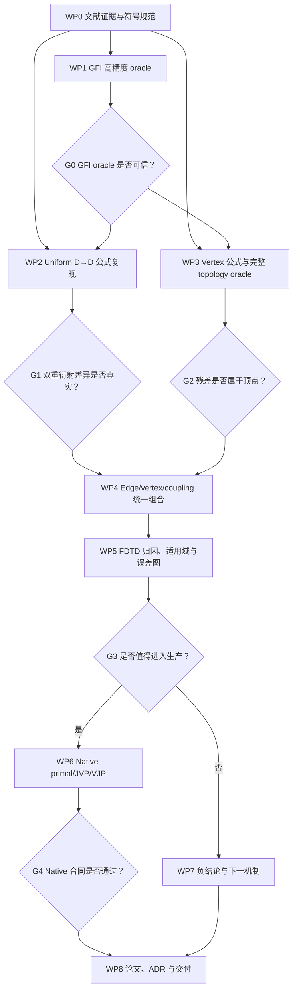

# 有限三维多面体 Maxwell 多重衍射：研究开题与 Agent 执行章程

> 状态：拟议研究章程；不是已接受的生产实现计划或 ADR
>
> 检索截止：2026-07-18
>
> 本仓库上下文（不影响本文独立阅读）：[顶点衍射研究章程](10-vertex-diffraction-research-charter.md)、
> [ADR-013 双重衍射](../standards/adr-013-double-diffraction.md)、
> [ADR-016 不完全过渡积分](../standards/adr-016-incomplete-transition-integral.md)

## 文档契约

本文同时是研究开题报告和 AI Agents 的执行合同。正文中的“必须”“不得”“仅当”是规范性要求；
附录中的文献判断用于解释这些要求的依据。任何 Agent 接手任务时，必须从具体任务卡开始，不得把
“继续调研”“尝试改进”当作可交付结果。

本文要推动的不是一个预设正确答案，而是一组可证伪研究：允许结论为“现有级联 D→D 已足够”、
“残差不属于顶点”或“通用路径分解不存在”。负结论只要满足复现与证据要求，同样视为有效完成。

### Agent 启动入口

当 Agent 收到“执行本章程”的指令时，必须按以下顺序开始：

1. 完整阅读仓库 `AGENTS.md`、本文第 1–12 节和自己任务依赖的附录；
2. 检查 `artifacts/polyhedral-maxwell/manifest.json` 是否存在；
3. 若不存在，只执行 T000，不自行跳到公式实现；
4. 若存在，读取 task registry 和最近 gate，只领取依赖已完成且状态为 `READY` 的一个 task；
5. 在 commentary 中报告 task ID、假设、允许写入范围和验收条件；
6. 完成后写 artifact、manifest 和自检结果，把状态改为 `REVIEW`，不得自行宣告 gate 通过；
7. Reviewer 只能依据冻结 artifact 和任务合同给出接受或退回。

Agent 的最终回答必须报告“完成了哪个 task、生成了哪些文件、哪些验收通过、哪些假设仍未决”，
不能只概述过程或建议下一步。

# 第一部分：研究立项

## 1. 项目摘要

### 1.1 待解决的问题

给定一个有限三维多面体、发射源、接收点、频率和电磁边界条件，射线传播系统把总场表示为直达、
反射（R）、透射（T）、边绕射（D）和顶点绕射（V）序列的相干和。本项目研究：

> 能否为任意 R/T/D/V 交互序列建立满足 Maxwell 方程的通用场表示；若通用严格闭式不可行，
> 能否建立一个低阶、统一、无重复计数、带失效判据且可原生 GPU 微分的有限多面体模型？

当前软件已经能处理一部分离散路径和级联双重衍射，但有限边端点、顶点波、相邻边耦合和重叠
过渡区仍可能造成不连续或全波残差。现有论文已经覆盖单楔、任意构型双楔、三直楔和特定 PEC
金字塔顶点，因此研究贡献不能是简单增加 D→D 或 V 项，而必须回答这些已知 canonical solutions
怎样在有限三维多面体中组合、去重、验证和进入原生可微软件。

### 1.2 总体目标

项目结束时必须形成下列两种结论之一：

- **正结论**：得到一个通过论文典型算例和现有收敛 FDTD 数据验证的有限多面体低阶统一模型，
  明确其适用域、误差和生产化条件；或
- **负结论**：用可复现证据证明候选 uniform D→D、vertex 或组合模型不能解释当前残差，或者其
  精度收益不足以承担生产复杂度，并明确下一个应研究的物理机制。

无论正负，项目都必须交付可复现 oracle、模型对照矩阵、研究决策记录和论文级结果图，不能只交付
文字综述。

### 1.3 近期研究对象

- 均匀外域中的有限 PEC 多面体；
- 点源或已知局部球面波照明；
- 固定频率与频率扫描；
- R、D、V 及其低阶组合，重点为 D→D、TX→V→RX、D→V 和 V→D；
- 固定离散 topology 下的连续几何和场导数；
- 现有 FDTD 收敛结果、论文 canonical cases 和高精度数值积分作为近期验证基础。

### 1.4 非目标

- 不宣称得到任意多面体、任意阶、全频段的有限闭式严格解；
- 不在首轮同时研究介质、阻抗、色散、穿透、粗糙面和 diffuse scattering；
- 不把独立 MoM/BEM/FEM 交叉验证设为近期 gate；
- 不在研究证据通过前修改生产 field model；
- 不用经验拟合掩盖 branch、相位、极化或重复计数错误；
- 不用 Torch、CPU 或有限差分形成生产数值后端。

### 1.5 研究价值

- **理论价值**：把“严格 Maxwell 总场”和“可解释 R/D/V 路径”之间常被忽略的表示鸿沟变成
  可检验问题，区分 canonical closed form、uniform asymptotics 和全局边界算子。
- **方法价值**：用预登记、held-out、完整 topology oracle 和负假设替代“看热图后调公式”的
  研究方式，使顶点归因和多重衍射归因能够被否证。
- **软件价值**：直接判断当前级联 D→D 是否需要 uniform coefficient、顶点行是否缺失、共享
  canonical integral 是否值得成为 CUDA primitive，以及哪些几何区域必须主动拒绝局部模型。
- **工程价值**：若正结论成立，可改善有限建筑/物体在阴影边界、顶点射线和多边遮挡处的复场；
  若负结论成立，可避免投入一个没有全波收益的复杂 native feature。

## 2. 研究问题、假设与证伪条件

### RQ1：通用严格路径解是否存在？

**工作假设 H1**：任意多面体的严格 Maxwell 总场可以由全局边界算子定义和数值求解，但一般不能
唯一压缩为有限个纯局部 R/D/V 系数的乘积。任意序列的通用有限闭式不是近期可兑现目标。

**证据任务**：从精确 wedge/quarter-plane、polyhedral singularity、BIE/T-matrix 和多重散射
文献中给出成立范围与反例机制。此任务只决定研究边界，不试图证明一个普遍“不可能定理”。

### RQ2：当前级联 D→D 是否遗漏 uniform double-diffraction physics？

**工作假设 H2**：在两个过渡区重叠、一个单绕射场被第二楔遮挡或边间距缩短时，当前逐边级联
D→D 与 Albani 2005 uniform dyadic 存在超过数值误差的幅相差异；该差异可能解释一部分现有
FDTD 残差。

**零假设 H2-0**：两者在当前软件适用域内等价到参考误差，或差异不能改善实际场景。

**证伪条件**：论文 canonical cases 复现无误后，uniform D→D 在预登记系统扫描中没有稳定超过
当前模型，或者收益小于 FDTD/采样不确定度，则停止生产化。

### RQ3：剩余场是否属于顶点/有限边端点机制？

**工作假设 H3**：exact incomplete-edge 与 Albani 等 2009 vertex wave 的相干组合，可以按空间
相位、距离阶、极化和顶点置换对称性解释当前顶点附近残差。

**零假设 H3-0**：残差主要来自近 PEC 采样、远端表面电流、缺失 topology、材料误差或其他
非顶点机制。

**证伪条件**：完整 topology oracle 下，vertex basis 在 held-out 扫描上的解释力不优于预登记
非顶点基底，或只通过逐点自由拟合才成立，则停止顶点归因。

### RQ4：能否形成统一且无重复计数的有限顶点邻域模型？

**工作假设 H4**：可以为一阶 edge、exact endpoint、vertex 和相邻 edge coupling 建立共同相位、
极化和渐近阶规范，并通过匹配项或减重项在 ISB/RSB、vertex ray 和 grazing 处保持连续。

**证伪条件**：若任意局部组合都必须依赖未压缩的全局表面电流才能通过验证，则项目转向长期
operator-hybrid 路线，不再声称得到纯局部 UTD 单元。

### RQ5：该模型能否成为原生可微 GPU 内核？

**工作假设 H5**：广义 Fresnel/相关 canonical integrals 及其 dyadic 组合可以实现稳定的原生
primal/JVP/VJP，在数学分支边界保持函数连续，并在固定 topology 下保持导数一致。

**证伪条件**：若稳定实现必须引入生产 CPU/Torch fallback、有限差分、不可控动态迭代或违反
现有 fusion/ABI 所有权，则停止生产实现并保留为离线 oracle。

## 3. 预期学术贡献

最终论文不得仅以“实现了已有公式”为主要贡献。至少需要完成下列一项主贡献和两项支撑贡献：

| 编号 | 候选贡献 | 类型 | 对软件的价值 |
|---|---|---|---|
| C1 | 有限 PEC 顶点邻域中 edge/endpoint/vertex/coupling 的一致组合与去重规则 | 主贡献 | 消除顶点 seam 与重复计数 |
| C2 | 级联 D→D 与 uniform D→D 的系统失效域、选择判据和全波归因 | 主或支撑 | 决定是否升级 ADR-013 模型 |
| C3 | Maxwell 边界/全波残差驱动的局部模型适用域或误差指标 | 主贡献 | 避免在近场和短边距盲用 UTD |
| C4 | generalized Fresnel + double/vertex dyadic 的原生可微 GPU 算法与全域误差图 | 主或支撑 | 直接支持 fields primal/JVP/VJP |
| C5 | R/D/V 交互图的 topology 完备性与无重复计数审计方法 | 支撑 | 防止字段公式正确但路径缺失/重复 |
| C6 | 证明当前候选模型不能解释残差，并识别非局部表面电流机制 | 有效负贡献 | 阻止错误生产实现，重定向长期研究 |

## 4. 成果与目录合同

### 4.1 研究产物根目录

所有未进入生产的研究输出必须写入：

```text
artifacts/polyhedral-maxwell/
├── manifest.json
├── decisions.md
├── bibliography/
├── conventions/
├── gfi/
├── double-diffraction/
├── vertex/
├── composite/
├── fullwave-attribution/
├── native-readiness/
└── paper/
```

计划 10 已有的 `artifacts/vertex-oracle/` 可以作为只读输入或通过 manifest 引用；Agent 不得复制后
形成两个无来源关系的顶点 oracle。若现有仓库的忽略规则或 artifact 规范要求不同，协调 Agent 必须
先记录实际路径映射，不能静默改目录。

### 4.2 每个实验的强制 manifest

每次可计入研究证据的运行必须记录：

- task ID、Git commit/worktree 状态和命令行；
- `witwin2` 环境、GPU、CUDA/driver、dtype；
- 输入文件及 SHA-256；
- 单位、时间约定、相位符号、极化基和角度分支；
- 随机种子或“确定性运行”声明；
- 输出文件、shape、字段含义和 SHA-256；
- 数值容差、失败样本和排除理由；
- 生成该产物的 Agent 与上游 task IDs。

没有 manifest 的图片、表格或数组不得进入 gate、论文或生产 ADR。

### 4.3 必交最终成果

1. `bibliography/evidence-matrix.md`：每篇论文解决了什么、没有解决什么、可复现对象是什么；
2. `conventions/symbol-map.md`：论文符号到本系统坐标、相位和 dyadic 基的唯一映射；
3. `gfi/report.md` 与机器可读参考数组；
4. `double-diffraction/report.md`：论文复现、当前模型对照、失效域；
5. `vertex/report.md`：顶点公式复现与 topology-complete oracle；
6. `fullwave-attribution/report.md`：预登记矩阵、held-out 结果与误差归属；
7. `decisions.md`：每个 gate 的通过/失败、证据链接和下一步；
8. `paper/draft.md`：按第 12 节论文结构形成的草稿；
9. 仅当生产 gate 通过时，提交独立 ADR、native contract、测试与性能证据。

## 5. 工作包与依赖关系



WP2 与 WP3 可以在 WP0 的符号冻结且 G0 通过后并行；在此之前不得并行各自发明坐标和相位规范。
WP6 必须等待 G3，不能以“提前搭框架”为理由修改生产 fields 或 native ABI。

### 5.1 初始 Agent 任务队列

下表是启动项目时的最小任务队列。Coordinator 可以拆小任务，但不得省略验收和依赖。状态只允许
`BLOCKED`、`READY`、`RUNNING`、`REVIEW`、`DONE`、`REJECTED`。

| Task ID | 初始状态 | Agent 角色 | 只读输入 | 允许写入 | 完成后解锁 |
|---|---|---|---|---|---|
| T000 | READY | Coordinator | 本章程、计划 10、ADR-013/016、仓库规范 | `artifacts/polyhedral-maxwell/manifest.json`、`decisions.md` | T010、T020 |
| T010 | BLOCKED | Literature | 核心论文与附录参考文献 | `bibliography/` | T020 |
| T020 | BLOCKED | Conventions | T010 evidence matrix、现有 fields/geometry conventions | `conventions/` | T110、T210、T310 |
| T110 | BLOCKED | Oracle | T020 symbol map、Carluccio 2011 | `gfi/` | T210、T310 |
| T119 | BLOCKED | Reviewer | T110 全部产物，只读生产代码 | `gfi/review.md` | G0 |
| T210 | BLOCKED | Oracle/Fields research | T110、Albani 2005、当前 D→D 只读接口 | `double-diffraction/` | T219 |
| T219 | BLOCKED | Reviewer | T210 全部产物 | `double-diffraction/review.md` | G1 |
| T310 | BLOCKED | Oracle/Topology research | T110、Albani 等 2009、现有 vertex artifacts | `vertex/` | T319 |
| T319 | BLOCKED | Reviewer | T310 全部产物 | `vertex/review.md` | G2 |
| T410 | BLOCKED | Theory/Fields research | 通过 G1/G2 的冻结 artifacts | `composite/` | T419 |
| T419 | BLOCKED | Reviewer | T410 全部产物 | `composite/review.md` | T510 |
| T510 | BLOCKED | Attribution | T210/T310/T410、收敛 FDTD 数据 | `fullwave-attribution/` | T519 |
| T519 | BLOCKED | Reviewer | T510 registry、原始结果和报告 | `fullwave-attribution/review.md` | G3 |
| T610 | BLOCKED | Native | G3 decision、已接受 ADR | 获批 owning production files、`native-readiness/` | T619 |
| T619 | BLOCKED | Native reviewer | T610 diff、tests、profiles | `native-readiness/review.md` | G4 |
| T710 | BLOCKED | Research writer | 所有 gate 与 artifact manifests | `paper/` | T719 |
| T719 | BLOCKED | Reproduction reviewer | T710 引用的全部核心结果 | `paper/reproduction-review.md` | 项目完成 |

T000 完成后只能将 T010/T020 中满足依赖的任务转为 READY。T210 与 T310 只有在 T119 接受 GFI
oracle 后才可并行 RUNNING。任何 task 进入 REVIEW 后，其实现 Agent 必须停止修改冻结产物；若
review 退回，则以新 artifact version 重新进入 RUNNING。

### 5.2 T000 启动命令与初始化检查

Coordinator 的第一个执行回合必须完成以下只读检查并将输出摘要写入 manifest：

```powershell
git status --short
conda run -n witwin2 python ci/run_ci_tier.py quick
```

若 quick 仅因研究产生的 dirty worktree 失败，必须记录各子检查结果，不得写成“CI 通过”。若存在
与本研究重叠的未提交修改，T000 必须登记文件 owner；不得覆盖或重置用户改动。

T000 随后创建 artifact schema version、task registry 和 convention version。研究脚本的实际命令
必须通过 `conda run -n witwin2 python ...` 执行；使用其他 Python 环境产生的数组不得进入 gate。

## 6. Agent 执行规则

### 6.1 角色

| 角色 | 责任 | 不得做的事 |
|---|---|---|
| Coordinator Agent | 冻结范围、分配 task、维护依赖图、审查 manifest、主持 gate | 不得替失败任务降低容差 |
| Literature Agent | 核对原论文、公式页、适用假设和引用链 | 不得只引用二手综述，不得把“未搜到”写成绝对首创 |
| Conventions Agent | 建立统一时间、相位、角度、极化和 dyadic 规范 | 不得为迎合结果逐 case 改符号 |
| Oracle Agent | 实现独立 fp64/高精度公式与 canonical cases | 不得调用生产实现作为自己的参考答案 |
| Geometry/Topology Agent | 枚举完整 R/D/V 行并验证几何约束 | 不得修改 fields 数值来补 topology 缺口 |
| Attribution Agent | 运行预登记 FDTD 对照、held-out 和不确定度分析 | 不得在看完 held-out 后重选主指标 |
| Native Agent | gate 通过后实现 CUDA primal/JVP/VJP 和 ABI contract | 不得增加 Torch/CPU/有限差分 fallback |
| Reviewer Agent | 只读复核推导、产物来源、负样本和 gate 判断 | 不得与被审查 Agent 共享同一未记录手工结果 |

一个 Agent 可以承担多个角色，但同一 task 的实现者不能是唯一 reviewer。

### 6.2 每个 Agent 必须接收的任务卡

协调 Agent 分派任务时必须填写：

```text
Task ID:
Research question / hypothesis:
Read-only inputs:
Allowed write roots:
Forbidden files/modules:
Required commands/environment:
Required outputs and schemas:
Acceptance tests:
Falsification / stop condition:
Upstream dependencies:
Downstream consumer:
```

缺少任一字段时，Agent 必须先补齐任务合同，不能自行扩大范围。

### 6.3 并行与写入纪律

- 两个 Agent 不得同时写同一报告、数据文件或生产模块；
- 并行任务通过不可变 artifact + hash 交接，不通过聊天中的未记录数字交接；
- 公式推导、oracle 和生产实现必须由不同 task 产生，禁止把同一代码既当被测对象又当参考；
- Reviewer 必须检查失败样本和被排除数据，不能只看汇总图；
- 任何坐标、相位或极化 convention 变化都会使下游 artifact 失效，必须提升 manifest 版本并重跑；
- 研究 Agent 默认不得写生产 `src/`；只有 WP6 的已批准任务卡可以写 owning facade/native owner。

### 6.4 阻塞报告

Agent 遇到公式歧义、论文缺页、branch 无法唯一确定或基准不能复现时，必须输出：

1. 最小歧义表达式和具体页码/公式号；
2. 已尝试的两个以上解释及其数值后果；
3. 哪些下游结论因此无效；
4. 建议向作者求证、寻找补充材料或停止该路线；
5. 不得用自由拟合选择“看起来最好”的解释。

## 7. 工作包任务卡

### WP0：文献证据、术语与 convention 冻结

**目标**：把附录文献变成可审计的公式和假设数据库，而不是摘要列表。

**任务**：

- 核对每篇核心论文的 DOI、版本、几何假设、场的时间约定、入射类型、有效区域和验证方法；
- 为每个候选公式记录原文公式号、所需参数、分支和退化极限；
- 建立 paper notation → canonical notation → repository notation 三列表；
- 预登记 WP2/WP3/WP5 的 case IDs、主指标和 held-out 切分；
- 明确“严格数值”“高频一致渐近”“启发式”和“工程级联”的标签。

**产物**：`bibliography/evidence-matrix.md`、`conventions/symbol-map.md`、
`conventions/case-registry.json`。

**验收**：Albani 2005、Albani 等 2009、Carluccio 等 2011/2012 的每个实现公式都能追溯到
页码/公式号；所有角度和极化基有机器可检查的定义；Reviewer 无需阅读聊天记录即可复现映射。

**停止条件**：关键论文无法获得足够公式信息时，后续对应工作包保持 blocked，不得猜实现。

### WP1：Generalized Fresnel Integral 高精度 oracle

**目标**：得到双重衍射和顶点衍射共享 canonical function 的独立数值真值。

**任务**：

- 按 Carluccio 等 2011 实现 fp64 论文算法；
- 建立更高精度积分/任意精度参考，仅用于离线 oracle；
- 扫描实参数、复参数、小参数、远尾、共轭和过渡分支；
- 验证论文给出的对称、极限和分区连接关系；
- 输出函数值和解析/高精度数值导数参考，但不形成生产有限差分导数。

**产物**：`gfi/cases.json`、`gfi/reference.npz`、`gfi/report.md`。

**验收**：所有预登记区域都有误差统计；远离零点报告相对误差、零点附近报告绝对误差；失败点
不得从统计中删除。具体容差在 WP0 根据参考积分条件数冻结，不能运行后放宽。

**Gate G0**：Reviewer 必须确认论文算法、高精度参考、对称/极限关系和失败点清单相互一致；
只有 G0 通过，WP2/WP3 才能使用该 GFI oracle。

**停止条件**：若论文算法的 branch 无法唯一复现，先返回 WP0 解决，不得进入 WP2/WP3。

### WP2：Uniform D→D 复现与当前模型对照

**目标**：判断当前级联 D→D 与 Albani 2005 uniform dyadic 的差异是否具有物理和软件价值。

**任务**：

- 复现论文任意构型双楔 canonical cases 和已公开 MoM 对照曲线；
- 验证 reciprocity、楔交换、远离过渡区退化、一个单绕射场被遮挡时的补偿；
- 用完全相同的几何、相位和极化输入运行当前 D→D；
- 扫描边间距、两个 transition variables、频率、极化和 skew angle；
- 在预登记现有 FDTD case 上比较 current、uniform 和关闭 D→D 三组模型。

**产物**：`double-diffraction/formula.md`、`cases.json`、`results.npz`、`report.md`。

**验收**：论文 case 先通过，才允许讨论系统收益；报告必须给出 complex field、幅度、相位和连续性，
不能只给 path loss；必须显示 uniform 模型更差的区域。

**Gate G1**：只有当差异超过 oracle/FDTD 不确定度，并在 held-out case 有一致收益，才进入 WP4；
否则记录 H2-0 并停止 D→D 生产升级。

### WP3：Vertex 公式与 topology-complete oracle

**目标**：判断有限边终止处是否存在当前路径表遗漏的可识别顶点贡献。

**任务**：

- 复现 Albani 等 2009 PEC pyramid/cube vertex dyadic；
- 生成独立于生产路径表的 TX→V→RX、D→V、V→D 候选行；
- 记录 vertex ID、incident faces/edges、观察扇区、极化基和 branch；
- 验证顶点/边置换、reciprocity、距离阶、阴影边界和 grazing 极限；
- 与 exact incomplete-edge、当前 edge/D→D 及预登记非顶点基底分别比较。

**产物**：`vertex/formula.md`、`topology.json`、`reference.npz`、`report.md`。

**验收**：oracle 必须在生产没有对应 row 时仍能合成顶点场；不得仅对已有 row 乘一个 vertex
权重；论文 canonical case 必须先于系统归因通过。

**Gate G2**：vertex basis 必须在 held-out 数据上同时符合相位、距离、极化和对称性，并优于
非顶点候选；否则接受 H3-0，不进入纯顶点生产实现。

### WP4：有限顶点邻域统一组合

**前置**：G1 或 G2 至少一个通过；若只通过一个，组合范围必须相应缩小。

**目标**：建立 edge、endpoint、uniform D→D、vertex 和必要 coupling 的共同记账规则。

**任务**：

- 为每项写出渐近阶、phase reference、spreading、dyadic 输入输出基；
- 定义每条物理机制的唯一 owner 和 topology row；
- 推导或构造匹配/减重项，防止 vertex 与 incident edges 重复计数；
- 检查 ISB、RSB、vertex ray、grazing 和相邻 transition overlap；
- 若必须加入拟合参数，预先限制参数数量、训练 case 和物理对称性，并与无参数模型分开报告。

**产物**：`composite/model.md`、`accounting-rules.json`、`results.npz`、`report.md`。

**验收**：每一项都能追溯到 canonical basis 或明确标注的 empirical correction；总场在预登记
seam 扫描上连续；删除任一项的 ablation 与物理预期一致。

**停止条件**：若去重无法在局部模型内定义，转向 operator-hybrid，不得用位置相关 clamp 隐藏。

### WP5：FDTD 归因、适用域与模型选择

**目标**：决定候选模型解释的是实际 Maxwell 残差，还是只复现 canonical 几何。

**任务**：

- 冻结 current、exact-G、uniform-D→D、vertex、composite 和 non-vertex baselines；
- 运行 near-wall、vertex-centered、ISB/RSB、三 cube 和频率/\(kL\) 扫描；
- 对照收敛 FDTD 的 complex field，而非仅 RSS/path loss；
- 报告参考离散误差、采样位置敏感度和模型误差；
- 用预登记训练/归因集决定模型，用 held-out 集做一次最终判断；
- 生成适用域地图和“何时拒绝局部模型”的判据。

**产物**：`fullwave-attribution/registry.json`、`results.npz`、`error-map.*`、`report.md`。

**Gate G3**：进入生产必须同时满足：论文 canonical cases 通过；held-out 收益超过参考不确定度；
现有已通过场景无不可接受回归；新增复杂度对应可识别物理机制；适用域和拒绝条件可执行。

若失败，输出负结论和下一候选机制，不得通过缩小展示窗口制造成功。

### WP6：Native primal/JVP/VJP 生产候选

**前置**：G3 通过，且独立 ADR 接受数值和 fusion boundary。

**目标**：把已验证的最小物理单元实现为唯一原生 CUDA backend。

**任务**：

- 由 owning Python facade 进行契约验证和 native dispatch；
- 实现 fused primal 及注册的 JVP/VJP/backward companions；
- 覆盖 fixed-topology tx/rx、连续几何和被批准参数的导数；
- 验证 fp32/fp64、branch 连续性、primal/dual lockstep、ABI 和负向 no-fallback；
- 记录 launch、同步、resident intermediates、寄存器和性能预算。

**产物**：独立 ADR、binding manifest/coverage 更新、native tests、AD tests、性能报告。

**验收**：遵守仓库 native-only policy；不增加 Torch/CPU/NumPy/有限差分生产计算；不增加未获
批准的 launch、同步和持久 tape；输出与冻结 oracle 在批准误差内。

**Gate G4**：native contract、direct test、end-to-end caller、primal/JVP/VJP lockstep、
no-fallback negative tests 和适用 CI tier 必须全部通过；性能或数值预算任一不通过都不得交付生产。

### WP7：负结论与长期 operator-hybrid 路线

**触发**：G1、G2 或 G3 失败，或 WP4 证明纯局部去重不可行。

**目标**：把失败转化为可复用研究结论，而不是丢弃数据。

**任务**：

- 列出被否定假设、最小反例和其稳定性；
- 判断缺失机制更接近全局表面电流、近场、短距强耦合、resonance 还是 topology；
- 评估 HNA-BEM、block T-matrix 或边界算子低秩压缩是否能形成下一项目；
- 明确哪些 artifact 仍可作为未来 oracle；
- 不修改生产模型。

**产物**：`decisions.md`、`paper/negative-result-outline.md`、下一阶段开题草案。

### WP8：论文与项目交付

**目标**：形成论文级论证链和可复现材料。

**任务**：

- 从 manifest 自动生成 case 表、版本表和结果索引；
- 区分已有公式、本文推导、本文实现和本文实验发现；
- 同时报告支持与反驳样本；
- 用 reviewer task 重跑核心图表；
- 给出对当前软件应“实现、保留 oracle、或拒绝”的明确决定。

**完成条件**：第 4.3 节成果齐全，所有 gate 有签名式 decision entry，核心结果能从干净环境命令
复现，论文 novelty claim 与附录文献矩阵一致。

## 8. Gate 记录格式

每个 gate 必须在 `decisions.md` 追加不可覆写记录：

```text
Gate ID and date:
Decision: PASS | FAIL | RE-SCOPE
Frozen hypotheses:
Evidence artifact hashes:
Primary metrics and uncertainty:
Known counterexamples/regressions:
Reviewer task ID:
Authorized downstream tasks:
Forbidden downstream tasks:
```

不得删除旧决定；新证据只能追加 superseding record，并说明为什么旧证据不足。

## 9. 验证矩阵

| 维度 | 必测区域 | 主要失败形式 |
|---|---|---|
| 几何 | coplanar/skew edges、短/长边距、凸/凹顶点、有限 edge endpoint | 路径不存在、错误 branch、重复 row |
| 过渡 | ISB、RSB、两个过渡区重叠、vertex ray、grazing | 发散、台阶、错误补偿、双计数 |
| 电磁 | 两个主极化、cross-pol、reciprocity、复场 | 幅度对但相位错、基变换错 |
| 尺度 | 频率、\(kL\)、源/观察距离、近 PEC 距离 | 高频模型在近场被误用 |
| 数值 | fp64 oracle、fp32 candidate、极小/极大 canonical arguments | cancellation、overflow、branch discontinuity |
| AD | fixed topology tx/rx/geometry JVP/VJP、branch 邻域 | primal 正确但导数错误 |
| 系统 | canonical、单 cube、三 cube、held-out scenes | canonical 成功但系统无收益 |

所有汇总图必须能回溯到逐 case complex results。只给平均 path loss、NMSE 或平滑后的热图不能
独立通过 gate。

## 10. 项目级停止与转向条件

出现以下任一情况时，Coordinator 必须停止相应路线并记录，而不是继续增加自由参数：

1. 核心论文公式无法唯一复现；
2. 候选模型只在训练位置改善，held-out 不改善；
3. 改善小于 FDTD 收敛/采样不确定度；
4. 模型破坏 reciprocity、极化、相位或已接受连续性；
5. 必须依赖当前生产输出才能生成“独立”oracle；
6. 纯局部系数无法避免依赖全局表面电流；
7. 生产化必须违反 native-only、ABI ownership、fusion 或 no-fallback 约束；
8. 三重或更高阶项没有数据证明是主导残差。

转向不等于失败：H2/H3 被否定后，下一候选可以是 nonlocal surface-current correction、短距强
耦合算子或 topology completeness；但必须创建新的假设和任务卡，不能偷偷扩大原任务。

## 11. 完成判据

只有同时满足以下条件，本项目才可标记完成：

- 所有执行过的 WP 有 manifest、报告、失败样本和 reviewer 记录；
- H2/H3/H4/H5 各有接受、拒绝或明确未决状态；
- “通用严格闭式”与“有限高频统一模型”的边界在论文中没有混淆；
- 至少形成一项 C1–C6 贡献，并有两个支撑贡献；
- 对当前软件形成明确行动：生产实现、保留离线 oracle，或不实施；
- 若进入生产，独立 ADR 和对应 CI tier 已通过；
- 若不进入生产，负结论足以阻止后续 Agent 重复同一无效路线。

## 12. 论文草稿结构

1. **Introduction**：软件残差、有限多面体场问题和准确限定的 novelty claim；
2. **Related Work**：single/multiple wedge、vertex、polyhedral Maxwell、GPU differentiable RT；
3. **Problem Formulation**：PEC Maxwell、R/D/V topology、严格总场与渐近路径分解；
4. **Canonical Building Blocks**：GFI、uniform D→D、vertex；
5. **Unified Accounting or Negative Result**：组合、减重、或局部模型不可行证据；
6. **Differentiation and GPU Formulation**：仅在 H5 成立时；
7. **Validation Protocol**：预登记 cases、FDTD uncertainty、held-out；
8. **Results**：canonical → attribution → system → performance；
9. **Limitations**：\(kL\)、near-field、materials、topology change、nonlocal currents；
10. **Conclusion**：对理论和当前软件分别给出结论。

# 第二部分：问题定义、可行性与文献证据

## A. 可行性结论

“任意有限三维多面体、任意交互序列的严格 Maxwell 解”必须拆成三个不同目标，否则很容易把
严格解、渐近闭式和工程射线模型混为一谈。

| 目标 | 可行性判断 | 含义 |
|---|---|---|
| 严格 Maxwell **边值问题的数值解** | 可行且已有成熟基础 | 用 EFIE/MFIE/CFIE、MoM/BEM、FEM、FDTD、MLFMA 或 T-matrix 数值求解；“严格”指方程和边界条件严格，结果仍有离散与迭代误差 |
| 固定规范下的**形式多重散射展开** | 条件可行 | 可写成算子逆、Neumann/Foldy-Lax/T-matrix 型展开；只有在相应算子级数收敛时才等于全场，而且“某条交互序列的场”通常不是唯一物理可观测量 |
| 任意多面体、任意阶、全频段的**通用有限闭式射线公式** | 不宜作为可兑现目标 | 目前没有这样的通式；边、顶点、近场、共振、重叠过渡区和全局表面电流使问题不能普遍化为有限个局部系数的乘积 |

因此，值得开展的不是“再次发明多阶衍射”，也不是宣称发现了一个完全无人研究的问题，而是：

1. 为有限三维 PEC 多面体建立**低阶、统一、无重复计数、带误差指标**的 Maxwell 渐近表示；
2. 把严格全波算子压缩成可由射线拓扑调用的局部或低秩修正，并给出适用域与失效判据；
3. 让双重/三重/顶点衍射在重叠过渡区保持一致，同时具有可在原生 CUDA 中实现的
   primal/JVP/VJP；
4. 用现有 FDTD 收敛证据和论文基准确定“缺的是顶点、边间耦合、有限边端点，还是近场全局电流”，
   而不是先拟合一个没有物理归属的补偿项。

对当前软件最直接的优先级是：**先复现 Albani 2005 的任意构型双重衍射，比较当前级联
D→D；并行复现 Albani 等 2009 的 PEC 金字塔顶点系数和 Carluccio 等 2011 的广义 Fresnel
积分算法。** 三重衍射已有 2012 年结果，只有数据表明确显示 D→D→D 是主导残差时才值得进入
近期实现。

近期范围应固定为均匀外域中的 PEC 多面体。介质、阻抗、色散和穿透问题是后续扩展，不能与顶点
和多重衍射的首轮归因混在同一研究阶段。按照当前计划约束，首轮研究以现有收敛 FDTD 数据和
论文 canonical cases 为验证基础，**暂不把独立 MoM/BEM/FEM 交叉验证设为进入下一阶段的必要
门槛**；这些严格数值方法在本文中主要用于界定理论版图和长期 operator-hybrid 方向。

## B. 严格 Maxwell 解的数学边界

以时谐 PEC 散射为例，严格问题是求外域中的 \(\mathbf E,\mathbf H\)：

\[
\nabla\times\mathbf E=i\omega\mu\mathbf H,\qquad
\nabla\times\mathbf H=-i\omega\epsilon\mathbf E+\mathbf J,
\]

并满足 PEC 边界条件 \(\mathbf n\times\mathbf E=0\) 和外域辐射条件。对介质或阻抗多面体还要增加
界面连续条件、色散和损耗模型。

这里至少有四种常被混用的“解”：

- **精确解析解**：满足连续 Maxwell 方程的解析表达，通常只存在于球、无限平面、无限楔等高度
  对称的典型问题；积分表示也可以是精确解析表示，但不等于有限个初等/特殊函数组成的闭式。
- **高频渐近解**：GTD/UTD、物理光学、等效边缘电流等；在 \(kL\to\infty\) 下按阶逼近，
  可以在阴影边界附近做一致化，但不是全频段严格解。
- **严格数值解**：从完整 Maxwell 边值问题出发，随网格、基函数阶数和迭代容差收敛；它不是
  闭式，却是任意几何最现实的基准答案。
- **工程射线模型**：将反射、透射、绕射系数沿离散路径组合；高效、可解释，但其路径分解和
  截断本身就是模型选择。

本综述把“严格 Maxwell”保留给第一种或第三种，不把 UTD 闭式称为严格解。

## C. 文献地图

### C.1 从 GTD 到单楔 UTD：已有的共同地基

- Keller 的 [Geometrical Theory of Diffraction](https://doi.org/10.1364/JOSA.52.000116)
  （1962）把边缘和焦散产生的新射线纳入几何光学，是整个路径化衍射框架的起点。
- Kouyoumjian 与 Pathak 的
  [PEC 楔边 UTD](https://doi.org/10.1109/PROC.1974.9651)（1974）用过渡函数消除普通
  GTD 在入射/反射阴影边界上的发散或不连续，是当前单边绕射系数的直接理论祖先。
- Nethercote、Assier 与 Abrahams 的
  [完美楔解析方法综述](https://doi.org/10.1016/j.wavemoti.2019.102479)（2020）系统梳理
  Sommerfeld-Malyuzhinets、Wiener-Hopf、Kontorovich-Lebedev 等方法。它也说明：即使是二维
  无限楔，精确理论也依赖典型几何和复杂变换；不能直接推广成任意有限三维多面体闭式。

这部分不是研究真空。新的论文必须明确相对标准 UTD 增加了什么：有限边、端点/顶点、多个重叠
过渡区、非局部耦合、误差界，或可微且 GPU 可实现的数值内核。

### C.2 双重、三重和一般高阶边绕射：不是空白

多阶衍射已有一条连续而明确的文献链。

| 工作 | 已解决的核心问题 | 仍未解决的边界 |
|---|---|---|
| Capolino、Albani、Maci、Tiberio，[共面斜边双重衍射](https://doi.org/10.1109/8.611240)（1997） | 两条共面斜边的双重绕射与过渡区 | 构型受限 |
| Albani，[任意构型双楔的一致双重衍射系数](https://doi.org/10.1109/TAP.2004.841289)（2005） | 取消两边共面假设；给出高频解析闭式 dyadic；用广义 Fresnel 积分处理重叠过渡区，并与 MoM 比较 | 仍是高频局部典型模型，不是任意有限多面体的严格全场 |
| Holm，[高阶楔绕射系数](https://doi.org/10.1109/8.509892)（1996） | 构造更高阶楔绕射场 | 高阶组合和过渡区计算复杂 |
| Andersen，[多边过渡区 UTD](https://doi.org/10.1109/8.596898)（1997） | 多边过渡区的一致处理框架 | 近边间距和一般三维顶点耦合仍困难 |
| Tzaras 与 Saunders，[改进的启发式多边过渡区解](https://doi.org/10.1109/8.982446)（2001） | 用 slope diffraction 提高多边预测且成本较低 | 明确是启发式；短边距构型仍会失准 |
| Holm，[多边过渡区高阶场求和](https://doi.org/10.1109/TAP.2004.827489)（2004） | 处理边数增加后高阶级数慢收敛 | 并未给出任意三维多面体的统一有限闭式 |
| Carluccio、Puggelli、Albani，[任意构型三直楔一致三重衍射](https://doi.org/10.1109/TAP.2012.2209623)（2012） | 三条直 PEC 楔、球面入射、重叠过渡区的解析 UTD dyadic | 固定三阶、直楔、高频假设 |

因此下列论文命题不成立：

- “学术界没有双重衍射闭式”；
- “没有任意摆放双楔的统一系数”；
- “三重衍射尚未有人研究”；
- “把单楔系数连续相乘就是新的任意阶严格理论”。

对当前系统尤其重要的是，ADR-013 的 D→D 是工程级联族；Albani 2005 则专门处理单楔系数连续
相乘在重叠过渡区失效的问题。两者应先做公式级和数据级对照，不能默认已经等价。

### C.3 顶点、角区和有限边端点

- Satterwhite 的
  [四分之一平面精确解](https://doi.org/10.1109/TAP.1974.1140803)（1974）和 Sahalos、
  Thiele 的[顶点场本征函数解](https://doi.org/10.1109/TAP.1983.1142987)（1983）表明，
  三维角点典型问题有深厚的谱理论基础，但不是一个可直接套到任意多面体的普适系数。
- Ivrissimtzis 的
  [Edge wave vertex and edge diffraction](https://doi.org/10.1029/RS024I006P00771)
  （1989）从 edge wave 的顶点终止出发讨论边与顶点绕射，对识别“边端点项”和“独立顶点波”
  很关键。
- Albani、Capolino、Carluccio、Maci 的
  [PEC 分片结构 UTD 顶点系数](https://doi.org/10.1109/TAP.2009.2027455)（2009）给出有限
  源/接收距离下的金字塔尖端一致一阶高频 dyadic，并明确覆盖由三条正交边组成的
  cube/parallelepiped 顶点。它使用广义 Fresnel 积分，并与全波 MoM 对照。这正是现有
  [计划 10](10-vertex-diffraction-research-charter.md) 应先复现的论文基线。
- Carluccio、Puggelli、Albani 的
  [广义 Fresnel 积分算法](https://doi.org/10.1109/TAP.2011.2163774)（2011）同时服务于双楔和
  顶点绕射，覆盖实际和虚参数，是最直接的原生数值内核参考。
- Assier 与 Abrahams 的
  [四分之一平面研究](https://doi.org/10.1137/19M1258785)（2021）说明，经典 Radlow
  ansatz 虽能意外给出很好的远场结果，却不满足完整兼容条件。这是一个重要警告：远场拟合良好
  不足以证明得到了严格顶点解。
- Lyalinov 的
  [平面角扇形顶点球面波绕射系数](https://doi.org/10.1016/j.wavemoti.2015.01.001)
  （2015）以及任意光滑凸锥方向系数的
  [Babich 等工作](https://doi.org/10.1137/S003613999833366X)（2000）提供更一般角域的谱/渐近
  入口，但离“任意有限多面体 + 任意序列 + 闭式”仍很远。

顶点衍射同样不是空白。更准确的空白是：**怎样把顶点、相邻有限边端点和边间耦合组成一个
可验证、无重复计数、在有限距离与重叠过渡区一致的三维多面体局部单元。**

### C.4 任意多面体的严格数值 Maxwell 基础

- Rao、Wilton、Glisson 的
  [任意形状表面电磁散射](https://doi.org/10.1109/TAP.1982.1142818)（1982）奠定三角面片
  RWG 基函数与 EFIE/MoM 的经典基础。它说明任意多面体有严格的边界积分数值路线，但不会自然
  输出有限条“物理路径”。
- Song、Lu、Chew 的
  [MLFMA](https://doi.org/10.1109/8.633855)（1997）展示了大型复杂三维目标全波积分方程的
  加速方向。它解决的是严格数值计算规模，不是闭式多阶衍射。
- Markkanen 与 Yuffa 的
  [任意形状粒子簇快速叠加 T-matrix](https://doi.org/10.1016/j.jqsrt.2016.11.004)
  （2017）把单体 VIE/T-matrix 与多体传播算子组合，是研究“算子级交互序列”和可重求和表示的
  重要参考。
- Costabel 与 Dauge 的
  [多面体域 Maxwell 场奇异性](https://perso.univ-rennes1.fr/monique.dauge/publis/CoDaMax_prep.html)
  （Archive for Rational Mechanics and Analysis, 2000）证明边和多面体角会产生角度依赖的奇异性；
  非凸边附近的场一般甚至没有平方可积梯度。它直接限制了对几何导数光滑性和单一局部系数的
  乐观假设。
- Groth、Hewett、Langdon 的
  [Hybrid Numerical-Asymptotic BEM](https://doi.org/10.1016/j.wavemoti.2017.12.008)
  （2018）在二维可穿透凸多边形上把 GO/衍射先验和 BEM 残差空间结合起来。虽然不是三维 PEC
  多面体答案，却给出了最值得借鉴的方法论：射线渐近负责已知振荡结构，数值算子只修正剩余场，
  并以收敛而不是经验拟合作为依据。

这些文献决定了一个重要表述：**“任意多面体严格 Maxwell 解”已有通用数值框架，真正缺的是
既保留严格算子控制、又能压缩成高频路径模型的中间层。**

### C.5 射线路径、GPU 与可微性

- Hoydis 等的 [Sionna RT](https://arxiv.org/abs/2303.11103)（2023，预印本/软件论文）说明
  GPU 可微射线追踪已经成为无线数字孪生的重要方向，但可微路径几何不等于严格 Maxwell 场。
- Eertmans 等的
  [多反射/多衍射可微 GPU 路径求解](https://arxiv.org/abs/2510.16172)（2025，预印本）用 Fermat
  原理统一任意反射/直边衍射序列，并通过隐式微分得到路径几何梯度。它非常适合
  `propagation.geometry` 的固定拓扑 stationary solve 参考，但论文并未提供任意阶严格 Maxwell
  场系数。
- Egea-Lopez 等的 [Opal](https://doi.org/10.1371/journal.pone.0260060)（2021）展示了 OptiX
  无线传播模拟器能高效支持高阶反射，但当时仍只实现单阶衍射。这从软件侧说明：路径搜索、字段
  系数、重复消除和 GPU 成本共同限制了多阶衍射落地。

目前检索到的工作里，尚未看到一套公开、经过严格验证的方案同时具备：任意多面体低阶统一
多重衍射、顶点/边端点去重、解析或稳定数值 JVP/VJP、以及过渡区全域 GPU 原生实现。这是一个
可信的工程—学术交叉空白，但正式投稿前仍需做系统检索和引用网络追踪，不能仅凭关键词搜索宣称
“全球首创”。

## D. 为什么通用有限闭式不现实

### D.1 局部典型问题不能覆盖全部全局边界电流

无限楔系数只依赖局部楔角、入射方向和观察方向；有限多面体的表面电流还依赖远端面、其他边、
内部/外部共振和所有多次耦合。两个局部邻域完全相同的多面体，也可能因远处几何不同而具有
不同的顶点附近总场。因此不存在普遍成立的纯局部有限系数乘积，除非把全局信息重新装入某个
算子或无限级数。

### D.2 边与角的奇异谱随几何变化

Costabel-Dauge 的结果表明，Maxwell 解在多面体边角处的正则性由相关角域本征问题决定。任意
二面角、立体角和非凸连接会改变奇异指数；这不是一张固定系数表就能完全覆盖的离散分类问题。

### D.3 任意交互序列不是独立可观测量

若将边界积分算子写成形式上的

\[
u=(I-K)^{-1}u_{\mathrm{inc}}
  =u_{\mathrm{inc}}+Ku_{\mathrm{inc}}+K^2u_{\mathrm{inc}}+\cdots,
\]

每个 \(K^m\) 可以解释成第 \(m\) 次相互作用，但只有在级数收敛时才等于算子逆；近共振、强
耦合或近距离边/面会造成慢收敛或不收敛。进一步把每项分解成 R、D、V 等射线，还依赖基函数、
渐近变形和重复计数约定。总场是物理可观测的，单条“严格路径场”通常不是唯一的。

### D.4 过渡区会合产生更高维典型积分

单边 UTD 的 Fresnel 过渡函数不能自动解决两个或三个 saddle/pole 同时会合。双楔、三楔和顶点
文献分别引入广义 Fresnel 或更复杂的谱合成，恰好说明“逐边相乘”不是统一方法。随着交互阶数
增加，典型积分维数、区域分支和数值稳定性都会增长。

### D.5 全频段与高频射线是不同承诺

当 \(kL\lesssim 1\)、边间距很短、观察点近表面或存在共振时，高频渐近阶次不再提供可靠的小
参数。此时应转向严格数值算子或混合修正，而不是继续增加局部 UTD 阶数并称其为严格解。

## E. 候选研究真空

以下“真空”是基于本次文献链的**候选空白**。置信度表示“尚未发现直接完整解决方案”的程度，
不是对全球文献的数学证明。

| 方向 | 新颖性判断 | 软件价值 | 风险 | 建议优先级 |
|---|---|---:|---:|---:|
| A. 有限三维 PEC 多面体的 edge-endpoint/vertex/D→D 一致复合单元，含去重规则 | 高；已有组成公式，但缺少面向任意有限邻域的统一组合与可验证归属 | 很高 | 高 | 1 |
| B. 当前级联 D→D 与 Albani 2005 uniform dyadic 的系统差异、失效域和自适应选择 | 中高；基础公式已有，但软件系统级比较与判据可能新 | 最高 | 中 | 1 |
| C. 从 Maxwell 边界算子残差构造局部非局部性指标，决定何时 UTD 不足 | 高；把全波残差变成射线模型误差证书是核心缺口 | 很高 | 很高 | 2 |
| D. 顶点/双重/三重一致系数的原生 CUDA primal/JVP/VJP，跨分区连续且有误差图 | 中高；数学公式已有，可微稳定实现研究不足 | 很高 | 中高 | 2 |
| E. 保留路径归因的算子级多重散射重求和，并给出截断/收敛界 | 高 | 中高 | 很高 | 3 |
| F. 多面体交互拓扑的完备枚举与 R/D/V 重复计数代数 | 中高；几何算法不少，但与一致场分解联合研究较少 | 很高 | 中高 | 2 |
| G. 任意阶多边衍射的通用闭式系数 | 过宽；已有高阶级数和固定二/三阶解，真正任意构型会迅速退化为算子问题 | 不确定 | 极高 | 不建议直接立项 |

### E.1 最强近期论文题目：统一有限顶点邻域

建议将 A 具体化为：

> 对有限三维 PEC 多面体，在固定一阶/二阶相互作用预算内，构造由 exact incomplete-edge、
> vertex wave 和 adjacent-edge coupling 组成的一致场；给出边端点/顶点归属和无重复计数规则，
> 并用收敛 FDTD 数据验证其在顶点射线、ISB/RSB、grazing 和 \(kL\) 扫描上的适用域。

它比“任意多面体任意阶严格闭式”窄得多，却同时满足：

- 有明确已有基线：Albani 2005、Albani 等 2009、Carluccio 等 2011/2012；
- 有当前系统真实残差和失败位置；
- 有可证伪机制：若完整顶点基底仍不能解释残差，就停止顶点归因；
- 有工程落点：D→D、V、edge→V/V→edge 以及过渡函数内核；
- 有合理发表贡献：统一组合、误差域、去重和验证，而非重新包装已知单项公式。

### E.2 最强软件论文题目：可微一致多重衍射内核

建议将 D 具体化为：

> 构造广义 Fresnel/Faddeeva 类过渡函数及双重/顶点 dyadic 的定工作量 GPU 算法，覆盖复参数、
> 阴影边界和极限分支；实现解析或伴随一致的 primal/JVP/VJP，并给出 fp32/fp64 全域误差图、
> 梯度检查和性能模型。

单纯“移植到 CUDA”通常不够学术；真正的贡献应包含区域划分、稳定渐近式、误差界或经验上界、
分支连续性、导数稳定性和批处理执行效率。

### E.3 长期高风险题目：算子压缩为可归因路径

建议将 C/E 合并为长期命题：从 EFIE/CFIE 的严格算子出发，用局部 canonical basis 加低秩全局
修正表示表面电流；将每个修正投影回 R/D/V 交互图，同时保留总场误差估计。它接近 HNA-BEM、
T-matrix 和路径模型的交叉区域，潜在价值最高，但数学与实现风险都远超计划 10。

## F. 对当前软件系统的直接帮助

### F.1 论文—模块映射

| 论文/方法 | 当前系统可直接吸收的内容 | 预期所有者 |
|---|---|---|
| Albani 2005 uniform double diffraction | 替换或校准级联 D→D；构建 overlapping-transition 对照矩阵 | `propagation.fields`，离散 pair 属于 `propagation.topology` |
| Albani 等 2009 vertex | cube/orthogonal-pyramid 顶点 oracle；V 行的 dyadic 场 | V 行属于 `propagation.topology`，连续量属于 `propagation.geometry`，场属于 `propagation.fields` |
| Carluccio 等 2011 GFI | 双重/顶点共享的特殊函数与分支测试 | 原生 CUDA 数值 primitive，由对应 fields facade 唯一拥有 ABI |
| Carluccio 等 2012 triple diffraction | D→D→D 的公式基线；仅在残差证明需要后进入生产 | topology/geometry/fields 按现有 typed contracts 分层 |
| Holm 1996/2004、Andersen 1997 | 高阶级数、过渡区和慢收敛警告；用于设计截断与重求和实验 | 离线 oracle，成熟后再决定生产所有者 |
| Costabel-Dauge 2000 | 非凸边/角处导数正则性和 AD 拒绝条件；避免承诺跨拓扑光滑梯度 | `propagation.geometry` 与 AD contract |
| Eertmans 等 2025 | 固定交互序列的 Fermat 求解和隐式微分 | `propagation.geometry`；不作为 fields 物理来源 |
| HNA-BEM | “已知射线基底 + 数值残差修正”的研究设计 | 仅离线研究/oracle；生产化需独立 ADR，不能成为 CPU fallback |

### F.2 与架构约束的关系

若研究最终进入生产，必须保持仓库现有边界：

- 离散序列、winner、vertex/edge ID 和规范化顺序属于 `propagation.topology`；
- stationary point、长度、方向、法线与固定 winner 的导数属于 `propagation.geometry`；
- dyadic 系数、相位、极化传播和原生 derivative companions 属于 `propagation.fields`；
- 广义 Fresnel 等热路径运算必须是原生 CUDA；Torch 只能做契约和编排；
- 离线 Python/fp64/FDTD oracle 可以用于研究与测试，但不能成为生产 fallback；
- 不能逐论文增加相互不兼容的特殊路径。双重、顶点和三重项必须共享统一的拓扑 ID、极化基、
  相位规范、极限规则和去重约定。

### F.3 最值得立即建立的对照数据

1. **双楔论文基准**：复现 Albani 2005 图表中的任意构型、过渡区与 MoM 对照量；与当前 D→D
   在幅度、相位、极化和极限上逐点比较。
2. **顶点论文基准**：复现 Albani 等 2009 的正交金字塔/cube 顶点；先做 standalone fp64
   oracle，不接生产。
3. **共享特殊函数基准**：复现 Carluccio 等 2011 的实/虚参数区域；覆盖小参数、远尾、共轭、
   对称和导数。
4. **系统残差矩阵**：复用计划 10 的 exact-G、FDTD 收敛数据和完整顶点 topology oracle；分别
   测 edge only、D→D uniform、V only、edge+V、edge+V+coupling。
5. **失效域扫描**：对 \(kL\)、边间距、顶点距离、入射/观察 grazing、凹凸角和极化做扫描；
   输出模型选择图，而不仅是平均 NMSE。

## G. 建议的论文主张与不建议的主张

### G.1 可以成立的主张

- “提出有限三维 PEC 顶点邻域的一致 edge/vertex/coupling 复合模型，并以收敛全波数据给出
  适用域和误差图。”
- “首次在某一明确范围内实现并验证 uniform double/vertex dyadic 的 GPU 原生可微算法。”
- “提出具有 Maxwell 边界残差指标的自适应 ray/operator hybrid，并证明或实证其误差控制。”
- “给出 R/D/V 交互图的无重复计数规范和拓扑完备性验证方法。”

### G.2 不建议的主张

- “首次解决多阶衍射”——双重、三重和高阶级数文献均已存在；
- “得到任意有限三维多面体的严格闭式 Maxwell 解”——除非实际给出并证明完整连续边值问题的
  通式，否则该说法会被轻易否定；
- “与 FDTD 接近即证明公式严格”——数值吻合只能支持准确性，不能把渐近模型变成严格解析解；
- “任意交互序列都有唯一严格物理场”——路径分解通常依赖表示与规范；
- “可微路径几何等于可微 Maxwell 解”——场系数、拓扑切换、边角奇异性和材料算子仍需独立处理。

## H. 核心参考文献清单

### H.1 基础与单楔

1. J. B. Keller, “Geometrical Theory of Diffraction,” *JOSA*, 1962.
   [DOI](https://doi.org/10.1364/JOSA.52.000116)
2. R. G. Kouyoumjian and P. H. Pathak, “A Uniform Geometrical Theory of Diffraction for an Edge in a Perfectly Conducting Surface,” *Proceedings of the IEEE*, 1974.
   [DOI](https://doi.org/10.1109/PROC.1974.9651)
3. M. A. Nethercote, R. C. Assier, and I. D. Abrahams, “Analytical Methods for Perfect Wedge Diffraction: A Review,” *Wave Motion*, 2020.
   [DOI](https://doi.org/10.1016/j.wavemoti.2019.102479)

### H.2 双重、三重与高阶衍射

4. F. Capolino, M. Albani, S. Maci, and R. Tiberio, “Double Diffraction at a Pair of Coplanar Skew Edges,” *IEEE TAP*, 1997.
   [DOI](https://doi.org/10.1109/8.611240)
5. M. Albani, “A Uniform Double Diffraction Coefficient for a Pair of Wedges in Arbitrary Configuration,” *IEEE TAP*, 2005.
   [DOI](https://doi.org/10.1109/TAP.2004.841289)
6. P. D. Holm, “UTD-Diffraction Coefficients for Higher Order Wedge Diffracted Fields,” *IEEE TAP*, 1996.
   [DOI](https://doi.org/10.1109/8.509892)
7. J. B. Andersen, “UTD Multiple-Edge Transition Zone Diffraction,” *IEEE TAP*, 1997.
   [DOI](https://doi.org/10.1109/8.596898)
8. C. Tzaras and S. R. Saunders, “An Improved Heuristic UTD Solution for Multiple-Edge Transition Zone Diffraction,” *IEEE TAP*, 2001.
   [DOI](https://doi.org/10.1109/8.982446)
9. P. D. Holm, “Calculation of Higher Order Diffracted Fields for Multiple-Edge Transition Zone Diffraction,” *IEEE TAP*, 2004.
   [DOI](https://doi.org/10.1109/TAP.2004.827489)
10. G. Carluccio, F. Puggelli, and M. Albani, “A UTD Triple Diffraction Coefficient for Straight Wedges in Arbitrary Configuration,” *IEEE TAP*, 2012.
    [DOI](https://doi.org/10.1109/TAP.2012.2209623)

### H.3 顶点与角区

11. R. S. Satterwhite, “Diffraction by a Quarter Plane, the Exact Solution, and Some Numerical Results,” *IEEE TAP*, 1974.
    [DOI](https://doi.org/10.1109/TAP.1974.1140803)
12. J. Sahalos and G. Thiele, “The Eigenfunction Solution for Scattered Fields and Surface Currents of a Vertex,” *IEEE TAP*, 1983.
    [DOI](https://doi.org/10.1109/TAP.1983.1142987)
13. L. P. Ivrissimtzis, “Edge Wave Vertex and Edge Diffraction,” *Radio Science*, 1989.
    [DOI](https://doi.org/10.1029/RS024I006P00771)
14. M. Albani, F. Capolino, G. Carluccio, and S. Maci, “UTD Vertex Diffraction Coefficient for the Scattering by Perfectly Conducting Faceted Structures,” *IEEE TAP*, 2009.
    [开放版本](https://escholarship.org/uc/item/78r6z1x6) · [DOI](https://doi.org/10.1109/TAP.2009.2027455)
15. G. Carluccio, F. Puggelli, and M. Albani, “Algorithm for the Computation of the Generalized Fresnel Integral,” *IEEE TAP*, 2011.
    [DOI](https://doi.org/10.1109/TAP.2011.2163774)
16. R. C. Assier and I. D. Abrahams, “A Surprising Observation in the Quarter-Plane Diffraction Problem,” *SIAM Journal on Applied Mathematics*, 2021.
    [DOI](https://doi.org/10.1137/19M1258785)
17. M. A. Lyalinov, “Electromagnetic Scattering by a Plane Angular Sector I: Diffraction Coefficients of the Spherical Wave from the Vertex,” *Wave Motion*, 2015.
    [DOI](https://doi.org/10.1016/j.wavemoti.2015.01.001)

### H.4 严格数值、奇异性与混合方法

18. S. M. Rao, D. R. Wilton, and A. W. Glisson, “Electromagnetic Scattering by Surfaces of Arbitrary Shape,” *IEEE TAP*, 1982.
    [DOI](https://doi.org/10.1109/TAP.1982.1142818)
19. J. Song, C.-C. Lu, and W. C. Chew, “Multilevel Fast Multipole Algorithm for Electromagnetic Scattering by Large Complex Objects,” *IEEE TAP*, 1997.
    [DOI](https://doi.org/10.1109/8.633855)
20. M. Costabel and M. Dauge, “Singularities of Electromagnetic Fields in Polyhedral Domains,” *Archive for Rational Mechanics and Analysis*, 2000.
    [作者页面与预印本](https://perso.univ-rennes1.fr/monique.dauge/publis/CoDaMax_prep.html)
21. J. Markkanen and A. J. Yuffa, “Fast Superposition T-Matrix Solution for Clusters with Arbitrary-Shaped Constituent Particles,” *JQSRT*, 2017.
    [NIST 页面](https://www.nist.gov/publications/fast-superposition-t-matrix-solution-clusters-arbitrary-shaped-constituent-particles) · [DOI](https://doi.org/10.1016/j.jqsrt.2016.11.004)
22. S. P. Groth, D. P. Hewett, and S. Langdon, “A Hybrid Numerical-Asymptotic Boundary Element Method for High Frequency Scattering by Penetrable Convex Polygons,” *Wave Motion*, 2018.
    [DOI](https://doi.org/10.1016/j.wavemoti.2017.12.008)

### H.5 GPU 与可微射线

23. J. Hoydis et al., “Sionna RT: Differentiable Ray Tracing for Radio Propagation Modeling,” 2023.
    [arXiv](https://arxiv.org/abs/2303.11103)
24. E. Egea-Lopez et al., “Opal: An Open Source Ray-Tracing Propagation Simulator for Electromagnetic Characterization,” *PLOS ONE*, 2021.
    [DOI](https://doi.org/10.1371/journal.pone.0260060)
25. J. Eertmans et al., “Fast, Differentiable, GPU-Accelerated Ray Tracing for Multiple Diffraction and Reflection Paths,” 2025，预印本。
    [arXiv](https://arxiv.org/abs/2510.16172)

## I. 检索限制

本综述以论文题名、DOI、作者机构页面、期刊页面和引用链为主，重点覆盖 electromagnetic UTD、
vertex/quarter-plane、multiple-edge transition、Maxwell polyhedral singularity、BIE/T-matrix/HNA 和
differentiable ray tracing。它足以否定“多阶衍射整体没有论文”的说法，并支持上述候选方向；但在
正式撰写 novelty claim 前仍应补做 IEEE Xplore、Web of Science/Scopus、MathSciNet 和专利库的
系统检索，记录检索式、时间范围和排除标准。
