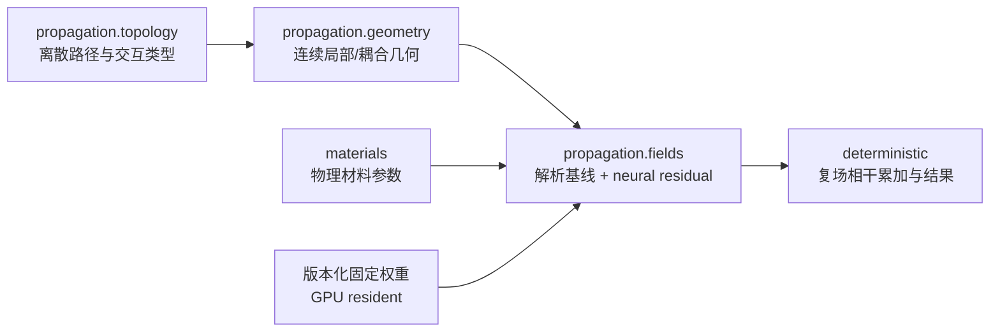

# 通用神经衍射组件：研究开题、产品路线与 Agent 执行章程

> 状态：拟议研究章程；不是已接受的生产实现计划或 ADR
>
> 检索截止：2026-07-18
>
> 相关研究：[有限三维多面体 Maxwell 多重衍射章程](11-polyhedral-maxwell-multiple-diffraction-research-charter.md)

## 文档契约

本文独立定义“神经衍射”要解决的问题、训练范式、物理边界、确定性 RT 集成方式、实验、gate 和
Agent 任务。读者不需要先读其他计划即可理解项目。本文中的“必须”“不得”“仅当”是研究与产品
判据，不表示当前生产代码已经具有神经模型。

本项目默认路线是：

> 用大量跨几何、跨材料、跨频率的离线样本训练一次，在新 site 不重新训练即可使用的通用衍射
> 组件。site-to-site fitting 只能作为可选的小型校准层，不能成为基础能力成立的条件。

这与 DLSS/通用 denoiser 的相似之处是“训练成本集中在供应方、固定权重随软件发布、用户场景直接
推理”；它并不是图像去噪算法。神经衍射的输出是必须保留复相位、极化、互易性和渐近极限的电磁
传输算子，并会在多径系统中相干相加，错误比单个像素误差更容易被放大。

# 第一部分：研究立项与产品决策

## 1. 待解决的问题

确定性射线追踪首先产生离散传播路径及其连续几何，然后为直达、反射、透射和衍射交互计算复电场。
经典 UTD 对无限直楔和部分高频区域非常有效，但有限边端点、顶点、相邻边耦合、重叠过渡区、复杂
材料和波长尺度几何仍可能产生系统误差。严格全波方法可以提供总场，却通常不适合在电尺寸很大的
场景中逐路径实时运行。

本项目研究：

> 能否保留确定性 RT 的路径枚举、几何、解析 UTD 基线和相干累加，只用一个预训练、跨 site
> 泛化、物理受约束的神经算子修正解析衍射模型在明确适用域内的复 Jones 传输误差？

近期产品主线不研究“用一个网络代替整个 RT”，也不承诺从纯局部输入恢复任意有限多面体的严格
Maxwell 总场。远端面电流、共振和非局部多次耦合没有进入特征时，网络不可能凭空知道它们；此时
正确行为是报告分布外或回到已验证的解析模型，而不是给出自信的黑盒结果。本文同时保存一个独立、
长期的 global Maxwell resolvent 研究支线；该支线使用完整场景输入、独立任务和 gates，不改变近期
local component 的产品合同。

## 2. 产品路线决策

### 2.1 三种范式

| 范式 | 训练数据 | 新 site 是否训练 | 权重表示什么 | 本项目地位 |
|---|---|---:|---|---|
| A. 通用预训练衍射组件 | 大量 canonical/full-wave/多场景离线数据 | 否 | 一类衍射交互的通用规律和解析模型残差 | **主路线** |
| B. 通用基座 + site 小校准 | A 的数据，加少量现场复信道/材料数据 | 可选 | 通用规律 + 低维材料/偏差参数 | 可选增强，不能成为依赖 |
| C. site-specific neural field | 单一场地的大量测量或仿真 | 是 | 该场地本身及其隐式材料/传播场 | 对照路线，不进入通用组件 |

选择 A 的原因不是单纯偏好，而是它最符合当前软件的产品边界：确定性 topology 和 geometry 已由
RT 提供，缺的是一个更好的 field interaction operator；若每个 site 都要先采集数据和优化网络，
系统就变成无线数字孪生校准服务，而不再是可直接使用的 RT 求解器。

### 2.2 与 DLSS/denoiser 的准确类比

| 方面 | DLSS/通用 denoiser | 本项目的神经衍射 |
|---|---|---|
| 训练部署 | 跨内容离线训练，部署固定权重 | 跨 canonical 几何/材料/频率离线训练，部署固定权重 |
| 运行输入 | 低分辨率/噪声图、运动和几何缓冲 | RT 已知的路径、局部几何、材料、频率和解析系数 |
| 运行输出 | 图像或像素修正 | 复数 $2\times2$ Jones 衍射算子修正 |
| 必须守恒的结构 | 时空稳定、图像边缘和感知质量 | 相位、极化、互易性、单位、渐近极限和过渡连续性 |
| 组合方式 | 屏幕空间重建 | 沿路径复算子级联，最终跨路径相干求和 |
| site fitting | 通常不需要 | 主路线不需要；只允许可选低维校准 |

因此，“像 DLSS”只描述产品训练/部署模式。数学上，它更接近一个预训练的、物理约束的 neural
scattering operator 或 learned residual closure。

### 2.3 冻结为两条独立研究路线

本计划同时保存下列两个方案，但不把它们实现成同一个网络：

| 项目 | 方案 A：Local neural/symbolic diffraction | 方案 B：Global Maxwell resolvent operator |
|---|---|---|
| 核心目标 | 修正 D1、DD、V 等明确 interaction class 的解析系数 | 近似完整 polyhedral scene 的 outgoing Maxwell inverse/Green tensor |
| 数学 domain | path/event space 的局部 symmetry quotient $\mathcal X_D/G$ | variable-size 全局场景、材料和 source/query operator |
| 典型输入 | D1 为 16/20 个无量纲实特征；DD 暂定 43 个 | boundary mesh/incidence graph、材料函数、$\omega$、$J$ 或 $(x,y)$ |
| 输出 | 复 $2\times2$ Jones residual，即 4/8 个实数 | $(E,H)$ 场函数或复 $3\times3$ Green tensor |
| locality | interaction-local 或 finite-cluster-local | scene-global |
| 参数目标 | D1 约 3k–15k；全部 heads 优先小于 100k | 不预设小参数；容量随 geometry/operator representation 研究 |
| 部署方式 | 固定权重，直接嵌入 deterministic RT fields | 长期全波 surrogate/preconditioner/oracle；不是当前 RT field plug-in |
| “严格”含义 | 在声明域内相对 reference 的受约束近似 | Maxwell residual、boundary/radiation residual 和 error certificate |
| “通用”含义 | 跨 site 复用同一局部 coefficient | 跨 variable-size polyhedral scenes 复用同一 global operator model |
| 当前优先级 | **主线，直接软件价值最高** | **长期高风险研究支线** |

两条路线的关系是单向可审计交接，而不是隐式耦合：

1. 方案 B 可以为方案 A 产生全局 residual、非局部失效域和高保真 teacher evidence；
2. 方案 A 的 canonical bases 可以成为方案 B 的 feature、preconditioner 或可解释 decomposition 候选；
3. 方案 A 不依赖方案 B 成功才可完成 G1–G4；
4. 方案 B 不得以“全局模型会补偿”为理由放宽方案 A 的 reciprocity、OOD 或 seam gate；
5. 方案 B 若进入生产，必须新增 architecture decision/ADR；它不能作为当前 native RT 失败后的
   Torch/CPU/full-wave fallback。

计划中的 N 系列任务属于方案 A；U 系列任务属于方案 B。两者共享文献、Maxwell convention、场景
group split 和 reference uncertainty，但模型 checkpoint、评价结论、gate 和论文主张分别管理。

## 3. 可行性结论

### 3.1 总结

- **研究可行性：高。** 确定性 RT 已提供结构化路径行，网络不必学习路径搜索，只需学习较低维的
  局部或成对交互残差。
- **学术潜力：中高。** 已有论文展示 neural diffraction interaction，但“全波监督的解析残差、
  跨 geometry-family 泛化、硬物理约束、D→D/vertex、原生 JVP/VJP”仍是可信候选空白。
- **数据可行性：中。** 可以从一个 canonical 全波求解产生很多观察方向、距离和频率样本，但相邻
  样本高度相关；真正的数据量必须按独立几何配置计数，不能用接收点数量虚增。
- **近期生产可行性：中。** 小型 MLP 的 CUDA 推理容易，困难在可信训练集、分布外检测、复场标签、
  native AD 和证明它没有破坏已有解析极限。
- **取代 UTD 或整个 RT：低，不建议。** 最稳健路线是 analytic baseline + neural residual。

### 3.2 核心可证伪假设

**H1：局部残差可压缩。** 在预先定义的 local/coupled domain 内，全波或高精度 canonical 解与解析
UTD 的差异可以由有限维无量纲不变量预测。

**H2：通用性来自物理坐标而非场景记忆。** 若输入不包含绝对世界坐标、scene ID、object ID 或场景
尺度，模型仍能在未见过的楔角、频段、材料组合和完整几何族上改善复场。

**H3：解析残差比纯网络替代更稳。** hybrid 模型在分布内优于 analytic baseline，在分布外退化到
baseline，并比纯 MLP 更好地保持互易性、极限和连续性。

**停止条件：** 若按完整 geometry family 划分的 held-out 测试中，改进不超过参考解不确定度，或
收益只能通过 site ID、每场景 latent code、逐 site 微调获得，则“通用衍射组件”假设失败。此时可把
结果转成 site calibration 研究，但不得把它作为同一产品目标宣告成功。

## 4. 模型定义

### 4.1 推荐形式：解析模型上的加性复残差

对一条衍射交互或一个显式耦合交互，令 $x$ 表示 RT 已知状态，推荐模型为：

$$
J_{\mathrm{hybrid}}(x)
=J_{\mathrm{analytic}}(x)
+S(x)\,W(x)\,\Delta\widehat J_{\theta}(\Phi(x)).
$$

- $J_{\mathrm{analytic}}$：已验证的 UTD、uniform D→D 或 vertex 基线；
- $S(x)$：显式物理尺度，吸收已知距离、波数和量纲；
- $W(x)$：确定性 validity envelope，在已知解析极限、训练域外和不可信区域把修正连续压到零；
- $\Phi(x)$：无量纲、规范化、对刚体变换不敏感的物理特征；
- $\Delta\widehat J_\theta$：小型网络输出的无量纲复 Jones 残差。

选择加性残差而非直接预测总系数，是为了保留已知物理，并避免在解析系数接近零时使用不稳定的
相对误差。网络输出优先使用实部/虚部，不使用会在 $-\pi/\pi$ 发生 wrapping 的幅相参数化。

### 4.2 通用不等于单一网络覆盖所有机制

建议把“通用组件”实现成共享规范下的模型族，而不是让一个 head 猜交互类型：

1. `D1`：单楔一阶衍射残差，第一研究目标；
2. `DD`：相邻双边/双楔耦合残差，输入两个交互的联合不变量，不能简单把 `D1` 调用两次冒充；
3. `V`：有限边端点/顶点邻域残差，只有计划 11 的物理归因通过后才启动；
4. `ERR`：误差/适用域 head，预测 analytic 与 hybrid 的可信区间或拒绝标志。

这些 head 可以共享 feature encoding 和数值 primitive，但必须分别建立标签归属、基线和 gate。

### 4.3 输入特征

`D1` 的候选特征只使用局部、可观测、无量纲量：

- $ks,ks'$：入射和出射段的电长度；
- 楔外角、入射/出射方向相对楔的正弦和余弦；
- UTD transition variables、grazing/shadow-boundary signed distances；
- 到两端点的 $kL_\pm$，仅在 finite-edge 研究已定义时使用；
- 频率相关的复介电常数、导电率、磁参数或经过标准化的**物理材料描述**；
- 解析系数、其 validity indicators 和条件数类特征；
- canonical 极化基变换，不使用全局 XYZ 分量直接学习旋转规律。

`DD` 还需要边间电距离、两楔相对姿态、两 stationary points、联合 transition variables 和交互顺序。
禁止输入绝对世界坐标、scene/object ID、训练数据文件 ID 或任意能让模型记住 site 的哈希。

### 4.4 强制物理约束

硬约束应优先通过参数化、canonical frame、特征共享和 envelope 实现，而不是全部变成可被网络权衡
掉的 soft loss：

- 刚体平移/旋转不变或等变；
- edge direction reversal、face swap 和规范化楔面顺序的一致性；
- 发射/接收交换下的电磁互易关系；
- 极化基变换正确，输出为复线性算子；
- 远离过渡区、适当高频/远场极限回到解析基线；
- 阴影边界、反射边界和 validity envelope 边界的连续性；
- SI 单位和无量纲缩放一致；
- 相同物理行在 batch row permutation 后输出不变。

能量/passivity、Maxwell 边界残差和 uncertainty calibration 可先作为 soft constraint 与审计指标，
在其适用假设明确后再决定是否硬编码。

### 4.5 它是 local 还是 global？

结论是：

> **模型参数化是 interaction-local；双重衍射是 finite-cluster-local；训练可以加入 global
> scene loss；最终信道通过 path composition 和 coherent path sum 成为 global。**

这里必须区分四种“局部/全局”：

| 层 | 数学对象 | 范围 | 本项目选择 |
|---|---|---|---|
| interaction-local | 单个楔交互的 Jones operator | 当前交互、相邻两段和有限边局部数据 | **D1** 主模型 |
| cluster-local | 两个或少数强耦合交互的联合 operator | D→D pair 或 vertex neighborhood | **DD**/**V** 独立 head |
| path-global | 一条完整 R/T/D 序列的级联传输 | TX 到 RX 的一条 path | 由确定性 RT 组合，不用 Transformer 重新学习 |
| scene-global | 所有 paths、远端表面和全局边界电流 | 完整 site | 相干求和/全波 reference；不作为基础网络输入 |

**D1** 隐含一个可证伪的局部 Markov 假设：给定规范化局部状态 $z_j$，该交互修正不再依赖 scene 的
其他部分。若两个局部状态完全相同、但因远端表面电流或共振而需要不同修正，则 **D1** 不可辨识；
正确动作是把该区域标为非局部、扩大成明确的 **DD**/**V** cluster，或拒绝 neural correction。不得加入
scene ID 或全局 latent 来掩盖这个失败。

### 4.6 Path space 的严格定义

Path space 是正确的上层组织空间，但 **D1** 网络不是直接把“一整条 path”编码成输出。给定场景
$\mathcal S$、TX $x_0$、RX $x_{m+1}$ 和离散交互序列
$\tau=(\tau_1,\ldots,\tau_m)$，定义一个 topology stratum：

$$
\mathcal P_\tau(\mathcal S)
=\left\{
p=(x_0,x_1,\ldots,x_m,x_{m+1})\;:\;
x_j\text{ 满足 }\tau_j\text{ 的几何、可见性和 stationary 条件}
\right\}.
$$

完整 path space 是不同离散 topology 的不交并：

$$
\mathcal P(\mathcal S)
=\bigsqcup_{m\geq 0}\;\bigsqcup_{\tau\in\{R,T,D,V,\ldots\}^m}
\mathcal P_\tau(\mathcal S).
$$

它是 **stratified/disjoint-union space**，不是一个普通固定维欧氏向量空间。路径深度、交互类型、
winner、edge/face ID 是离散变量；交互点、方向、长度和材料状态是每个 stratum 内的连续变量。
这与当前 fixed-topology AD 完全一致：导数只在一个冻结 stratum 内定义，不能把 topology switch
当作普通连续导数。

对 path $p$ 的第 $j$ 个衍射事件，使用局部抽取映射

$$
\pi_{D,j}:(\mathcal S,p,j)\longmapsto z_j\in\mathcal X_D,
$$

再经 symmetry quotient 和数值 encoding：

$$
z_j\longmapsto [z_j]\in\mathcal X_D/G
\xrightarrow{\;\Phi_D\;}\phi_j\in\mathbb R^{d_D},
$$

其中 $G$ 至少包含全局刚体变换，并按 convention 处理 edge reversal 和 face swap。因此：

- **path space 算，而且是训练样本来源和全局组合的母空间；**
- 网络的直接 domain 是 path space 经局部抽取、物理对称商和 feature encoding 后的
  $\mathcal X_D/G$；
- **D1** 不能外推到 **DD** 或 **V** stratum；新的 topology 类型需要新的 head 和独立 gate。

### 4.7 单楔局部状态与具体输入

对第 $j$ 个 D 事件，定义未编码物理状态：

$$
z_j=
\left(
k,\ell_j^-,\ell_j^+,
\widehat d_j^-,\widehat d_j^+,
\widehat e_j,n_j^0,n_j^1,
r_j^-,r_j^+,
m_j
\right).
$$

各项含义为：

| 参数 | 物理意义 | 自由度/备注 |
|---|---|---|
| $k=2\pi f/c$ | 波数 | 不单独直接输入；进入电长度和材料评价 |
| $\ell_j^-,\ell_j^+$ | 前一交互到楔、楔到后一交互的距离 | 2 个正实数 |
| $\widehat d_j^-,\widehat d_j^+$ | 入射和出射单位传播方向 | 各 2 个内在自由度 |
| $\widehat e_j$ | 规范化 edge direction | 用于建 canonical frame，不作为世界坐标输入 |
| $n_j^0,n_j^1$ | 有序两楔面法线 | 确定 wedge angle/frame；消除全局旋转后只留下局部几何 |
| $r_j^-,r_j^+$ | 交互点到两个有限边端点的距离 | infinite-wedge model 可省略 |
| $m_j$ | 交互频率处的物理边界描述 | PEC 为空；阻抗面可用两面的归一化复表面阻抗 |

令 $R_j=R(\widehat e_j,n_j^0,n_j^1)\in SO(3)$ 是确定性 canonical frame，
$\beta_j$ 是楔角，$q_j\in\mathbb R^4$ 是从 analytic UTD 计算得到的四个 signed transition
variables。建议 **D1-v0** encoding 为：

$$
\Phi_D(z_j)=
\left[
\begin{array}{c}
\log(1+k\ell_j^-),\ \log(1+k\ell_j^+)\\
\sin\beta_j,\ \cos\beta_j\\
R_j^\mathsf T\widehat d_j^-,\ R_j^\mathsf T\widehat d_j^+\\
\log(1+kr_j^-),\ \log(1+kr_j^+)\\
q_j\\
\psi_m(m_j)
\end{array}
\right].
$$

所有长度都只以电长度出现。对于完全由频率处表面阻抗描述的材料，不再额外输入裸
**frequency_hz**；色散通过 $m_j(f)$ 体现。若存在物理厚度 $t$，输入 $kt$，而不是米和 Hz 两个可让
网络学习单位的量。

### 4.8 输入维度和输出维度

必须区分 **物理流形的内在维度** 与 **送进 MLP 的冗余编码维度**。单位向量、sin/cos 和 derived
transition variables 会增加张量列数，但不会增加新的物理自由度。

**D1-v0** 的建议维度合同为：

| 输入块 | 编码列数 |
|---|---:|
| 两段电长度 | 2 |
| wedge angle 的 sin/cos | 2 |
| canonical 入射/出射方向的 XYZ 分量 | 6 |
| 两个 endpoint 电距离 | 2 |
| 四个 analytic transition variables | 4 |
| PEC material descriptor | 0 |
| 两个 isotropic faces 的复归一化表面阻抗 | 4 |

因此：

- finite PEC **D1-v0**：$d_D=16$；
- infinite PEC（不含 endpoint）：$d_D=14$；
- finite isotropic-impedance **D1-v0**：$d_D=20$；
- 不计 derived $q_j$ 且商掉刚体变换后，finite D1 的连续内在维度约为
  $2+1+4+2+d_m=9+d_m$；严格 Keller-cone constraint 还会再减一个自由度。

这个 16/20 列 schema 是研究期可检验建议，不是已经冻结的 native ABI。N020 必须用可辨识性、
消融和数值条件证据决定是否保留冗余 transition columns。

主输出是 canonical 入/出极化基之间的复 Jones residual：

$$
\Delta\widehat J_\theta:\mathbb R^{d_D}\longrightarrow\mathbb C^{2\times2}
\cong\mathbb R^8.
$$

- 一般各向异性、cross-polarizing 模型输出 8 个实数：
  $\Re J_{11},\Im J_{11},\ldots,\Re J_{22},\Im J_{22}$；
- 对 isotropic PEC 且理论保证 canonical soft/hard basis 下为 diagonal 的版本，应硬参数化为
  $\mathbb C^2\cong\mathbb R^4$，而不是让网络学习 off-diagonal 接近零；
- uncertainty head 独立输出 8 个 log-variance，或先用 1 个整体 log-scale；
- validity/OOD head 独立输出一个 $[0,1]$ score；不得把 score 混入 8 个物理输出。

**DD-v0** 是 cluster-local。最简单的、故意冗余的 provisional encoding 为两个 **D1-v0** PEC
features 加以下 pair context：

$$
\left[
\log(1+kd_{12}),
R_1^\mathsf T\widehat e_2,
R_1^\mathsf T\widehat r_{12},
q_{12}^{\mathrm{joint}}\in\mathbb R^4
\right].
$$

它有 $16+16+1+3+3+4=43$ 个输入实数，输出仍是一个联合
$\mathbb C^{2\times2}\cong\mathbb R^8$ operator residual。43 只是便于首轮实验的上界 schema；
共享中间段、重复材料和约束方向可在不改变物理状态后压缩。不得为了维度小而把真正非可分的 DD
强制写成两个 16→8 的 **D1** 乘积。

顶点的面/边 valence 可变，不应现在伪造一个固定输入维度。若后续启动 **V**，需在“固定最大 valence
的 padded canonical fan”和“permutation-equivariant set encoder”之间另做 ADR/研究决策。

### 4.9 局部算子怎样产生全局信道

设 $F_\ell(p,f)$ 是第 $\ell$ 段的已知自由空间传播与极化 transport，$J_{\tau_j}$ 是第 $j$ 个交互
operator。单条 path 的复传输为：

$$
T_\theta(p,f)
=A_{\mathrm{rx}}(p,f)
\left[
\overleftarrow{\prod_{j=1}^{m}}
F_j(p,f)\,J_{\tau_j,\theta}(z_j)
\right]
F_0(p,f)\,A_{\mathrm{tx}}(p,f).
$$

只有当 $\tau_j=D$ 时才使用 **D1** hybrid operator；**DD** row 使用独立联合 operator，不能与两个
D1 rows 重复计数。接收信道是确定性 RT 找到的全部有效 paths 的相干和：

$$
H_\theta(\mathcal S,x_{\mathrm{tx}},x_{\mathrm{rx}},f)
=\sum_{p\in\mathcal P_{\mathrm{valid}}(\mathcal S)}
w_p\,T_\theta(p,f).
$$

所以网络没有读取全 scene，最终 $H_\theta$ 仍然是 scene-global 的。模型的跨 site 泛化来自同一个
local operator 被组合到新场景的新 paths 上，而不是通过一个新场景 latent 记忆全局场。

### 4.10 训练分布、部署分布和 loss

不能简单写成“$x$ 在一个盒子里均匀采样”。先定义 scene/path/event 上的测度
$\mu(\mathcal S,p,j)$，再把它 push forward 到模型输入空间：

$$
\nu_D=(\Phi_D\circ\pi_{D,j})_\#
\left[
\mu(\mathcal S,p,j)\mid \tau_j=D
\right].
$$

这里的 $\#$ 表示 push-forward measure。推荐训练分布是三部分混合：

$$
\nu_{\mathrm{train}}
=\alpha\,\nu_{\mathrm{canonical}}
+\beta\,\nu_{\mathrm{scene-path}}
+\gamma\,\nu_{\mathrm{boundary/active}},
\qquad \alpha+\beta+\gamma=1.
$$

- $\nu_{\mathrm{canonical}}$：覆盖楔角、材料、电长度和方向的设计分布；
- $\nu_{\mathrm{scene-path}}$：从有代表性的 deterministic RT path rows 得到的部署先验；
- $\nu_{\mathrm{boundary/active}}$：主动加密 transition、grazing、endpoint 和 high-uncertainty 区；
- 真正部署分布记为 $\nu_{\mathrm{deploy}}$，必须与训练覆盖和 OOD rejection 一起报告。

同一全波 solve 产生的大量相邻 rows 属于同一个 configuration group。train/test split 在
$(\mathcal S,\text{geometry family},\beta,\text{material family},\text{frequency band})$ 组上进行，
不能在 rows 上随机切分。评估同时报告：

1. 对 canonical 参数空间近似均匀的 physics coverage metric；
2. 按 $\nu_{\mathrm{deploy}}$ 加权的产品 metric；
3. 训练 support 外的拒绝率和 analytic-only 结果。

局部 teacher loss 直接比较复 operator：

$$
\mathcal L_{\mathrm{local}}
=\mathbb E_{z\sim\nu_{\mathrm{train}}}
\left[
\left\|
J_{\mathrm{analytic}}(z)
+S(z)W(z)\Delta\widehat J_\theta(\Phi_D(z))
-J_{\mathrm{ref}}(z)
\right\|_{Q(z)}^2
\right],
$$

其中 $Q(z)$ 可由 teacher covariance/uncertainty 给出，不能让不收敛 reference 与高质量 reference
等权。总目标为：

$$
\mathcal L
=\mathcal L_{\mathrm{local}}
+\lambda_{\mathrm{global}}\mathcal L_{\mathrm{coherent\ scene}}
+\lambda_{\mathrm{rec}}\mathcal L_{\mathrm{reciprocity}}
+\lambda_{\mathrm{sym}}\mathcal L_{\mathrm{symmetry}}
+\lambda_{\mathrm{lim}}\mathcal L_{\mathrm{limit}}
+\lambda_{\mathrm{cal}}\mathcal L_{\mathrm{uncertainty}}.
$$

$\mathcal L_{\mathrm{coherent\ scene}}$ 可以用整个新场景的复 $H$ 监督局部共享权重，但不得引入
per-site trainable latent。若只有加入该 latent 才能降低 global loss，则那是 site-specific model，
不是本文的通用组件。

### 4.11 参数量可以而且应当很小

输入维度小不自动保证网络小；真正让小模型可行的是先解析地移除高频和奇异结构。网络不得学习：

- 已知自由空间相位 $\exp(-ikL)$；
- 已知几何扩散和单位缩放；
- analytic UTD 已正确描述的主项；
- canonical frame 的刚体旋转；
- 能由确定性 transition variables 表达的快速分支变化。

它只学习经过 $S(z)$ 归一化后的 bounded complex residual。项目的工作假设是该 residual 在每个已声明
stratum 内足够平滑，因此不需要 NeRF、scene Transformer、hash grid、大型 GNN 或 material/object
embedding table。若 residual 仍含随 $kL$ 快速旋转的相位，应先检查 phase convention、GO subtraction
和 analytic factorization，而不是先增加网络宽度。

对输入维度 $d$、输出维度 $o$、$L$ 个等宽 hidden layers 和宽度 $h$ 的全连接 MLP，参数量为：

$$
N_\theta=(d+1)h+(L-1)h(h+1)+(h+1)o.
$$

建议的 capacity ladder 为：

| 模型 | 输入→hidden→输出 | 参数量 | FP32 权重 |
|---|---|---:|---:|
| D1 PEC diagonal-small | 16→32→32→32→4 | 2,788 | 约 10.9 KiB |
| D1 PEC full-Jones-small | 16→32→32→32→8 | 2,920 | 约 11.4 KiB |
| D1 PEC full-Jones-default | 16→48→48→48→8 | 5,912 | 约 23.1 KiB |
| D1 impedance upper baseline | 20→64→64→64→64→8 | 14,344 | 约 56.0 KiB |
| DD PEC provisional | 43→64→64→64→8 | 11,656 | 约 45.5 KiB |

因此首轮合理目标是：

- 单个 D1 head：约 3k–15k trainable parameters；
- D1、DD、uncertainty/validity heads 合计：优先控制在 100k 参数以内，即 FP32 小于约 0.4 MiB；
- 128-width、约 50k 参数的 D1 只作为 capacity upper baseline，不作为默认产品设计；
- 禁止用 site/object/material ID embedding 增加随场景数量增长的参数。

参数少不表示训练样本可以少。相反，大量跨 geometry-family 数据训练一个小模型，有助于迫使它学习
共享物理规律而不是记忆场景。模型选择必须画出 error–parameter–latency Pareto curve，并选择满足
G1–G3 的最小模型；不能只按训练 loss 选择最大网络。

还必须区分模型文件大小与逐 row 计算量。一个 6k 参数 MLP 只占约 24 KiB，但对一百万 interaction
rows 仍约有数十亿级 dense MAC。生产 gate 因此同时限制参数、每 row 运算、launch、临时显存和实际
吞吐。权重小且被大量 rows 重复使用，有利于 GPU cache/residency；是否足够快仍必须由 fused native
benchmark 决定，不能由参数量推断。

### 4.12 Symbolic neural network 的角色与“通用解”边界

Symbolic neural network 可以使用，而且与“小参数、可解释、原生可微”的目标相符；但它有四种不同
用法，不能混称为“学出公式”：

| 路线 | 得到什么 | 推荐程度 |
|---|---|---:|
| Equation Learner/EQL | 从预选的加、乘、sin、cos 等算子组成稀疏表达式 | 高，作为 D1 symbolic baseline |
| neural model → symbolic regression | 先拟合复 residual，再把每个可辨识分量蒸馏成表达式 | **最高，主路线** |
| physics basis + learned coefficients | 已知 canonical functions 保持 symbolic，网络只预测少量系数 | **最高，最稳健 hybrid** |
| KAN/spline edge functions | 学习可视化的一元函数，再尝试 symbolic extraction | 中，作为研究对照；native 成本需单独评估 |

[Equation Learner](https://arxiv.org/abs/1610.02995) 通过稀疏的可微算子网络寻找可解释表达式；
[AI Feynman](https://arxiv.org/abs/1905.11481) 利用量纲、对称、可分性和组合性缩小 symbolic search；
[Cranmer 等](https://arxiv.org/abs/2006.11287) 展示了先训练带 inductive bias 的神经模型、再对其
模块做 symbolic distillation；[KAN](https://arxiv.org/abs/2404.19756) 用可学习一元 spline 替代普通
线性权重，并可辅助发现函数结构。它们支持本文把 symbolic discovery 设为正式对照，但没有任何一项
自动保证得到 Maxwell 严格解。

#### 推荐的 semi-symbolic 形式

把输入分成包含快速 canonical/transition 结构的 $u$，以及缓慢变化的材料、楔角和有限边 context
$v$。令 $B_r(u)$ 是预先允许的 symbolic/canonical basis，例如常数、UTD transition function、
其稳定导数组合和已知渐近基。模型只学习少量系数：

$$
\Delta\widehat J_\theta(u,v)
=\sum_{r=1}^{R} c_{r,\theta}(v)\,B_r(u),
\qquad R\ll d_{\mathrm{hidden}}.
$$

其中 $c_{r,\theta}$ 可以是：

1. 稀疏 EQL 表达式；
2. 只有数百参数的小 MLP；
3. 一维/二维 spline 或 rational function；
4. 最终经 symbolic regression 蒸馏出的显式公式。

这比让 symbolic search 直接重新发现 Fresnel/UTD/branch structure 更现实。已知特殊函数本身可以作为
symbolic atom；否则仅允许初等函数的搜索器往往会用巨大表达式近似一个已有 canonical function。

候选 symbolic grammar 必须是封闭且数值安全的：

$$
\mathcal G=
\{+,-,\times,\operatorname{safe\_div},
\log(1+x),\sqrt{1+x},\sin,\cos,
F_{\mathrm{UTD}},\overline{(\cdot)}\}.
$$

所有输入先无量纲化；division、log 和 square root 必须有声明域和稳定分支。禁止把裸
$\exp(-ikL)$ 放回 grammar 让模型重新学习已剥离的传播相位。复输出可以分别发现实部/虚部公式，
但最终必须重新检查它们共同满足的 reciprocity、analytic continuation 和 branch convention。

#### 它能学出的“通用解”

“通用”分为三级：

| 等级 | 主张 | 可行性 |
|---|---|---:|
| U1 | 对一个明确的 D1 问题族，在给定材料/楔角/电长度域上的统一 symbolic residual coefficient | **可行，主要目标** |
| U2 | 对 DD 或某类固定-valence vertex cluster 的统一公式 | 可能，但需独立输入空间、basis 和 gate |
| U3 | 任意有限多面体、任意 R/T/D/V 序列、全频段的严格 Maxwell 闭式通解 | **不可由本模型得到** |

U3 不可由 local symbolic network 得到的原因不是优化器不够强，而是数学信息不足：

1. 相同局部楔状态可嵌入不同远端几何，产生不同全局边界电流；
2. path space 是不同 topology strata 的不交并，不存在一个固定 16 维连续表达式自动覆盖新 strata；
3. 共振、短边强耦合和波长尺度结构依赖全局 operator，不是局部 coefficient 的函数；
4. symbolic regression 对有限数据给出的表达式是一个 hypothesis，不是 Maxwell 存在唯一性证明。

因此合理的论文目标是“某个明确衍射类的通用近似解/统一修正式”，不是“任意多面体的通解”。
如果 symbolic expression 在 held-out geometry families、渐近极限和 reciprocity tests 上通过，它可能
比黑盒 MLP 更适合成为软件组件；“可打印成公式”本身不构成通过。

#### Symbolic 接受与生产合同

候选表达式只有同时满足以下条件才可取代小 MLP：

- 在 train、interpolation、geometry-family OOD 和 seam scans 上达到预登记误差；
- complexity–error Pareto 优于或接近小 MLP，并在新域没有 pole/branch failure；
- edge/face 对称、互易、PEC diagonal structure 和 analytic limit 可由结构保证或逐域验证；
- 对输入 rounding、FP32/FP64 和极端 transition variables 数值稳定；
- 输出表达式及其 JVP/VJP 可以编译为固定工作量 native CUDA。

Symbolic search、EQL/KAN 训练和 expression simplification 只属于离线研究。生产不得运行 Python
symbolic interpreter、动态表达式树或 CPU evaluator。通过 gate 的表达式必须冻结 AST/hash，生成或
手写为 owning native operation，并提供解析一致的 primal/JVP/VJP；否则保留为论文/oracle，不进入
runtime。

### 4.13 U3 应怎样严格 formulate

虽然 U3 不能由局部 D1 模型得到，它仍可以被严格地表述成一个全局 operator research problem。
“任意多面体、任意序列、全频段、严格、闭式”是五个不同量词，必须分别定义。

#### 几何、材料与频率类

令场景

$$
\mathcal S=
\left(
\{\Omega_q\}_{q=0}^{Q},
\Gamma,
\{\varepsilon_q(\omega),\mu_q(\omega),\sigma_q(\omega)\}_{q=0}^{Q},
\mathcal B
\right)
$$

满足：

- $\{\Omega_q\}$ 是 $\mathbb R^3$ 的有限 Lipschitz polyhedral partition，$\Omega_0$ 是连通 exterior；
- $\Gamma=\bigcup_q\partial\Omega_q$ 包含有限数量的平面 faces、straight edges 和 vertices；
- $\varepsilon_q,\mu_q,\sigma_q$ 是线性、因果、passive 的频散材料；PEC faces 由边界类型
  $\mathcal B$ 指定；
- source $J$ 紧支撑且满足相容的 charge conservation；
- 先取 $\omega\in\mathbb C_+=\{\operatorname{Im}\omega>0\}$，再用 limiting absorption 定义实频
  outgoing solution；$\omega=0$ 的静电/静磁问题单独定义，不能把含 $1/\omega$ 的时谐公式直接代零。

“任意多面体”表示对上述类中的每个有限 $Q$、任意允许的 face/edge/vertex incidence graph 和材料
参数都成立，而不是只对一个固定最大面数的向量输入成立。多面体边角处的 Maxwell singularity 会随
角域谱变化；[Costabel–Dauge](https://perso.univ-rennes1.fr/monique.dauge/publis/CoDaMax_prep.html)
给出了这种 polyhedral singular structure 的基础分析。

#### 严格 Maxwell 边值问题

采用 $e^{-i\omega t}$ convention，定义复介电常数

$$
\varepsilon_c(x,\omega)
=\varepsilon(x,\omega)+\frac{i\sigma(x,\omega)}{\omega}.
$$

在每个材料子域中求
$(E,H)\in H_{\mathrm{loc}}(\operatorname{curl})\times
H_{\mathrm{loc}}(\operatorname{curl})$：

$$
\nabla\times E=i\omega\mu H,
\qquad
\nabla\times H=J-i\omega\varepsilon_c E.
$$

等价的 electric-field equation 是：

$$
\mathcal L_{\mathcal S}(\omega)E
\equiv
\nabla\times\mu^{-1}\nabla\times E
-\omega^2\varepsilon_c E
=i\omega J.
$$

还必须满足：

- dielectric interface 上
  $\widehat n\times[E]=0$、$\widehat n\times[H]=K_s$、
  $\widehat n\cdot[\varepsilon_cE]=\rho_s$ 和 $\widehat n\cdot[\mu H]=0$；无 surface source 时
  $K_s=\rho_s=0$；
- PEC face 上 $\widehat n\times E=0$；
- exterior scattered field 满足 Silver–Müller radiation condition；
- divergence/charge constraint、edge/corner traces 和有限能量条件；
- reciprocity、causality 和 passivity 所要求的 frequency analyticity。

外域 Lipschitz Maxwell scattering 的解理论通常使用 weighted Sobolev spaces、Fredholm alternative
和 limiting absorption；例如
[Osterbrink–Pauly](https://arxiv.org/abs/1809.01117) 给出了 exterior weak Lipschitz domain 的相应
框架。这些条件是“严格”的一部分，不是实现细节。

#### 真正的通用解是 geometry-dependent resolvent

定义 outgoing resolvent：

$$
\mathcal R_{\mathcal S}^{+}(\omega)
=\lim_{\eta\downarrow0}
\mathcal L_{\mathcal S}(\omega+i\eta)^{-1}.
$$

则严格解为：

$$
E=\mathcal R_{\mathcal S}^{+}(\omega)(i\omega J).
$$

等价地，dyadic Green tensor
$G_{\mathcal S}^{+}(x,y;\omega)\in\mathbb C^{3\times3}$ 满足：

$$
\mathcal L_{\mathcal S,x}(\omega)
G_{\mathcal S}^{+}(x,y;\omega)
=I_3\delta(x-y)
$$

以及全部 interface、PEC 和 radiation conditions。任意 source 的场由：

$$
E(x,\omega)
=i\omega\int_{\mathbb R^3}
G_{\mathcal S}^{+}(x,y;\omega)J(y,\omega)\,dy.
$$

因此最精确的“任意多面体通解”目标应写成：

$$
\boxed{
\mathfrak F:
(\mathcal S,\omega,x,y)
\longmapsto
G_{\mathcal S}^{+}(x,y;\omega)
}
$$

而不是 $\mathbb R^{16}\to\mathbb R^8$ 的局部 coefficient。输入是 variable-size 的完整 boundary/material
operator，输出是在 $(x,y,\omega)$ 上的复 $3\times3$ Green tensor，或等价的 source-to-field
operator。单个 query 输出 18 个实数，但完整输出是一个函数/operator，因此是无限维对象。

#### “闭式”必须预先定义

若论文声称 closed form，至少必须约定它是一个有限表达式，使用有限次代数运算和预先声明的特殊
函数，并且：

1. 不包含 geometry-dependent integral equation solve、PDE solve 或 optimization；
2. 不把未知 spectrum/eigenfunctions、无限 surface current 或未给收敛率的无限级数改名为特殊函数；
3. 对类中每个 $\mathcal S$ 和允许频率满足 Maxwell equation、全部 traces 和 radiation condition；
4. 在材料无耗实频上按 limiting-absorption boundary value 取值，并正确处理 poles/resonances；
5. 低频、波长尺度和高频都不是渐近近似。

若允许调用 $\mathcal L_{\mathcal S}^{-1}$、边界积分逆或无限级数，那么确实可以写出“统一 operator
公式”，但它是 exact representation，不是通常意义的有限闭式。研究中必须明确使用
**closed form**、**exact operator representation**、**convergent expansion** 或
**high-frequency asymptotic** 中的哪一个词。

#### 任意交互序列怎样进入 formulation

令交互字母表 $\mathcal A=\{R,T,D,V,\ldots\}$，所有有限 words 构成 free monoid
$\mathcal A^\ast$。场景与端点决定 admissible language
$\mathfrak L(\mathcal S,x,y)\subseteq\mathcal A^\ast$。若要声称“任意序列严格解”，必须构造
sequence kernels：

$$
K_{\mathcal S,\tau}^{+}(x,y;\omega),
\qquad
\tau=(\tau_1,\ldots,\tau_m)\in\mathfrak L,
$$

使得：

$$
G_{\mathcal S}^{+}(x,y;\omega)
=G_{0}^{+}(x,y;\omega)
+\sum_{\tau\in\mathfrak L(\mathcal S,x,y)}
K_{\mathcal S,\tau}^{+}(x,y;\omega).
$$

这一定是可数无限和，因为“任意序列”允许任意深度。严格性还要求：

- 和在 $\operatorname{Im}\omega>0$ 的 operator norm 或局部
  $H(\operatorname{curl})$ norm 中收敛；
- 实频结果是上述和的 limiting-absorption boundary value；
- 给出 truncation remainder bound，而不是只展示若干阶数值吻合；
- 每个物理贡献有唯一 projector/partition，R/D/V 之间无重复计数；
- 所有 words 的和恢复完整 boundary condition、reciprocity 和能量关系；
- 在 resonance/strong coupling 导致朴素级数失效时有严格 resummation/analytic continuation。

抽象 operator 展开可以写成：

$$
\mathcal R
=(I-\mathcal K)^{-1}\mathcal R_0
=\sum_{m=0}^{\infty}\mathcal K^m\mathcal R_0,
\qquad
\mathcal K=\sum_{a\in\mathcal A}\mathcal K_a,
$$

进一步展开 $\mathcal K^m$ 才得到 words：

$$
\mathcal K^m
=\sum_{\tau\in\mathcal A^m}
\mathcal K_{\tau_m}\cdots\mathcal K_{\tau_1}.
$$

但这只有在所选空间中收敛时才是等式；而且把 exact global boundary operator 唯一拆成局部
R/T/D/V operators 本身就是未解决的核心。R/D/V 通常来自 Green contour 或 microlocal/high-frequency
decomposition，并不是天然唯一的严格可观测量。

#### 如果仍希望用神经模型研究 U3

U3 对应的模型不再是 local neural diffraction，而是 global geometry-conditioned neural operator：

$$
\mathcal N_\theta:
(\mathcal S,\omega,J)
\longmapsto
(E_\theta,H_\theta),
$$

或 Green-operator 版本：

$$
\mathcal N_\theta:
(\mathcal S,\omega,x,y)
\longmapsto
\widehat G_{\mathcal S,\theta}^{+}(x,y;\omega)\in\mathbb C^{3\times3}.
$$

它需要 variable-size polyhedral boundary、incidence graph、材料函数和 source/query 作为输入，必须对
face/edge 排列不变并对 $SE(3)$ 等变。这是 global operator learning，不能保持 D1 的 16 维输入和几千
参数承诺；它也不会因为使用 symbolic network 就自动成为 closed form。

更可信的学习目标是“近似 inverse/preconditioner + 可验证修正”：

$$
\widetilde E_\theta=\mathcal N_\theta(\mathcal S,\omega,J),
\qquad
r_\Omega=\mathcal L_{\mathcal S}(\omega)\widetilde E_\theta-i\omega J,
\qquad
r_\Gamma=\widehat n\times\widetilde E_\theta\big|_{\Gamma_{\mathrm{PEC}}}.
$$

若能计算 stability constant 或可靠上界 $C_{\mathcal S}(\omega)$，则争取证明 a posteriori certificate：

$$
\|E-\widetilde E_\theta\|_{H(\operatorname{curl};K)}
\leq
C_{\mathcal S}(\omega)
\left(
\|r_\Omega\|+\|r_\Gamma\|+\|r_\infty\|
\right).
$$

这里 $r_\infty$ 表示 radiation/interface residual，具体 dual norms 必须在研究中冻结。靠近 resonance
时 $C_{\mathcal S}(\omega)$ 可能变大，这正是全频通用模型不能只报告平均数据误差的原因。

因此 U3 最合理、可执行的研究表述是：

> 对任意给定有限 polyhedral scene，构造 geometry-conditioned approximation of the outgoing Maxwell
> resolvent，并提供收敛或 residual-based error certificate；同时研究该 resolvent 是否存在无重复计数、
> 可收敛的 R/T/D/V word decomposition。

这仍是非常困难但数学上成立的研究问题。它可以得到通用算法、通用 operator representation 或带证书
近似；除非进一步满足本节的 closed-form 合同，否则不能称为任意多面体严格闭式通解。

## 5. 数据与训练策略

### 5.1 需要很多样本，但不是很多 site-specific 测量

主路线确实需要大规模离线数据；这些数据是供应方建立的跨问题训练库，不是用户每到一个新 site
重新采集。每次全波/canonical solve 可在多个频率、观察方向和距离上产生许多 row labels，因此网络
训练样本可以很大，而昂贵的独立求解次数较少。

必须同时报告两种数据规模：

- `row_count`：网络实际看到的交互行数量；
- `independent_configuration_count`：独立楔角、材料、频段、有限边尺寸、耦合几何和照明配置数量。

泛化证据以后者为准。相邻 receiver points 不能被当作独立样本随机拆进 train/test。

### 5.2 分层数据源

| 层 | 数据源 | 作用 | 风险控制 |
|---|---|---|---|
| A | 精确/一致 canonical 公式和高精度数值积分 | 学习符号、极限、对称和广覆盖基础区域 | 不能把同一解析公式蒸馏后声称超过它 |
| B | 收敛 FDTD 或其他已接受的高保真 canonical 全波数据 | 学习解析模型的真实复 Jones 残差 | 记录网格、边界、收敛误差和 GO 项去除方式 |
| C | 多几何族、多频率的完整场景全波数据 | 验证相干组合与非局部失效域 | 只在固定、完整 topology 下归因；避免总场误标成单路径 |
| D | 真实复信道/场测量 | 最终现实域验证或可选材料校准 | 不作为通用基座的必要训练输入 |

独立 MoM/BEM/FEM 交叉验证不设为本研究的近期要求；使用当前已接受的收敛 FDTD、论文 canonical
cases 和高精度积分即可启动。但 teacher uncertainty 必须进入 gate，模型不能“改进”到参考噪声以下
还宣称有物理收益。

### 5.3 标签定义

最佳监督是 canonical 极化基下的复 $2\times2$ Jones operator 或其 residual，而不是 RSS/pathloss。
只用接收功率时，多条路径相干干涉会让单条路径系数不可辨识；网络可能以错误相位互相抵消，并在
新 topology 上崩溃。

若全波数据只给总场，必须先完成以下之一：

1. 在 canonical 问题中减去定义明确的 incident/GO/已知项，得到可复现 residual；
2. 通过完整固定 topology 的可微相干累加做 scene-level loss，但不把优化后的单路径输出称为唯一
   物理真值；
3. 若两者都做不到，该数据只能用于最终 channel-level 验证，不能作为 path-label teacher。

### 5.4 训练阶段

1. **Stage 0：convention 与数据审计。** 冻结时间约定、相位、楔面排序、极化基、单位和 label schema。
2. **Stage 1：解析恒等与约束预训练。** 大量生成 canonical 样本，训练网络在解析可信区输出零残差，
   并满足变换、互易和极限约束。
3. **Stage 2：全波 residual 学习。** 用层 B 数据训练 `D1`，主动加密 analytic error 和模型 uncertainty
   同时高的区域。
4. **Stage 3：geometry-family OOD。** 整个楔角区间、频带、材料族、有限边尺度或几何族留出，禁止
   receiver-point 随机切分。
5. **Stage 4：完整场景相干验证。** 冻结基础模型，进入确定性 RT 相干累加，验证场而非只验证单行。
6. **Stage 5：可选低维校准。** 只有基础模型已独立通过通用 gate 后，才评估 per-material scalar、
   小 adapter 或 Bayesian update；必须单独报告无校准结果。

### 5.5 初始数据预算不是最终承诺

项目不应先拍脑袋固定“需要一百万还是一亿样本”。N110 必须先做 scaling-law pilot：从约
$10^3$ 个独立 canonical configurations 开始，逐级增加到 $10^4$–$10^5$ 量级，并绘制误差相对
独立配置数、row 数和模型容量的曲线。只有曲线仍随独立配置数改善，才值得扩大 teacher 计算。

这些数量是首轮实验的数量级假设，不是成功标准。若少量配置产生上千万相邻 rows，却在新几何族
失效，应判定数据覆盖不足，不能判定模型需要更大。

## 6. 与当前 deterministic RT 的集成

### 6.1 所有权与数据流



- topology 继续由确定性 RT 发现，网络不得生成、删除或重排路径；
- geometry 继续提供 stationary points、方向、距离和规范化局部 frame；
- 神经特征、解析 field baseline、复 Jones residual 和 native derivative companions 属于
  `propagation.fields`；
- deterministic solver 只消费 `PathFields` 并相干累加，不拥有神经衍射公式；
- 训练基础设施和离线 oracle 不得成为生产 runtime fallback。

`D1` 的自然插入点是当前一阶 diffraction fields evaluation；`DD` 的自然插入点是已存在的 coupled
double-diffraction field owner，而不是在 solver 结果层做 channel correction。实际修改生产代码前，
必须另立数值/融合边界 ADR。

### 6.2 生产执行合同

研究阶段可以使用 Torch 做离线训练和 oracle 分析；若进入生产，推理必须遵守仓库唯一 native
CUDA/RayD 后端政策：

- 权重有 schema/version/SHA-256、训练数据 manifest 和适用域版本；
- 权重预加载并驻留 GPU，不能逐 batch host copy；
- feature construction、MLP/operator inference、envelope 和 Jones composition 在 owning native
  operation 内实现；
- `none`、JVP 和 VJP 都有注册的原生 companion，Torch autograd 只能 dispatch；
- 缺少权重、ABI symbol、支持 SM、AD companion 或 fingerprint 不匹配时，在计算前明确失败；
- 不允许 Torch/CPU/NumPy/有限差分或 analytic-only 静默 fallback；
- 是否使用 neural model 是显式求解配置/模型版本，不由捕获 native error 后临时决定；
- 结果 metadata 记录 model fingerprint、domain decision 和拒绝计数。

这里的 “analytic fallback” 需特别区分：公式中的 $W(x)=0$ 是模型定义的一部分，在已声明域外主动
返回解析基线；它不是捕获运行失败后的计算后端 fallback。适用域判定必须确定、可测试且在 kernel
执行前具备所需能力。

## 7. 评估矩阵与 gate

### 7.1 强制基线

每个实验至少比较：

1. 当前 analytic model；
2. 纯 MLP 直接预测 Jones operator；
3. analytic + unconstrained residual；
4. analytic + physics-constrained residual（主模型）；
5. 主模型去掉 uncertainty/envelope 的 ablation；
6. 若研究 site calibration，另列“通用零校准”和“校准后”，不得只报告后者。

### 7.2 指标

- canonical complex Jones NMSE、每个极化通道的幅度和相位误差；
- 完整场景 complex field NMSE、CIR/频响误差和最终功率误差；
- reciprocity、edge reversal、face swap、row permutation 的误差；
- 阴影/反射边界、grazing 和 envelope seam 的连续性；
- held-out wedge angle、frequency band、material family、$kL$ 和完整 geometry family；
- uncertainty calibration、拒绝率、拒绝样本上的 analytic baseline 误差；
- native primal/JVP/VJP correctness、duality 和 seam 行为；
- 每百万 interaction rows 的时间、launch 数、临时显存和吞吐。

### 7.3 Gate

| Gate | 通过条件 | 失败后的动作 |
|---|---|---|
| G0 标签可辨识 | canonical residual 定义、相位/极化/GO subtraction 可复现，误差有界 | 停止 per-path 学习，只保留 channel-level 验证 |
| G1 通用性 | 完整 geometry-family OOD 上主模型稳定优于 analytic，提升超过 teacher uncertainty；不使用 site ID/latent | 判定通用假设失败，禁止进入 native |
| G2 物理一致性 | 互易/对称/极限/seam 通过预登记阈值，且优于纯 MLP | 重做参数化或缩小适用域，不靠增加 loss 权重掩盖 |
| G3 场景价值 | 固定权重在未训练场景的相干复场上改善；不要求 site fine-tune | 保留为 canonical 论文结果，不产品化 |
| G4 Native readiness | native primal/JVP/VJP、ABI、no-fallback、性能和 fingerprint 全通过 | 保留离线研究模型 |

任何 gate 都不得只用平均 RSS 或随机 receiver split 通过。阈值由 N020 在看 held-out 结果前冻结。

# 第二部分：Agent 执行章程

## 8. 产物与目录合同

所有未进入生产的研究产物写入：

```text
artifacts/neural-diffraction/
├── manifest.json
├── decisions.md
├── literature/
├── conventions/
├── datasets/
├── models/
├── canonical-evaluation/
├── scene-evaluation/
├── native-readiness/
└── paper/
```

数据和模型 manifest 至少记录：task ID、Git 状态、命令、`witwin2` 环境、GPU/CUDA、输入输出 hash、
teacher/solver 版本、几何配置组 ID、train/validation/test group、单位/相位/极化 convention、模型结构、
随机种子、优化器、checkpoint hash、失败样本、排除理由和上游 artifact IDs。

## 9. 初始任务队列

| Task ID | 初始状态 | 任务 | 允许写入 | 验收/解锁 |
|---|---|---|---|---|
| N000 | READY | 初始化 manifest、所有权、task registry 和 dirty-worktree 记录 | 根 manifest、`decisions.md` | 解锁 N010/N020 |
| N010 | BLOCKED | 文献 evidence matrix：通用、site-specific、object-centric、neural interaction | `literature/` | 每项主张能追溯原论文；解锁 N030 |
| N020 | BLOCKED | 冻结 convention、group split、指标、阈值和 label schema | `conventions/` | 未看 held-out；解锁 N030/N100 |
| N030 | BLOCKED | 建立 data-card、许可证、teacher uncertainty 与泄漏审计 | `datasets/` | G0 review 输入 |
| N100 | BLOCKED | 构建 analytic/纯 MLP/unconstrained residual 基线 | `models/baselines/` | 不接生产；解锁 N110 |
| N110 | BLOCKED | scaling-law pilot 与 active sampling | `datasets/pilot/`、`models/pilot/` | 给出按独立配置数的曲线；决定扩数 |
| N200 | BLOCKED | 训练 physics-constrained `D1` 通用模型 | `models/d1/` | G1/G2 review 输入 |
| N210 | BLOCKED | geometry-family OOD、对称、互易、seam 和 uncertainty 审计 | `canonical-evaluation/` | Reviewer 决定 G1/G2 |
| N300 | BLOCKED | 冻结权重进入未见场景的固定-topology 相干评估 | `scene-evaluation/` | Reviewer 决定 G3 |
| N400 | BLOCKED | 可选 site calibration 对照，不得覆盖零校准结果 | `scene-evaluation/calibration/` | 只回答增益/样本成本，不影响 G3 |
| N500 | BLOCKED | `DD` 联合 head；仅当 D1 和计划 11 的 D→D 归因支持 | `models/dd/` | 独立 G1–G3，不继承 D1 结论 |
| N600 | BLOCKED | Native ABI/fusion/JVP/VJP feasibility；不得先改生产 | `native-readiness/` | G4 与新 ADR 输入 |
| N700 | BLOCKED | 论文草稿与复现实验包 | `paper/` | 独立 reviewer 重放核心结果 |

N600 之前任何任务不得修改 `src/`、native binding manifest 或生产 ABI。N400 是旁支；没有 N400 的
数据或改进，项目仍可完成。N500 和后续 vertex head 不能因为“网络能拟合”而跳过计划 11 的物理归因。

### 9.1 Symbolic 分支任务

在 N200 产生冻结的 D1 residual dataset、N210 完成 OOD 审计后，Coordinator 可以创建 N220：
对同一输入、输出和 split 运行 EQL、physics-basis coefficient model 与 neural-to-symbolic
distillation。N220 只允许写入 symbolic-model artifacts，不得修改原数据 split 或生产代码；其验收
必须包含表达式 AST/hash、complexity、全域 pole/branch 扫描、与最小 MLP 的 Pareto 对照，以及 native
primal/JVP/VJP 可实现性报告。N220 是可选研究分支，不阻塞 N300；只有其结果优于或接近小 MLP 且通过
4.12 的全部合同，才可成为 N600 的候选。

### 9.2 Global resolvent 分支任务

方案 B 的全部研究产物写入 **artifacts/neural-diffraction/global-resolvent/**，不得与方案 A 的 D1/DD
checkpoint、dataset 或 gate 文件共用可变路径。初始 U 系列任务为：

| Task ID | 初始状态 | 任务 | 允许写入 | 验收/解锁 |
|---|---|---|---|---|
| U000 | BLOCKED | 冻结 4.13 的 scene class、function spaces、材料、频率、source 和 closed-form 术语 | global-resolvent/formulation/ | N020 convention 已冻结；解锁 U010/U100 |
| U010 | BLOCKED | 核对 polyhedral Maxwell resolvent、BIE、limiting absorption、singularity 与 operator expansion 文献 | global-resolvent/literature/ | 每个 well-posedness 和 convergence 主张可追溯；UG0 输入 |
| U100 | BLOCKED | 定义 variable-size geometry/material/source/query schema 和 reference uncertainty | global-resolvent/datasets/ | 无 scene ID 泄漏；geometry-family split；解锁 U110 |
| U110 | BLOCKED | 建立非神经 exact-operator/discretized baseline 和最小可复现 scenes | global-resolvent/baselines/ | 复场、boundary/radiation residual 可重放；解锁 U200 |
| U200 | BLOCKED | 训练 geometry-conditioned Green/resolvent operator baseline | global-resolvent/models/ | 未见 geometry family 的场与 Green query 结果；UG1 输入 |
| U210 | BLOCKED | 构造 volume/interface/PEC/radiation residual 和 stability/error certificate | global-resolvent/certification/ | certificate coverage 与 resonance 失败域；UG2 输入 |
| U300 | BLOCKED | 研究 resolvent 的 R/T/D/V word projector、收敛、重求和和去重 | global-resolvent/path-decomposition/ | 给出 remainder 或明确负结论；UG3 输入 |
| U400 | BLOCKED | 对比 local A、global B 和 analytic/full-wave reference | global-resolvent/comparison/ | 区分 local model error、topology error 和 nonlocal residual |
| U500 | BLOCKED | 论文、复现包和是否需要新 solver/ADR 的决策 | global-resolvent/paper/ | 独立 review；不得直接修改生产 |

方案 B 使用独立 gates：

| Gate | 通过条件 | 失败后的结论 |
|---|---|---|
| UG0 well-posed formulation | scene/material/frequency class、outgoing solution、reference 和 norm 完整定义 | 停止训练，先修正问题定义 |
| UG1 global generalization | 完整未见 polyhedral geometry families 上优于非神经 surrogate baseline | 只能称 scene-family model，不称通用 operator |
| UG2 certification | residual 与实际误差相关且 certificate 在声明域覆盖；resonance failure 明确 | 只能作为经验 surrogate，不能声称严格 |
| UG3 sequence representation | word decomposition 无重复计数、具有收敛/重求和和 truncation bound | 保留 resolvent 结果，放弃严格 path attribution |
| UG4 architecture decision | 收益、资源、native feasibility 和 owner 边界支持新 ADR | 只保留离线 oracle/论文，不进入生产 |

U200 可以和 N200 在数据 convention 冻结后独立运行，但不能读取 N200 的 held-out labels 调整自己的
split。U210/U300 的负结论仍是有效研究产物。任何 U 系列任务在 UG4 之前不得修改生产 source、native
ABI、public solver API 或把 global model 接成 fallback。

## 10. Agent 启动与交付规则

Agent 收到“执行本章程”时必须：

1. 完整阅读仓库 `AGENTS.md`、本文和自己依赖的 owner README/ADR；
2. 检查 `artifacts/neural-diffraction/manifest.json`；不存在时只执行 N000；
3. 每次只领取依赖满足且状态为 `READY` 的 task；
4. commentary 报告 task ID、假设、允许写入范围、数据 split 和验收；
5. 生成 artifact、hash、命令和失败样本，把状态改为 `REVIEW`；
6. 实现 Agent 不得是自己 task 的唯一 reviewer；
7. 最终回答报告完成的 task、产物、通过的验收和未决假设，不得只写“训练成功”。

训练集扩张必须由 N110 scaling evidence 或 active-learning acquisition 决定。禁止在看完 OOD test 后
把其样本加入训练并仍称同一 test；需要新建 split version。禁止删掉低场强、相位跳变、grazing、
transition seam 或不收敛 teacher 样本而不记录原因。

# 第三部分：文献定位与候选学术空白

## 11. 最接近的既有工作

### 11.1 直接 neural diffraction 先例

Jiang 等的 [Learnable Wireless Digital Twins](https://doi.org/10.1109/OJCOMS.2025.3535959)
（[开放预印本](https://arxiv.org/abs/2409.02564)）已经明确提出 neural diffraction interaction：
把楔相对入射/出射角、楔几何、距离和 learned EM property 输入 MLP，输出复 $2\times2$ transfer
matrix。论文使用 Sionna 生成合成信道，考虑一阶 BS→diffraction→UE，并通过 site channel loss 学习
object representation 与共享 interaction network。

这证明“确定性几何 RT + neural interaction”是可行架构，但与本文目标不同：它的训练包含特定 site
的 neural objects，teacher 本身是 RT，不是用于修正 UTD 的高保真全波 residual；也没有建立
D→D/vertex、完整 geometry-family OOD、硬渐近/互易约束、原生 CUDA JVP/VJP 或无 site fitting
产品合同。因此不能把该论文当作本文主张的新颖点，也不能把复现它当作本项目完成。

### 11.2 site-specific/calibration 路线

- [Learning Radio Environments by Differentiable Ray Tracing](https://arxiv.org/abs/2311.18558) 从合成和
  实测 CIR 校准材料、散射与天线参数，是范式 B/C 的重要基线。
- [Neural Reflectance Fields for RF Ray Tracing](https://arxiv.org/abs/2501.02458) 从接收功率学习场景
  reflectance field，展示复相干建模的重要性，但核心仍是场景材料反演。
- [WiNeRT](https://openreview.net/pdf/6d23a255602a38d6d7163f16454dc1a88ad31db9.pdf) 学习无线
  RT surrogate 和 ray-surface interaction，适合比较 site surrogate 与结构化交互模型。
- [NeRF2](https://arxiv.org/abs/2305.06118) 以少量场景测量拟合 RF neural field，属于本文明确区分的
  site-specific field 表示。

这些工作说明现场拟合可以很有价值，但不能证明一个新 site 零训练的通用 diffraction primitive。

### 11.3 朝通用组件前进的证据

- [RFScape](https://arxiv.org/abs/2411.18635) 用 object-centric neural representation 保留传统 RT
  的可组合性，比全场 neural field 更接近通用组件，但仍侧重学习对象的 RF 表示。
- [RadTwin](https://arxiv.org/abs/2604.23310) 显式以 geometry-conditioned 模型追求动态环境无需重训，
  表明跨场景泛化本身已成为研究目标；它是场景级 decoder，不是严格路径级 diffraction operator。
- [Sionna RT](https://arxiv.org/abs/2303.11103) 证明可微 RT 能对材料、天线和位置优化，为 scene-level
  fine-tuning 与验证提供方法参考，但可微几何/RT 不等于全波衍射真值。
- 声学中的 [Learning Acoustic Scattering Fields](https://arxiv.org/abs/2010.04865) 已展示“波动求解器
  离线产生大数据、学习散射场、运行时与 RT 组合”的相邻领域可行性；电磁复极化约束更严格，不能
  直接移植其结论。

## 12. 候选研究真空与论文主张

截至本次检索，可信的候选空白不是“第一个 neural diffraction”，而是：

> 第一个以解析 UTD/uniform coefficient 为安全基线、用高保真全波复 Jones residual 监督、在完整
> 未见 geometry family 上零 site-training 泛化、具有互易/对称/渐近/拒绝机制，并可嵌入原生可微
> deterministic RT 的神经衍射组件。

可拆成三类论文贡献：

1. **物理—ML：** 无量纲 canonical 参数化、hard constraints、analytic envelope 和 uncertainty
   共同保证模型在域外回到解析基线；
2. **数据—验证：** 按独立 geometry configuration 计数、全波复算子 residual、完整几何族留出和
   场景相干验证的 benchmark；
3. **系统—数值：** 固定权重 resident CUDA 推理和一致 primal/JVP/VJP，并量化百万路径行成本。

以下主张在没有证据前不得使用：

- “通用模型解决任意多面体 Maxwell 衍射”；
- “比 UTD 准确”，但 teacher 只是另一个 UTD RT；
- “跨场景泛化”，但 test 只是同一场景的新 receiver points；
- “无需校准”，但材料 latent 是在 test site 上优化得到；
- “物理约束”，但所有规律只作为软 loss 且测试时显著违反；
- “生产可用”，但推理或导数依赖 Torch/CPU fallback。

## 13. 当前推荐的最小研究切片

首轮只做 PEC 或少量明确物理材料的 `D1`，不同时启动 D→D、vertex、材料反演和 site fitting：

1. 从计划 11 已冻结的 convention/canonical oracle 复用只读数据；
2. 选择一个解析模型已知误差、标签可归属的一阶有限楔/边参数域；
3. 比较 analytic、纯 MLP、unconstrained residual 和 constrained residual；
4. 留出完整楔角区间、一个频带和一个有限边尺度族；
5. 先证明零 site-training 的复 Jones OOD 改进，再做完整场景相干验证；
6. 只有 G1–G3 通过后，才评估 native 实现或可选 site calibration。

这个切片足以回答用户真正关心的产品问题：训练一次的模型是否能像通用图形组件一样随 RT 软件
发布，并在新场景直接工作。如果答案是否定的，应尽早得到明确负结论，而不是把每个 site 的 fitting
成本隐藏在“数字孪生初始化”中。
