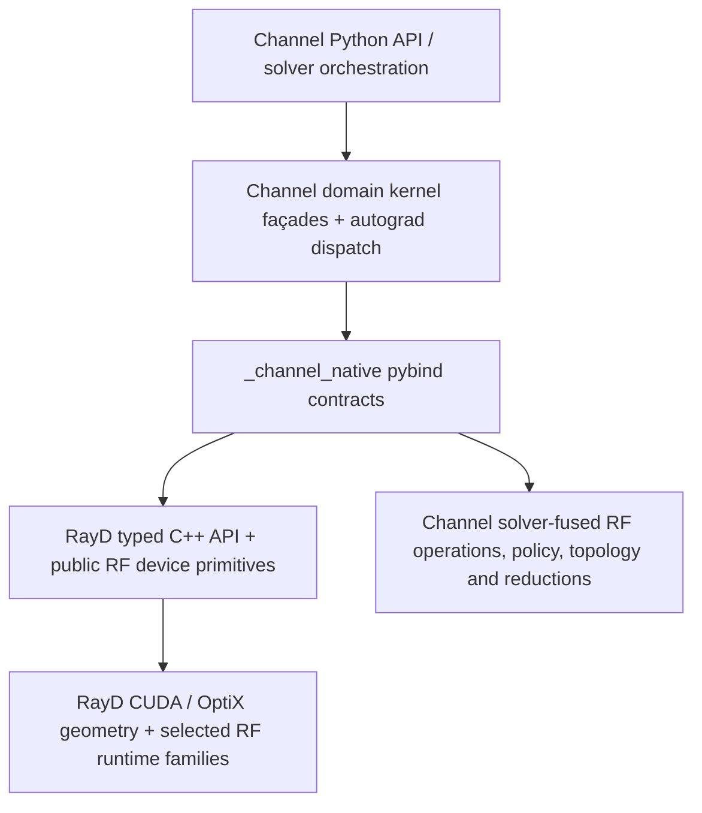

# Plan 13 — 直接 RayD 集成、RayDN 退役与 RF runtime 所有权迁移

**状态：** EXECUTION IN PROGRESS（用户于 2026-07-20 选择 Phase 8B 方案 2 并要求完成
Phase 11/12）；ADR-023/024/025/026/028 已接受；Phase 10A/10B 已完成原子
pin/switch/delete；Phase 11A/11B 机械去重、RayD legacy extern-C 删除、clean-RayD wheel
packaging 与 nightly 子门已完成；Phase 8B、稳定 integration 命名、Phase 12 profiling 优化和
最终 clean-checkout release 收口正在执行

**计划日期：** 2026-07-18

**子代理审计更新：** 2026-07-19（补入 transmission、diffraction family matrix、shared RF
dependency closure，并修正 immutable owner baseline 与 scattering C1/C2 语义）

**Channel Native 审计基线：** `main@a741f8d`（`Merge wt/scattering-v2 into main`）

**RayD 远端锁定基线：** `origin/main@346416f8f35250cd50c7d320d877307d55a8fc9f`
（已于 2026-07-18 push；Channel lock 已固定相同 commit 与 integration-header SHA256）

**Native binding 基线：** 211 个 `_channel_native` symbols

**范围：** Channel Native ↔ RayD 原生边界、历史 `RayDN/raydn` 命名与胶水层、
通用 EM/layer-stack 与 transmission runtime、diffraction operation-family ownership、
通用 scattering runtime，以及刚合并的 scattering v2 multi-bounce coherent
primal/JVP/VJP family。除明确独立立项的 batched penetration trace 外，本文不改变物理
模型、数值顺序、fusion 边界或 solver 行为。

**关联记录：** [Plan 08](./08-channel-native-modular-architecture-hardening-plan.md)、
[Plan 10](./10-scattering-v2-multibounce-coherent-ad-plan.md)、
[Plan 10a](./10a-scattering-v2-native-interfaces.md)、
[ADR-001](../standards/adr-001-python-native-dispatch.md)、
[ADR-009](../standards/adr-009-native-fusion-ownership.md)、
[ADR-010](../standards/adr-010-native-scattering-kernels.md)、
[ADR-012](../standards/adr-012-stationary-coupled-diffraction.md)、
[ADR-013](../standards/adr-013-double-diffraction.md)、
[ADR-018](../standards/adr-018-bdpt-diffraction-realignment.md)、
[ADR-020](../standards/adr-020-mc-transmission-polarization-unification.md)、
[ADR-021](../standards/adr-021-multibounce-coherent-scattering.md)、
[ADR-022](../standards/adr-022-bdpt-fixed-topology-ad.md)、
[ADR-023](../standards/adr-023-direct-rayd-typed-integration.md)、
[ADR-024](../standards/adr-024-shared-rf-transmission-ownership.md)、
[ADR-025](../standards/adr-025-diffraction-operation-family-ownership.md)、
[ADR-026](../standards/adr-026-rayd-generic-scattering-runtime-ownership.md)。

## 1. 执行结论

本计划作出六项结论：

1. `RayDN` 不是应继续保留的第二个 backend。当前实现已经通过同一 CMake graph
   source-link RayD，但 Channel Native 又在其上叠加了 raw `int64_t` handle、
   `extern "C"` 数组 ABI、函数指针 getter 和 `raydn_*` façade。应删除这层历史身份，
   改为 `_channel_native` 直接调用 RayD 提供的 typed C++ API。
2. “直接使用 RayD”不等于 Python import `rayd.torch`，也不等于再构建一个 Python
   extension。目标仍然只有一个生产 Python extension：`_channel_native`；RayD 作为同一
   build graph 中的原生 target，被 Channel Native 的 C++ binding 直接链接和调用。
3. 将计算交给 RayD 的主因是**领域所有权和设备 primitive 的单一实现**：scene、AS、
   OptiX trace、intersection、visibility、通用 path geometry 属于 RayD。Fusion 是决定
   API 粒度和 kernel 边界的重要约束，但不是“所有计算都应搬进 RayD”的理由。
4. Transmission 迁移此前没有包含在旧版 Plan 13 中。目标是让 RayD 成为 shared
   EM/layer-stack/Jones device primitives、`em_layer_stack` 和
   `field_transmission_sequence` 完整 primal/backward/JVP family 的 numerical owner；
   Channel 保留 materials/fields façade、CSR resource contract、topology 和 solver policy。
5. Diffraction 不能用一个笼统 owner 覆盖所有语义。Generic pure-wedge family 和 RayD
   order-1 exporter 应由 RayD 统一；MC Sionna fixed-tape estimator、coupled RD/DD fused
   fields、packing/MIS/accumulation分别保留完整的 Channel owner。每个 operation family
   内部必须统一 primal/JVP/VJP，不能把 UTD 子段从 fused solver operation 中拆出。
6. scattering v2 合并后，通用的、与 solver policy 无关的散射运行时计算适合成为 RayD
   原生能力；solver event policy、拓扑、资源生命周期、MIS/累积和结果组装仍属于
   Channel Native。迁移必须按完整 primal/JVP/VJP family 执行，尤其不能拆开新加入的
   chain fused operations；chain 迁移必须等待 shared EM/transmission dependency closure。

最终目标不是“Channel Native 只剩 Python”。Channel Native 仍拥有 RF contracts、solver、
离散路径策略、solver-fused operations 和求解器归约；RayD 拥有通用 ray/geometry、shared
RF device primitives，并在 ADR-024/025/026 分别接受后拥有选定的 transmission、
diffraction 和 scattering runtime families。

## 2. 不可协商约束

- 唯一生产计算 backend 仍是 compiled native CUDA/RayD extension。不得引入 Torch、
  NumPy、Python loop、CPU 或有限差分 fallback。
- `_channel_native` 是唯一生产 Python extension。不得在运行时加载 `rayd.torch`，不得
  建立第二套 dispatcher、第二个 scene registry 或跨 DSO 的重复 handle 生命周期。
- 设备数据保持 resident。不得增加 `.cpu()`、`.numpy()`、`.tolist()`、host iteration、
  scalar extraction、隐式同步或可避免的 host/device copy。
- 纯 owner move 必须保持公开 API、Config 默认值、metadata、row identity/order、tensor
  storage alias、stride、dtype、device、gradient state、随机数消费和异常行为。
- 不改变 kernel 的 launch geometry、stream、同步、归约顺序、atomics、tape lifetime、
  compile flags、OptiX pipeline/SBT/payload 或浮点求值顺序。
- Primal/JVP/VJP/backward 是一个迁移单元。不得由两个项目分别拥有同一 production
  operation family 的 primal 和 derivative。跨仓切换允许 RayD 先合并一个 dormant
  candidate，但在 Channel pin/switch 前它不得被 `_channel_native` 编译或调用，此时
  Channel 仍是 authoritative production owner；不得发布或长期保留双 production owner。
- 不为旧 `RayDN/raydn` 名称增加 alias、re-export、capability fallback 或兼容 shim。
  内部 API 不承担兼容承诺；若 public snapshot 受影响，显式更新 snapshot 和 migration
  note。
- 架构迁移与数值/fusion 优化分离。若要合并 visibility + scattering、建立新的 batched
  penetration trace、裁剪 RayD diffraction map 为 tape-only kernel、修改 chain fusion、
  改 reduction 或引入新 polarization ABI，必须另写 ADR 和独立 PR。
- 实施期间若修改本目录架构规则，`AGENTS.md` 与 `CLAUDE.md` 必须在同一提交中保持完全
  一致。

## 3. 当前状态审计

### 3.1 当前并不是“未使用 RayD”

当前 CMake 已经：

- 验证 `dependencies/rayd.lock.json` 的 repository、commit 和 integration header SHA256；
- `add_subdirectory(.../RayD/backends/torch)`；
- 禁用 RayD Python module；
- 将 `_channel_native` 链接到 `rayd_torch_native_core`；
- 将 RayD build identity 写入 Channel Native build fingerprint。

因此问题不是“要不要开始使用 RayD”，而是原生调用边界仍保留了一层历史 `RayDN`
间接层。

### 3.2 当前冗余调用链

当前主要路径是：

```text
Python domain façade
  -> _channel_native.raydn_* / bdpt_* binding
  -> native/channel_native/rayd/{scene,geometry,reflection,diffraction}.cpp
  -> native/channel_native/rayd/bridge.h 的函数指针类型
  -> native/channel_native/rayd/common.cpp 的 *_fn() getter
  -> rayd_torch_native_* extern "C" integration entry
  -> RayD native implementation
```

`bridge.h` 复制长函数签名，并以 raw pointer、output array、capacity 和 `int64_t` scene
handle 表达结果；`common.cpp` 基本只把每个 getter 指向一个 RayD entry。这两者是本计划
要删除的核心胶水层。

当前 `src/`、`native/`、`ci/` 和构建文件中仍有 73 个文件包含 `RayDN/raydn` 或
`uses_raydn_native`。Phase 0 source scan确认基线 native manifest 中有 16 个严格
`raydn_*` symbols，另有若干实际
调用 RayD 但以 `bdpt_*` 命名的 generic geometry symbols。实施前 Phase 0 必须生成完整、
可审计的逐符号清单，不能只按字符串批量替换。

### 3.3 当前计算所有权

| 能力 | 当前实际计算 owner | 评价 | 目标 |
|---|---|---|---|
| scene/mesh native resource、AS/OptiX 生命周期 | RayD | 合理，但 handle/命名仍是 RayDN 胶水 | RayD typed RAII resource |
| intersection、visibility、reflection trace/EPC | RayD | 合理 | 直接 RayD C++ API |
| order-1 diffraction path export | RayD OptiX | 合理 | 直接 RayD C++ API |
| composed coupled RD/DD geometry | Channel prepare/finalize + RayD EPC/visibility primitives | operation与primitive分层，不能简单标成RayD owner | Channel composed operation / RayD primitive，逐层typed contract |
| MC diffraction edge discovery/counting | Channel Native CUDA | 算法含 Channel/Sionna sampling policy，当前误放在 `rayd` bridge | 留在 Channel，重命名并迁出 `rayd/` |
| material/layer-stack RF evaluation | Channel Native CUDA | façade/resource owner 合理；通用 numerical/device primitive 不应阻塞 RayD chain | RayD numerical owner，Channel contract/façade 保持 |
| free-space/reflection transport、rough reflection scale | Channel Native CUDA | 与 Channel propagation ABI/AD/fusion 绑定 | 保持 |
| transmission sequence primal/backward/JVP | Channel Native CUDA | solver-neutral complete-row family，且 scattering chain 依赖同一 EM core | 整族迁 RayD；Channel fields façade 保持 |
| pure-wedge diffraction primal/backward/JVP | Channel Native CUDA，重演 RayD UTD exporter | generic UTD physics 跨仓重复 owner | 整族迁 RayD typed API |
| coupled RD/DD field primal/backward/JVP | Channel Native CUDA | 反射/双绕射 leg 与 row output 单 launch 融合 | 各 complete family 保持 Channel owner |
| MC Sionna fixed-tape diffraction primal/backward/JVP | Channel Native CUDA | solver estimator/Jacobian/cell atomic fusion | 整族保持 Channel owner |
| enumerated topology、row selection、solver orchestration | Channel Native | 合理 | 保持 |
| solver sampling policy、MIS、accumulation、result metadata | Channel Native CUDA/Python orchestration | 合理 | 保持 |
| scattering runtime eval/sample/integral | Channel Native CUDA | 当前合法；但它们是可复用的 resident runtime primitive | ADR-026 接受后迁到 RayD |
| scattering table/phase-screen resource construction | Channel Native offline/runtime resource layer | 合理 | 保持 |

### 3.4 为什么不是单纯因为 fused kernel

Fusion 只回答“一个 operation 应多大、哪些中间量不能跨边界物化”，不回答“这个
operation 属于哪个项目”。决定 owner 的顺序是：

1. ABI operation 和物理语义是否通用；
2. scene/device resource 和 primitive 的生命周期由谁控制；
3. fusion/launch/tape 边界能否完整保留；
4. 谁能作为唯一 primal/JVP/VJP owner；
5. 是否会引入 solver policy、Channel result schema 或跨 solver 依赖。

因此：

- Ray tracing/visibility/intersection 放在 RayD，首先因为它们依赖 RayD scene/AS/OptiX
  primitive；保留融合只是必须满足的性能约束。
- 完整 chain scattering operation 适合整体进入 RayD，是因为它可以作为通用、resident、
  solver-neutral runtime primitive；它绝不能为了匹配 Python 目录而拆成多个 kernel。
- Pure-wedge UTD 适合进入 RayD，因为它与 RayD order-1 exporter 是同一通用数值语义；
  coupled RD/DD 和 MC Sionna 虽含 UTD，却拥有不同的 fused operation/result contract，
  所以保留 Channel 完整 owner 不构成 primal/JVP/VJP 拆分。
- MIS、event probability 和 deterministic/BDPT accumulation 即便能写成 fused kernel，仍
  不应因为“更 fused”就移进 RayD，因为它们是 Channel solver policy。

## 4. 目标架构



### 4.1 “直接 RayD”的准确含义

RayD 新增 source-level C++ integration API v2，建议位于 `namespace rayd::torch`，至少包含：

- RAII `SceneHandle`/`SceneResource`，销毁由析构和所有权类型管理；
- `IntersectResult`、`VisibilityResult`、`ReflectionTraceResult`、
  `ReflectionEpcResult`、`DiffractionPathResult` 等 named result structs；
- 使用 `at::Tensor`、`std::optional<at::Tensor>`、typed config/result 的直接 C++ functions；
- primal/JVP/VJP/backward 的对称 typed contracts；
- public, versioned CUDA device-header contracts for complex/medium/Fresnel,
  layer-stack primal/dual, Jones frames and the selected UTD primitives；
- 清晰的 stream/device/ABI validation contract。

Channel Native 的 C++ bindings 直接 include 该 header 并调用这些函数。Python 侧持有的
scene resource 应改名为 `RayDSceneResource`，由 typed holder 绑定；不得继续把裸 C++
pointer 塞进 `int64_t` 并由 Python 传递。

### 4.2 保留的必要边界

“去胶水层”不代表删除所有 façade。以下层仍然必要：

- Python domain `kernels/` façade：验证 typed contract、请求 required symbol、dispatch、
  组装 named result；
- `_channel_native` pybind registry：稳定 Torch-facing ABI、错误转换和 build fingerprint；
- custom autograd wrapper：只负责 dispatch native primal/JVP/VJP/backward，不重建数值；
- solver orchestration：选择 rows/events、组织资源、调用 owner、组装结果。

删除的是历史兼容/间接层：重复函数签名、getter function pointer、raw output capacity、
dummy handle、`RayDN` identity 和无行为的 backend shim。

RayD public device headers 只能承载通用 numerical primitives，不能 include Channel private
headers。Channel 保留的 fused kernels可以 include这些 RayD headers；反向的
`RayD -> native/channel_native/*` include 被 CI 明确禁止。

### 4.3 命名与 owner 修正

目标命名至少包括：

| 当前名称 | 目标 |
|---|---|
| `RayDNScene` | `RayDSceneResource` |
| `RayDNEdgeRecords` | `RayDEdgeRecords` |
| `CompiledScene.raydn` | `CompiledScene.rayd` |
| `_raydn_scene_handle_id` | 删除；使用 typed handle |
| `raydn_*` Python/native symbol | `rayd_*` |
| `uses_raydn_native` | `uses_rayd_native` |
| generic `bdpt_intersect_forward` | `rayd_intersect_forward` |
| generic `bdpt_visibility_forward` | `rayd_visibility_forward` |
| Channel-owned `bdpt_diffraction_discover_edges*` | `mc_diffraction_discover_edges*`，迁出 RayD bridge owner |

命名迁移必须更新 direct tests、binding manifest、contract coverage、current-owner delta、feature
list、public snapshot（如适用）和 migration note。不得留下旧名 alias。

## 5. Transmission owner 决策

### 5.1 ADR-020 不是 owner migration

ADR-020 已统一四个 solver 的 transmission 模型：Path/Deterministic/BDPT standalone 走
enumerated full-Jones field，MC Basic 保持 incident-projected power estimator，BDPT mixed
shooting 已使用 full-Jones transmitted-state kernel。但这次变更没有移动 native numerical
owner；因此旧版 Plan 13 并未覆盖用户要求的 transmission 迁移。

### 5.2 迁入 RayD 的 6 个 Channel-facing contracts

ADR-024 接受后，以下两个完整 family 的**原生 numerical implementation**迁到 RayD；
Channel 继续拥有 Python-facing domain façade、typed row/material contract 和
`_channel_native` binding：

| Family | Baseline bindings | 迁移规则 |
|---|---:|---|
| resident CSR layer-stack | `em_layer_stack_eval`, `em_layer_stack_backward`, `em_layer_stack_jvp` | 三者同批；保留 complex r/t、R/T/A、material/frequency AD |
| complete-row transmission field | `field_transmission_sequence`, `field_transmission_sequence_backward`, `field_transmission_sequence_jvp` | 三者同批；保留 layer traversal、Jones transport、carrier、projection、length/delay/gain fusion |

`field_transmission_sequence` 当前 primal 位于 `field_transport.cu`，backward/JVP 位于
`field_transport_transmission.cu`。物理文件分布不构成两个 owner；迁移时必须按 operation
family 取出完整 primal/backward/JVP，不得只搬一个 translation unit。

必须冻结的 fusion/tape contract：

- 每 row 内遍历 CSR layers，不把 per-layer state materialize 到跨-launch tensor；
- backward/JVP 重新计算当前 layer chain，不新增 persistent tape；
- shared layer gradients 保持当前 atomic accumulation 和顺序；
- transmission TUs 保持 precise-math，不能继承 pure-wedge 的 `--use_fast_math`；
- 七项 field outputs、row order/identity、receiver projection、phase/delay/gain schema 不变。

### 5.3 先迁移 shared RF device-header dependency closure

Scattering v2 chain 不能在当前依赖关系下直接搬到 RayD。实际闭包包含：

```text
scattering_chain_*.cu
  -> field_transport.cuh / field_transport_ad_common.cuh
  -> field_transport_ad.cuh
  -> em/layer_stack.cuh
  -> em/{fresnel,medium,complex}.cuh
  -> rayd/shared/utd/utd_math.h
```

ADR-024 必须先让 RayD 成为以下通用 device math 的唯一 source owner：

- complex、medium、Fresnel、CSR layer-stack primal/dual；
- Jones frame、slab reflection/transmission transport 及其 dual/adjoint helpers；
- 被 transmission、coupled diffraction、BDPT 和 scattering chain 共用的最小公共子图。

Channel 未迁移的 reflection、BDPT、coupled diffraction kernels 改为 include 同一份 RayD
public device headers。Channel 的 `tensor_checks.h`、pybind validation 和 solver state schema
不搬入 RayD；RayD typed host API 自己验证其 contract。迁移逐 helper 比较 normalized body、
compile attributes、PTX/SASS 和 primal/dual lockstep，随后删除 Channel 私有副本。

### 5.4 明确保留在 Channel 的 transmission 内容

| 内容 | 原因 |
|---|---|
| material models、ABI/CSR encoding、cache、validation façade | Channel `materials` contract |
| topology pair/winner、thin-sheet eligibility、component-5 packing | discrete topology/policy |
| `bdpt_transmitted_light_subpath_state` + backward + JVP | 融合 19-field BDPT state、event mask/type、PDF、depth、lateral exit 和 phase compensation |
| BDPT standalone transmission orchestration | ADR-020 enumerated opaque oracle |
| BDPT event probability/MIS/RNG | solver estimator policy |
| MC Basic incident-polarization estimator semantics | solver-specific power-domain contract |
| component accumulation、metadata、results | solver contract |

BDPT transmitted-state family继续是一个完整 Channel owner，但只调用 RayD-owned shared RF
device primitives；不得把其中的 transmission 子表达式拆成另一个 kernel，也不得把 BDPT
state/PDF schema下沉到 RayD。

### 5.5 Straight-segment penetration 与 MC event glue

当前 `straight_transmission_chains` 以 Python/Torch orchestration反复调用 RayD intersect，并
在 accepted ADR-020 event-glue边界内做 incident-polarization bookkeeping。这不是本轮 6 个
binding 的 owner move。Phase 0 必须量化其生产 hot-path 占比并建立两项后续任务：

1. RayD solver-neutral batched segment-penetration trace，返回 ordered resident hits/normals/
   material ids/t-distance；Channel 继续决定 eligibility、winner 和 topology packing；
2. 若 MC Basic wall-product/active-state update 已构成 hot-path physics，将其收口为 Channel
   native CUDA estimator kernel，保持 ADR-020 数值、RNG 和 estimator domain。

这两项会改变 fusion/launch boundary，必须用独立 ADR-027 + profiler/equivalence evidence，
不能混入 move-only ADR-024，也不阻塞 shared RF header 和两套 family 的迁移。

## 6. Diffraction primal/JVP/VJP 所有权统一

### 6.1 以 operation family 而不是“diffraction”统称定 owner

| Operation family | 当前事实 | 最终 authoritative numerical owner | 动作 |
|---|---|---|---|
| RayD order-1 path exporter / visibility | RayD OptiX | RayD | typed direct API；离散 winner 不求导 |
| pure wedge `field_diffraction_wedge` + backward + JVP | Channel 完整 family，但重演 RayD generic UTD exporter | RayD | 三件套整体迁移；Channel fields/autograd façade保留 |
| MC `mc_sionna_diffraction_tape_accumulate` + backward + JVP | Channel fixed-tape Sionna/ITU estimator | Channel | 三件套保持完整，不拆 UTD 子表达式 |
| coupled RD `field_coupled_rd` + backward + JVP | Channel reflection-slab + UTD row fusion | Channel | 三件套保持完整；调用 RayD shared device primitives |
| coupled DD `field_coupled_dd` + backward + JVP | Channel two-wedge one-launch row fusion | Channel | 三件套保持完整；调用 RayD shared device primitives |
| `coupled_rd_prepare` + backward + JVP | Channel continuous stationary-geometry family | Channel（本计划） | 保持三件套；未来完整移动需独立证据 |
| composed RD/DD geometry ABI | Channel prepare/finalize + RayD EPC/visibility primitives | Channel operation / RayD primitive | 在 current-owner inventory明确双层，不按文件夹误判 |
| deterministic/path/MC pack/compact/vector accumulation | Channel solver/propagation | Channel | 保持 |
| BDPT connection/PDF/MIS/storage | Channel BDPT | Channel | 有真实 caller才保留 |

“统一所有权”的含义是每一行拥有一个完整 primal/JVP/VJP owner，而不是把所有带
diffraction 字样的 kernel 都搬到 RayD。特别是 coupled RD/DD 与 MC Sionna 已各自拥有不同
result schema、tape 和 fusion；拆出其中的 UTD 子段会增加 launch/materialization并破坏 AD
lockstep。

### 6.2 Pure-wedge 迁移 contract

ADR-025 负责把以下 3 个 bindings 对应实现整体迁入 RayD：

- `field_diffraction_wedge`；
- `field_diffraction_wedge_backward`；
- `field_diffraction_wedge_jvp`。

迁移必须保留 `wedge_row_eval<T>` numerical order、optional winner vertices、fixed-winner
geometry AD、三套 launch、row/output schema 和 current CMake `--use_fast_math`。该 flag 是
为了与 RayD OptiX order-1 exporter 的 fast-math路径锁步；不能扩散到 coupled、
transmission 或其他 precise-math family。

RayD exporter 与 fixed-winner wedge reevaluator 仍是两个不同 ABI operations：前者负责离散
path discovery/export，后者负责连续 field reevaluation及 AD。将两者进一步融合或消除
numerical duplication是独立 numerical ADR，不属于 owner move。

### 6.3 MC diffraction tape 的真实边界和命名

MC Basic 当前先调用 RayD diffraction accumulation获取 sampling/visibility tape，再由 Channel
`mc_sionna_diffraction_tape_accumulate` family 生成真实 solver map。它不是“RayD primal +
Channel derivative”的同一 operation split：两者是 tape producer 与 estimator consumer。

计划必须：

- 将 live-only-for-MC 的 `bdpt_diffraction_accumulation_forward` / `raydn_*` façade改成真实
  语义名称，例如 `rayd_diffraction_sample_tape_forward`；
- 保留 RayD 当前 fused implementation和输出，rename-only 不裁剪未消费 map columns；
- 如果要改成 tape-only kernel，另写 fusion/performance ADR并用 Nsight证明；
- 对 MC fixed tape 的 primal/backward/JVP、proposal/Jacobian、finite-thickness slab、cell
  atomics、RNG 和 output exactness整体锁定。

### 6.4 Legacy/误归属 diffraction 清理

- `bdpt_diffraction_discover_edges*` 实际是 Channel CUDA 且 production caller 是 MC Basic；
  删除 BDPT/RayDN aliases，重命名为 `mc_diffraction_discover_edges*`。
- `mc_diffraction_edge_geometry` 与 `bdpt_diffraction_edge_geometry` 当前转发同一 Channel
  implementation；若后者无 production caller，删除 wrapper而非复制实现。
- `bdpt_diffraction_connection_samples_from_tape`、
  `bdpt_diffraction_point_connection_samples`、state pack/wi 等 legacy symbols必须执行静态
  caller、dynamic binding、public import、真实 BDPT E2E 四项审计；无 caller则连测试/
  manifest/budget一起删除，不以 name-based coverage当作生产可达证据。
- `_tx_visible_diffraction_states` 当前存在 Python loop/Torch 几何重算候选。Phase 0 必须
  确认 live path；若 live，迁成完整 native Channel capacity/mask planning op并调用 RayD
  batched visibility primitive，保持四个 fractions和 active-row order exact，禁止继续生产
  Torch geometry。

### 6.5 Diffraction 冻结验收

- pure wedge forward与 RayD exported `field_xyz` parity；
- material/frequency/source/target/winner-vertex JVP/VJP、adjoint dot-product和 test-only FD；
- ISB/RSB、finite edge、stationary external incident、ADR-012/013 RD/DD regression；
- MC fixed-tape primal/JVP/VJP及 seed/RNG invariance；
- coupled RD/DD primal/JVP/VJP完整 lockstep且无新 intermediate/launch；
- fast-math/PTX/SASS、register、launch和stream parity；
- live source中旧 `bdpt_diffraction_accumulation_forward`、`raydn_diffraction_*` façade为零；
- 每个保留的 `bdpt_diffraction_*` symbol都有真实 BDPT E2E caller。

Phase 8B 已将 sample-tape producer 原子重命名为
`rayd_diffraction_sample_tape_forward`：旧名没有 live ABI、Python alias或
re-export，RayD typed implementation、19-output tuple、launch、RNG和行顺序保持不变。

## 7. Scattering v2 纳入后的 owner 决策

### 7.1 当前基线

ADR-021/022 已在本计划基线中接受并实现：

- 211-binding build，scattering v2 最终验证为 1037 tests / 0 failures；
- multi-bounce coherent scattering 默认关闭，旧配置保持 bitwise 不变；
- 新增 chain ensemble 和 chain realization 两套完整 primal/backward/JVP family；
- BDPT fixed-topology AD 已覆盖材料/散射/频率/功率路径；随机 topology、visibility、PDF、
  MIS 和 sampled quantities 按 ADR-022 冻结。

本计划以这些 as-built contract 为准。Plan 10/10a 中早期草案与已验收 kernel 不一致处，
以 ADR-021、ADR-022 和当前 kernel source 为权威。

### 7.2 建议迁入 RayD 的 17 个运行时 bindings

以下 operation families 是 solver-neutral、device-resident 的散射 primitive。ADR-026
接受后，应把**原生实现 owner**整体迁入 RayD；Channel Native 仍保留同名 Python-facing
façade/binding contract：

| Family | Baseline bindings | 迁移规则 |
|---|---:|---|
| table evaluation AD | `scattering_table_eval`, `_backward`, `_jvp` | 三者同批迁移 |
| table sampling | `scattering_table_sample`, `scattering_table_pdf` | 与共享 table device math 同批迁移 |
| single-bounce ensemble | `scattering_ensemble_eval`, `_backward`, `_jvp` | 保持原 launch/数值顺序 |
| phase-screen patch integral | `scattering_patch_integral_eval`, `_backward`, `_jvp` | RayD 消费 resident height tensor，不接管 phase-screen 生命周期 |
| v2 chain ensemble | `scattering_chain_ensemble_eval`, `_backward`, `_jvp` | 完整 row-fused operation，不拆 C1/scatter/C2 |
| v2 chain realization | `scattering_chain_realization_eval`, `_backward`, `_jvp` | 完整 chain transport + patch integral，不拆分 |

同时迁移其真正共享的 device math（当前包括 `scattering_table.cuh`），但不能顺手把
Channel solver policy 或 table builder 搬入 RayD。

这里的“迁入 RayD”是**所有权移动**，不是新增一套实现：

- RayD source tree 成为上述 CUDA source 和 shared device header 的唯一 owner；
- Channel C++ binding 通过 RayD typed API 直接调用；
- Channel 删除本地对应 `.cu/.cuh` 实现；
- 不允许两个项目在同一 production build同时编译同一实现或以复制代码形成“双 owner”；
  跨仓切换期间未被 Channel pin/call的 RayD dormant candidate不构成 production owner；
- Channel manifest 仍记录 `_channel_native` 对外 symbol；current-owner inventory另行记录RayD为
  numerical implementation owner。

### 7.3 明确保留在 Channel Native 的 scattering 内容

| 内容 | 保留原因 |
|---|---|
| `scattering_event_probabilities` | MC/BDPT event selection policy，不是通用 BSDF primitive |
| Kirchhoff table 构建、缓存、版本与校验 | offline/resource ownership；不能把 builder primal/AD 拆成跨项目双 owner |
| `kirchhoff_table_ad.cu` 及其独立 CPU/NumPy test oracle | 当前属于 table-build contract；生产不得调用 CPU oracle |
| `ScatteringTableRuntime` / resident table resource orchestration | Channel scene/material/scattering contract |
| `PhaseScreenRuntime`、seed、生成、structure assignment、cache | realization 生命周期和可复现性属于 Channel 配置 |
| rough reflection scale / `C_r` composition | 当前由 `propagation.fields` owner；ADR-021 明确 chain kernel 不逐 bounce 重算 |
| chain discovery、join、row budget、C1/C2 packing | enumerated topology policy |
| coherent combine、deterministic accumulation | solver accumulation policy |
| BDPT continuation、NEE、MIS、event glue、BDPT AD companions | BDPT estimator policy，不能下沉为 RayD 通用 scattering |
| MC Basic single-scatter estimator | solver-owned baseline，不通过迁移改变算法 |
| result/metadata/capability assembly | public solver contract |

### 7.4 scattering v2 迁移必须冻结的 contract

- `Dmax=8` 的 padded C1/C2 representation、row depth 和有效 slot 语义；
- chain1 transport → diffuse scatter → chain2 transport → receiver projection 的完整 fusion；
- as-built chain ensemble binding order；
- `weights` 冻结语义；
- rough `C_r` 继续在既有 orchestration/field owner 组合；
- default-off 行为：`scattering_chain_max_depth=0`、`scattering_coherent=False`、
  `max_scattering_order=1`；
- realization/ensemble 的相位、Jones basis、CSR layer interpretation 和输出 schema；
- scattering compile contract 按基线 TU 冻结：`scattering.cu` 中 table
  primal/sample/pdf 使用默认 flags；ensemble/patch/chain/table-AD 等既有 lockstep TUs
  保持 `--fmad=false`；不得把任一模式扩散到另一 family；
- deterministic primal/JVP reduction 与 backward shared-gradient atomic behavior；
- chain geometry AD 按 as-built family 冻结：chain ensemble reverse mode 必须 fail loud、
  forward geometry 使用 JVP；chain realization 继续支持现有 geometry VJP/JVP；
- ADR-022 的 fixed-topology/fixed-sample/fixed-visibility/fixed-PDF/MIS contract。

任何一项若要改变，都不再是 owner move，必须退出 ADR-026，进入独立 numerical ADR。

## 8. 分阶段执行计划

### Phase 0 — 冻结双仓基线、dependency closure 与 current-owner delta

1. 固定 Channel `a741f8d`、已 push 的 RayD `origin/main@346416f...`、lock/integration SHA
   和 211 binding manifest；CI/release 从远端 clean clone复验。
2. 生成全部 `RayDN/raydn`、typed integration、live/dead caller 和 public/internal清单。
3. 分别冻结 transmission 6 个候选 contracts、diffraction 第 6.1 节 family matrix、
   scattering 18 个 bindings（17迁、event probabilities留）的 source/header/caller/launch/
   tape/compile-flag清单。
4. 生成 shared RF header dependency graph，逐 helper记录唯一 source owner、primal/dual mirror、
   compiler attributes 和所有 consumer。
5. 冻结四 solver exact outputs、rows/storage alias、RNG、launch/sync/memcpy/peak memory、
   PTX/SASS或等价 codegen/resource evidence。
6. `docs/dev/audit/phase9-native-owner-inventory.json` 是 ADR-009 immutable baseline，绝不
   修改；新建 current-owner inventory + migration-delta记录每次 owner transfer。

**退出条件：** 每个待移动/保留/删除 symbol和 header helper都有唯一 owner、caller、替代
接口、fusion reason和验收项。

### Phase 1 — ADR-023：直接 RayD typed integration 与 RayDN 退役

冻结 typed C++ API v2、RAII handle、named results、single-extension/source-link模型、异常/
stream contract、legacy API期限、Channel 零 shim/零旧名和 exact/packaging gates。

### Phase 2 — RayD typed C++ API v2

1. 增加 RAII resource、geometry/trace/visibility/reflection/diffraction typed entries。
2. 新 entry复用现有 implementation，不复制 kernel；old/new exact lockstep。
3. 覆盖 shape/dtype/device/stream/empty/error/lifecycle direct tests。
4. 更新 RayD integration header/version；不构建 RayD Python module。

### Phase 3 — Channel 直接切换 RayD 并退役 RayDN

1. Pin 已 push RayD commit/header SHA，Channel bindings直调 typed API。
2. 删除 `bridge.h`、`common.cpp`、function-pointer getters、raw scene-handle plumbing。
3. 完成第 4.3 节 rename，删除 compatibility re-export/shim。
4. 更新 build fingerprint、live manifests、current-owner delta、tests/docs/public snapshot；
   同步 `AGENTS.md`/`CLAUDE.md`。

**退出条件：** live source/build/CI/current docs中旧 identity为零；immutable archive 如保留旧
词只能逐项 allowlist。

### Phase 4 — Generic geometry 命名与 dead bridge 清理

1. generic `bdpt_intersect/visibility` 改为 `rayd_*`。
2. MC edge discovery移出 RayD bridge并按第 6.4 节 rename。
3. reflection/diffraction legacy bindings做四项可达性审计；dead则治理完整删除。
4. 跑 import graph、no-fallback和solver dependency gates。

### Phase 5 — ADR-024：Shared RF primitives 与 transmission ownership

**状态：** COMPLETE（2026-07-19；仅冻结决策，numerical owner transfer 在 Phase 6A/6B 完成）

冻结第 5.2-5.4 节：public device-header ABI、6 个 Channel-facing contracts、完整 family move、
precise-math/fusion/tape、Channel保留内容和双仓 dormant-candidate切换规则。

### Phase 6A — Shared RF device headers + layer-stack family

**状态：** COMPLETE（2026-07-19；RayD candidate
`4cb400acbfcc2da7fda4110d1298d311816905f1` 已 push，Channel 已原子 pin/switch）

**激活证据：** integration v2 header SHA-256
`c8e162c55a0e5abe789e4f1b19cd6ab00ee4ef59d70244cfc55d58166aeb646b`；
202 个 Channel bindings 中 `em_layer_stack_eval/backward/jvp` 的 ABI/façade仍由
Channel持有，numerical owner已迁为RayD。冻结的129-helper闭包中112个ADR-024
numerical helpers已激活RayD唯一source owner，10个Channel boundary helpers继续留在
Channel，7个scattering-table helpers继续等待ADR-026。Channel本地RF numerical
headers与`em_debug.cu`已删除，无forwarding shim或双production owner。

1. RayD 建立 complex/medium/Fresnel/layer-stack/Jones/slab primal/dual public device headers。
2. Channel所有consumer切到同一 RayD header；exact/codegen/AD lockstep后删除本地副本。
3. 整族迁 `em_layer_stack_eval/backward/jvp`，Channel materials façade和CSR owner保持。

### Phase 6B — Transmission-sequence family

**状态：** COMPLETE（2026-07-19；RayD candidate
`3988f0934fec7b521ee5190b0defc0883c84b9e6` 已 push，Channel 已原子
pin/switch/delete 本地 transmission-sequence source）

**激活证据：** 202 个 Channel bindings 中
`field_transmission_sequence/backward/jvp` 的 ABI/façade保持Channel持有，numerical
owner整族迁为RayD；current owner split为RayD 23、layered 2、Channel Native 177。
Channel删除`field_transport_transmission.cu`并从`field_transport.cu`移除primal owner，
没有forwarding shim、第二launch或persistent tape。129-helper闭包保持112/10/7，BDPT
transmitted-state三件套保持完整Channel owner。
锁定integration v2 header SHA-256为
`6cb18f682e08cb0bb0853507e3b4b82a68e681bb1dad89dc8c36518705f74989`，identity为
`rayd.torch.integration.v2.20260719.rf-transmission-sequence`。

整族迁 `field_transmission_sequence/backward/jvp`；保持 complete-row fusion、atomic layer
gradients、无 persistent tape、precise-math和四 solver ADR-020 parity。BDPT transmitted-state
继续在 Channel并改用 RayD shared primitives。

### Phase 6C — ADR-027 后续：Batched penetration / MC glue native 化

只有独立 fusion ADR、Nsight基线和 exact证据完成后才实现第 5.5 节；不与 move-only提交混合。

### Phase 7 — ADR-025：Diffraction operation-family ownership

**状态：已完成（2026-07-19）。** ADR-025 已接受；此阶段只接受边界，不执行 Phase 8A/8B
代码迁移。机器契约记录于 `docs/dev/audit/phase13-diffraction-family-matrix.json` 和
`docs/dev/audit/phase13-diffraction-legacy-audit.json`。

冻结第 6.1 节矩阵、pure-wedge三件套 move、MC/coupled families保留、sample-tape rename、
fast/precise math边界和 legacy deletion规则。live `_tx_visible_diffraction_states` 的四个
fractions、any-visible判定和 active-row 顺序也已冻结；Phase 8B必须以Channel composed
native capacity/mask planning operation替换Torch几何/loop/host Boolean，不得作为fallback保留。

### Phase 8A — Pure-wedge family 迁入 RayD

**状态：COMPLETE（2026-07-19）。** RayD提交
`11e72526cdddf669678975c8921a9d44c6504e20` 已push；Channel已原子
pin/switch/delete本地pure-wedge数值实现。integration v2 header SHA-256锁定为
`7a2b68f459e7e981a23735271eff2844fe0483d119cf514d59d2032d11be5aef`，identity为
`rayd.torch.integration.v2.20260719.rf-transmission-sequence.pure-wedge-diffraction`。

202个bindings保持不变，`field_diffraction_wedge/backward/jvp`的ABI/façade仍由Channel
持有，numerical owner整族迁为RayD；current owner split为RayD 26、layered 2、Channel
Native 174。旧`field_wedge_ad_diffraction.cu`已删除且无forwarding source/fallback；
optional winner vertices、fixed-winner AD、每个active entry单launch、zero-row no-launch、
caller current stream和family-local `--use_fast_math`保持。数值体LF/UTF-8精确区域SHA-256为
`09b4788ce1c39bb51a1c76f1a6f95269ae65cb8b04a501d174f355bd7bf53f3c`；RayD直接
C++ contract测试及完整CTest 2/2通过。完整证据见
`docs/dev/audit/phase13-diffraction-phase8a-evidence.json`。

### Phase 8B — Diffraction 名称、legacy 与 Torch geometry 收口

**实现状态：IN PROGRESS（2026-07-20；ADR-028 方案 2 已接受）。**

执行第 6.3/6.4 节：区分 tape producer/estimator consumer，删除旧 aliases，四项审计 dead
BDPT bindings；live `_tx_visible_diffraction_states` 改为 native完整 planning op。按 ADR-028
保留十二个状态 tensors 的 object/storage/stride 等全部 identity，以 CUDA `bool[N]` mask
作为唯一 validity truth；不得把 `K` 或 Boolean 拉回 host，不改变四 fractions 或 active row
顺序。sample-tape producer 原子改名为 `rayd_diffraction_sample_tape_forward`，旧名和兼容
re-export 为零。

### Phase 9 — ADR-026：RayD generic scattering runtime ownership

**状态：已完成（2026-07-19）。** ADR-026 已接受；此阶段只接受边界，不执行 Phase
10A/10B 的源码移动、RayD pin 或本地实现删除。

显式修订 ADR-010，冻结第 7.2 节 17 个 contracts、resource/tensor ABI、完整 family move、
source/header唯一 owner、chain fusion/AD/compile flags和第 7.3 节不迁移内容。ADR 已接受，
但在对应 Phase 10 atomic activation 前 scattering 仍保持 Channel production owner。

### Phase 10A — Scattering table 与 single-bounce families

**状态：COMPLETE（2026-07-19）。** RayD 提交
`4577e744adfe8665f7817e3aff5e8e533ec896e7` 已 push；Channel 已原子 pin/switch/delete
11 个 table/ensemble/patch contracts 的本地数值实现与 private table header。integration
v2 header SHA-256 为
`9f95ad9e8e3b790d00f8e762a3e6a09252d46afb65bfc3aba7c42325836cb1fb`，typed
scattering header SHA-256 为
`66d75a20be16057f03cdfb79e3b9dcc85cacec79b555cd73b019259aa510262a`，shared
table header SHA-256 为
`38ea9be424640301a88a97bccca9ab4bc599191ecfb0b259881ef6a300c96e38`。
202 个 bindings 的 ABI/façade保持 Channel 持有，numerical owner split 更新为 RayD 37、
layered 2、Channel Native 163。`scattering_event_probabilities` 与六个 chain contracts
仍为完整 Channel owners；direct tests、逐 TU flags、launch/codegen/resource 和 deletion
证据见 `docs/dev/audit/phase13-scattering-phase10a-evidence.json`。

迁 11 个 bindings：table eval/backward/JVP/sample/pdf、ensemble三件套、patch-integral
三件套。Channel pin/switch后删除本地 source；确有 table-runtime helper 依赖的 Channel
consumer 改为 include RayD-owned shared table header，不为满足目录对称给
`kirchhoff_table_ad.cu` 增加当前并不存在的无用依赖。更新 current-owner
delta/duplication/launch/coverage。

### Phase 10B — Scattering v2 chain families

**实现状态：COMPLETE（2026-07-19）；最终 duplication/release acceptance 待 Phase
11。** RayD 提交 `768b96e42a95f70c32d55f98a72000085317e288` 已 push；Channel
已原子 pin/switch/delete 六个 chain contracts 和四个本地 chain CUDA TUs。integration
v2、typed scattering、shared table header SHA-256 分别为
`0608bfbaf022379bc03442f9baa777ec05cfe3f6ab9b964e2385ec12a7b6c654`、
`ac95c418860d109aeaa96623131592e4df8887992e5fc25ecab71b4ddbf1f55b`、
`38ea9be424640301a88a97bccca9ab4bc599191ecfb0b259881ef6a300c96e38`。
202 个 bindings 的 ABI/façade仍由 Channel 持有，numerical owner split 为 RayD 43、
layered 2、Channel Native 157；`scattering_event_probabilities` 与 lifecycle/policy/
topology/packing/RNG/MIS/accumulation/results 仍由 Channel 持有。ensemble geometry
为 JVP-only/VJP fail-loud，realization geometry 支持 VJP/JVP。direct tests、逐 TU
flags、launch/codegen/resource、deletion 与 duplication 证据见
`docs/dev/audit/phase13-scattering-phase10b-evidence.json`。

在 Phase 6A dependency closure后整族迁 6 个 bindings：chain ensemble三件套、chain
realization三件套。保持 reflection-only C1/C2、`Dmax=8`、row/tape/output、`--fmad=false`、
launch/reduction/atomic和default-off exactness；Channel无本地 duplicate。

move-only 实现已将 duplication 从 Phase 10A 的 11.913070% 降至 11.170566%，并
清理 12 个 stale regions、分类 3 个 typed-adapter packing regions；冻结预算
10.211512% 未放宽且仍未达到。按 move-only 约束不在 Phase 10B 混入额外 dedup，
该 nightly/release blocker 由 Phase 11 显式关闭。

### Phase 11 — Release、packaging 与旧 RayD API退役

**实现状态：IN PROGRESS（Phase 11A/11B COMPLETE，2026-07-19；RayD legacy API、
packaging、nightly/release 仍待完成）。** Phase 11A 仅在
`fields.cpp` 与 `materials.cpp` 使用 TU-local compile-time helpers 收敛 typed request/
parameter packing；显式 pybind signatures、参数和 validation/error 顺序、typed
Request/Result、output schema、ABI、launch 与数值均不变。`EXACT_TOKEN_MATCH` 从 Phase
10B 的 `8747/78304 = 11.170566%` 降至 `8402/78162 = 10.749469%`；5 个 stale regions
已移除，当前 155 个 regions 全部分类且 0 unclassified。冻结预算 `10.211512%` 未放宽、
在 Phase 11A 尚未达到，最终 acceptance 明确留给 Phase 11B。binding manifest 保持 202 symbols，
仅 source line locations 更新，semantic changes 为 0。证据见
`docs/dev/audit/phase13-boundary-dedup-phase11a-evidence.json`。

Phase 11B 继续只收敛非数值 boilerplate：Python façade 共用 validation/result helpers，
chain 参数按冻结名称顺序进行 zero-copy tuple packing；四个 Channel CUDA TU 使用 TU-local
compile-time macros 共用 validation、allocation、pointer/result 和 launch-configuration
plumbing。所有显式 Python/native signatures、tensor identity/storage、validation/error 和
saved-tensor 顺序、output schema、kernel launch/reduction/RNG 与数值保持不变。去重指标降至
`7826/77821 = 10.056413%`，低于未放宽的冻结预算 `10.211512%`；当前 143 个 regions
全部分类，0 stale、0 unclassified。证据见
`docs/dev/audit/phase13-boundary-dedup-phase11b-evidence.json`。Phase 11B 完成不代表 Phase
11 release 收口完成；下列 packaging、RayD legacy API 与 clean-checkout release gates 仍须执行。

1. Wheel只有 `_channel_native` 和规定 metadata，无 RayD Python extension/未声明 DSO。
2. 两仓无复制的 RF/scattering physics、legacy integration signature或反向 private include。
3. 更新 FEATURE_LIST、migration docs、live manifests、current-owner delta、lock/fingerprint。
4. RayD 其他 consumer全部迁移后，才在 RayD独立 PR删除旧 extern-C API。
5. 保存 nightly/release、Nsight、exact/codegen/AD/packaging evidence，关闭 ADR-023-026。

### Phase 12 — Profiling-driven 性能收口

**实现状态：IN PROGRESS（2026-07-20）。** 先以独立进程冻结 diffraction/scattering 候选
微基准（每进程 1 warmup + 7 steady，默认 2 进程，波动显著时扩至 5 进程），记录 hash、
CUDA 时间、launch/sync/copy、temporary bytes 与 capacity/active ratio；再用 Nsight Systems
定位 launch/synchronization hot path，并仅对有证据的一个假设进行独立提交优化。RTX 5080
当前 Nsight Compute performance-counter 权限受限，若管理员权限仍不可用则保存明确 blocker，
以 Systems timeline、编译器 codegen/resource 与稳定 timing 完成不依赖硬件 counters 的验收。

首选候选是把 ADR-028 的 composed four-visibility launches 收敛为 pure-native typed RayD
single-launch edge visibility；只有 exact mask/stream/error parity、launch/copy/sync 不回退、峰值
内存不超过冻结 capacity 模型且跨进程改善超出方差时才激活。tape-only diffraction kernel、
CUDA Graph、stochastic/chain reverse geometry AD、cross-pol table、GPU table builder等仍需各自
独立 ADR 和 profiler 证据，不得顺带实现。

最终 Phase 12 验收还必须清除 diffraction output compaction 中既有的 device-to-host count
copies 和 `cudaStreamSynchronize`：将其迁为 capacity+valid contract，并让无效 rows 在 native
vector accumulation/topology packing 中保持 inert；不得把动态 shape 或数值筛选转回 Python/
Torch。目标 stage 每个独立进程 median 至少改善 10%，端到端 median 至少改善 5%，非目标
median/p95 回退分别不超过 5%/10%，hash exact；边界结果扩为 5 进程并要求 paired 95% bootstrap
CI 的改善下界大于零。

## 9. 跨仓 PR/提交顺序

推荐序列如下；每一步都应可独立 review 和 bisect：

| 顺序 | 仓库 | 内容 | 是否改变数值 |
|---:|---|---|---|
| 1 | Channel docs | 本计划 + ADR-023 proposal | 否 |
| 2 | RayD | typed C++ API v2 + direct tests；旧 API 暂留 | 否 |
| 3 | Channel | 更新 lock，直接调用 typed RayD，删除 bridge/common | 否 |
| 4 | Channel | RayDN 零残留命名/typed handle/manifest/migration | 否 |
| 5 | Channel | generic geometry 命名、MC edge owner、dead bridge 清理 | 否 |
| 6 | 两仓 docs | ADR-024 shared RF/transmission 接受与 interface freeze | 否 |
| 7 | RayD | public RF device-header closure + dormant layer-stack family | 否 |
| 8 | Channel | pin/switch shared headers和 layer-stack三件套，删除本地副本 | 否 |
| 9 | RayD | dormant transmission-sequence三件套 | 否 |
| 10 | Channel | pin/switch transmission family，BDPT state改用shared primitives | 否 |
| 11 | 两仓 docs | ADR-025 diffraction family matrix 接受 | 否 |
| 12 | RayD | dormant pure-wedge primal/backward/JVP | 否 |
| 13 | Channel | pin/switch/delete pure-wedge；diffraction rename/dead cleanup | 否 |
| 14 | 两仓 docs | ADR-026 scattering ownership 接受 | 否 |
| 15 | RayD | dormant table + single-bounce scattering families | 否 |
| 16 | Channel | pin/switch 11 个 bindings并删除本地实现 | 否 |
| 17 | RayD | dormant scattering v2 chain两套 family | 否 |
| 18 | Channel | pin/switch 6 个 bindings并删除本地 chain kernels | 否 |
| 19 | 两仓 | nightly/release/packaging evidence和文档收口 | 否 |
| 20 | RayD | 经所有 consumer审计删除旧 extern-C API | 否 |
| 后续 | 独立 ADR-027/PR | batched penetration、tape-only或其他 fusion/数值能力 | 是/可能是 |

RayD PR 必须先合并并产生固定 commit；Channel 随后只 pin 已合并 commit。不得让 Channel
依赖未固定 branch、dirty worktree 或本地未提交 header。

## 10. 验证矩阵

所有 Python/build/test 命令使用 `witwin2`：

```bash
conda run -n witwin2 python ci/run_ci_tier.py quick
conda run -n witwin2 python ci/run_ci_tier.py cuda
conda run -n witwin2 python ci/run_ci_tier.py nightly
conda run -n witwin2 python ci/run_ci_tier.py release
```

| 变更 | 最低 gate | 额外证据 |
|---|---|---|
| docs/ADR | quick 中相关 static/docs gates | 链接、编号、AGENTS/CLAUDE 一致性 |
| typed RayD API / Channel direct switch | Channel `quick` + `cuda`，RayD direct suite | old/new exact lockstep、handle lifecycle、negative contract、wheel single-extension |
| RayDN rename/owner cleanup | `quick` + targeted CUDA E2E | zero-reference scan、manifest/public snapshot/import graph |
| shared RF + transmission Phase 6A/6B | `cuda` + `nightly` | complex oracle、AD duality、four-solver parity、precise-math、atomic/tape/launch |
| diffraction Phase 8A/8B | `cuda` + `nightly` | exporter parity、fast-math/codegen、fixed-tape/coupled lockstep、legacy reachability |
| scattering Phase 10A/10B | `cuda` + `nightly` | exact outputs、AD lockstep、Nsight/launch/memory、逐 TU 默认 flags / `--fmad=false` parity |
| packaging/release boundary | `release` | clean locked checkouts、fingerprint、wheel inspection、supported SM |

### 10.1 必须覆盖的正确性测试

- scene create/destroy、multiple scenes、invalid/stale handle、device mismatch 和 error
  propagation；
- intersect/visibility/reflection/diffraction 的 empty/batch/non-contiguous/dtype/shape contract；
- Path、Deterministic、MC Basic、BDPT 的代表性 end-to-end scenes；
- layer-stack的 complex128 oracle、R/T/A、Brewster、lossy/thick multilayer、CSR边界和
  material/frequency primal/JVP/VJP；
- transmission depth 0/1/max、zero-thickness/zero-sigma、七项 outputs、geometry/material/
  frequency AD、atomic layer gradients、ADR-020 polarized oblique-wall和BDPT state/PDF/RNG；
- pure-wedge/exporter parity、fixed-winner/vertex AD、ISB/RSB/finite-edge，以及 coupled RD/DD
  和 MC fixed-tape各自完整 primal/JVP/VJP；
- scattering table eval/sample/pdf normalization、boundary bins、invalid tables；
- ensemble/patch integral 的 energy、reciprocity、Jones basis 和 phase convention；
- chain depth 0/1/max、reflection-only C1/C2 + diffuse-vertex layer-stack response、
  degenerate single-bounce collapse；
- deterministic coherent combine 与 ensemble/realization 路径；
- BDPT `max_scattering_order`、fixed-topology AD 和 frozen stochastic quantities；
- primal/JVP/VJP/backward companion lockstep、adjoint dot-product、有限差分仅作为 tests oracle；
- native missing/capability mismatch/unsupported SM/ABI mismatch 必须 fail loud。

### 10.2 必须覆盖的性能与资源测试

- kernel launch count 不增加；
- host/device memcpy、host sync、stream wait 不增加；
- peak resident/tape memory 不超出现有 budget；
- occupancy、registers、shared memory、atomics 和 ray divergence 无非预期退化；
- source owner move 前后 compile flags一致：transmission/coupled保持 precise-math，pure wedge
  继续匹配 RayD OptiX `--use_fast_math`；scattering 按源 TU 保持基线模式，
  `scattering.cu` 的 table primal/sample/pdf 不新增 `--fmad=false`，既有 lockstep TUs
  继续使用 `--fmad=false`；
- 若 compiler output 因路径/target 变化而不同，必须解释差异并通过 exact/ULP、resource、
  benchmark 证据；无法证明等价则停止 owner move，不放宽 tolerance。

### 10.3 Manifest 与治理同步

每次 native boundary 变化必须同步：

- `ci/native-binding-manifest.json`；
- contract-coverage manifest；
- current native owner inventory + migration delta；immutable Phase-9 inventory只读；
- duplication ledger；
- launch/resource maintenance ledger；
- no-fallback negative tests；
- direct contract tests 和至少一个 E2E caller；
- `ci/public-api-snapshot.json`（若 public contract 改名）；
- FEATURE_LIST、migration note、RayD lock/build fingerprint；
- `AGENTS.md` 与 `CLAUDE.md` 的一致更新。

211 是基线，不是不可变目标：纯 rename以及 6 个 transmission、3 个 pure-wedge、17 个
scattering contract的implementation owner move应保持 binding数量；经四项审计确认的 dead
binding可以删除，但必须在 symbol delta ledger逐项说明最终计数。

## 11. 风险、停止条件与回滚

| 风险 | 预防/停止条件 |
|---|---|
| typed API 实际产生第二套实现 | RayD 新 entry 只能复用现有 internal implementation；发现复制 physics 立即停止 |
| scene handle 生命周期变化导致 UAF/leak | RAII direct tests、multi-scene/stress/exception teardown；未通过不得切换 Channel |
| 搬文件改变 NVCC codegen | 固定 flags/target、比较 compiler/resource evidence；无法解释则停止 |
| RayD chain反向依赖 Channel private headers | Phase 6A先完成 public RF dependency closure；CI禁止 RayD -> Channel include |
| layer-stack或transmission primal/AD拆分 | 6 个 contracts按两个完整 family迁；任一 companion缺失立即停止 |
| pure-wedge fast-math扩散 | 单 source flag/target审计；coupled/transmission保持 precise-math |
| 将所有 diffraction误当一个 family | 第 6.1 节矩阵逐 operation验收；MC/coupled完整 family不拆 |
| chain op 被拆分导致 launch/中间量增加 | 把两套 chain family 作为 ADR 冻结的 complete operation；review gate 拒绝拆分 |
| scattering table/phase-screen owner 模糊 | ADR-026 明确 RayD 只消费 resident tensors，Channel 管构建/缓存/seed |
| 兼容 shim 长期存在 | Channel 切换 PR 的退出 gate 要求旧调用零引用；不以 feature flag 双轨运行 |
| 跨仓提交不可复现 | RayD 先合并，Channel pin commit+header hash，release 禁止 dirty checkout |
| default-off 行为漂移 | 对三项默认开关做 bitwise baseline；任何漂移按 numerical change 拒绝 |

每个 Channel 切换提交都通过更新 lock 回滚到上一个已验收 RayD commit；不得通过运行时
fallback 回滚。删除本地 kernel 只发生在新 owner 的 exact/cuda gates 通过之后，但合并时不
允许主分支长期保留双 owner。

## 12. 完成定义

仅当以下全部成立，本计划才可标记完成：

1. Channel Native 生产源码、构建、CI manifest 和 current docs 不再使用 `RayDN/raydn`
   identity；无 compatibility alias。
2. `bridge.h`、`common.cpp`、function-pointer getter、raw scene-handle plumbing 和无行为 backend
   shim 已删除。
3. `_channel_native` 直接调用 RayD typed C++ API；wheel 仍只有一个生产 extension。
4. Generic geometry/visibility/reflection/diffraction 的 owner和命名一致，MC edge discovery/
   sample tape不再伪装成BDPT/RayDN operation，dead bridge有四项审计结论。
5. ADR-024 接受后，第 5.2 节 6 个 transmission-related contracts由 RayD作为唯一 numerical
   owner；shared RF/layer-stack/Jones primal/dual device math没有 Channel副本或反向 private
   include；BDPT transmitted-state完整留在 Channel。
6. ADR-025 接受后，pure-wedge三件套由 RayD完整拥有；MC Sionna、coupled RD、coupled DD各自
   在 Channel保持完整 primal/JVP/VJP owner，所有 legacy diffraction symbols有真实 owner/
   caller或被治理完整删除。
7. ADR-026 接受后，第 7.2 节17个 scattering runtime contracts的 numerical implementation
   只有RayD一个owner；Channel无对应本地`.cu/.cuh` duplicate。
8. scattering v2两套 chain family完整迁移，shared RF依赖闭合，fusion/AD/compile flags/
   row/tape/output与`a741f8d`一致。
9. Channel保留第 5.4、6.1和7.3节 solver/resource/policy owners，没有把BDPT state、MIS、
   event policy、topology或accumulation错误下沉RayD。
10. quick/cuda/nightly/release、exactness、AD、performance、packaging 和 no-fallback evidence
   达到各阶段要求；没有通过放宽 tolerance/budget/allowlist 获得通过。
11. 所有live manifests、current-owner delta、lock、build fingerprint、migration docs、
   `AGENTS.md` 和
   `CLAUDE.md` 同步且可审计。

ADR-024/025/026分别是条件边界：任一未接受，对应 transmission/diffraction/scattering
保持当前完整 owner，不得半迁移；ADR-023直接集成与RayDN退役仍可独立完成。
